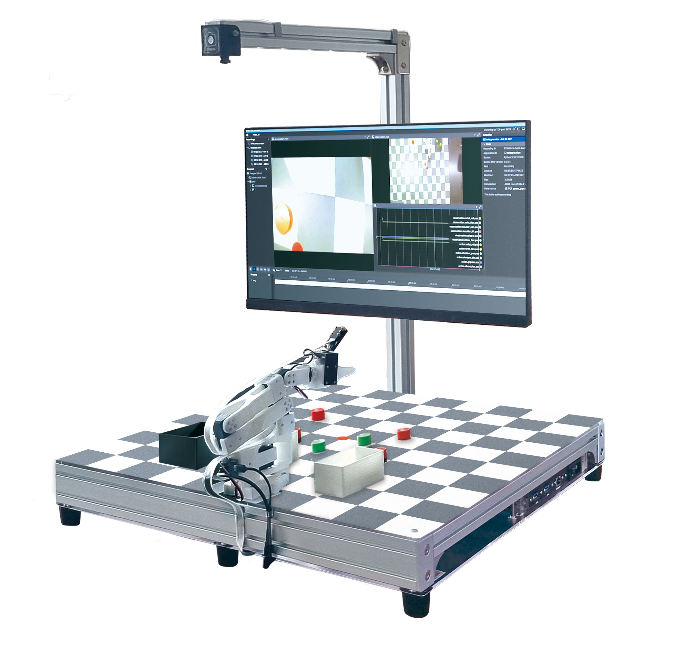
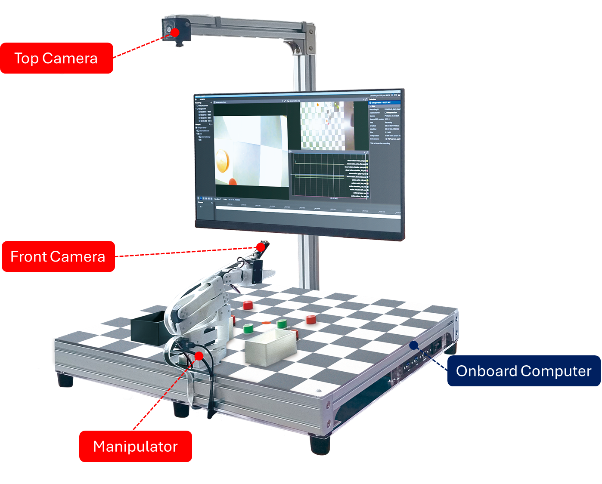

# PhysicAI Arm Busan

작성일 기준(2026년) 현재 로봇 개발은 기구학과 제어 중심의 전통적 접근에서 벗어나, AI 모델·시뮬레이션·합성 데이터·엣지 컴퓨팅·안전 규격이 결합된 통합 시스템 개발로 빠르게 전환되고 있습니다. 특히 비전-언어-행동(VLA) 계열 모델과 체화 추론(embodied reasoning) 기술은 로봇이 자연어 지시를 이해하고, 환경을 해석하며, 여러 단계를 가진 작업을 스스로 계획하는 방향으로 발전하고 있습니다. 동시에 시뮬레이션은 단순 검증 도구를 넘어 디지털 트윈과 합성 데이터 생성을 위한 핵심 인프라가 되었고, 휴머노이드 로봇은 연구 데모에서 산업 현장 파일럿으로 이동하고 있습니다. 이러한 변화 속에서 로봇 개발자는 하드웨어 제어뿐 아니라 데이터 파이프라인, AI 추론, 소프트웨어 플랫폼, 안전·보안의 이해 등을 필수 역량으로 요구되어져가고 있습니다.

PhysicAI Arm Busan은 현대 로봇공학과 Physical AI의 흐름을 반영하여 설계된 교육용 로보틱스 플랫폼입니다. 학습자는 이 장비를 통해 기초 로봇공학의 핵심 개념을 이해하고, 시뮬레이션 기반 검증과 VLA 기초 활용까지 연결된 실습을 수행할 수 있습니다. 본 교재는 개별 공학 요소의 심화 자체보다, 로봇 시스템을 구성하는 기술들이 어떻게 맞물려 동작하는지를 이해하고 경험하는 데 중점을 둡니다. 따라서 PhysicAI Arm은 기초 이론, 시스템 통합, 그리고 최신 지능형 로봇 기술의 흐름을 하나의 학습 경로로 이어 주는 출발점이 됩니다. 

## 개발환경 소개

장비의 각 모듈의 명칭은 아래와 같습니다.

### Onboard Computer

본 제품에 탑재된 온보드 컴퓨터(이하 온보드)는 **Jetson Orin Nano** 입니다. 본 온보드는 아래와 같은 하드웨어 성능을 보유하고 있습니다. 

| Type | Spec |
| ---- | ---- |
| GPU | 40 TOPS |
| CPU | 6-core Arm® Cortex® -A78AE v8.2 64-bit CPU 1.5MB L2 + 4MB L3 |
| Memory | 8GB 128-bit LPDDR5 68GB/s |
| Storage (external SSD) | 256GB |

온보드에 탑재된 OS 버전은 *Jetson Linux 36.3.0* 버전이며, 자사의 추가 설정으로 아래 모듈 및 소프트웨어가 탑재되어져 있습니다.

| Name | Version |
| ---- | ------- | 
| Linux Kernel | 5.15.136-tegra |
| ROS2 | Humble (Source build) |
| Python | 3.10.12 |
| OpenCV | 4.10.0 (cuda, gstreamer) |
| Gazebo | Fortress |
| xpad | 0.4 |
| numpy | 1.26.1 |
| torch | 2.4.0a0+3bcc3cddb5.nv24.07 |

7장과 8장 일부를 제외한 교재에서의 모든 실습 및 예제는 아래 환경에서 동작되었습니다. 이에, 상기 기재된 소프트웨어 버전을 **임의로 업그레이드/다운그레이드** 할 경우 실습이 **원활히 진행되지 않을 수 있습니다.** 반드시 이 점 숙지해주시길 바랍니다. 

### Visual Studio Code

Visual Studio Code(이하 VSCode)는 MS에서 Electron 프레임워크를 기반으로 개발된 무료 프로그램으로 추가로 원하는 확장 기능을 설치해야 IDE로 사용 가능합니다. 윈도우를 비롯해 리눅스 Mac을 모두 지원하며 파이썬을 비롯해 다양한 언어와 부가 기능을 수 많은 확장 기능으로 지원합니다.

장비에 탑재된 온보드엔 이미 VSCode가 설치되어져 있습니다. 아래 사진과 같이 좌측 바에 위치하여져 있습니다.

