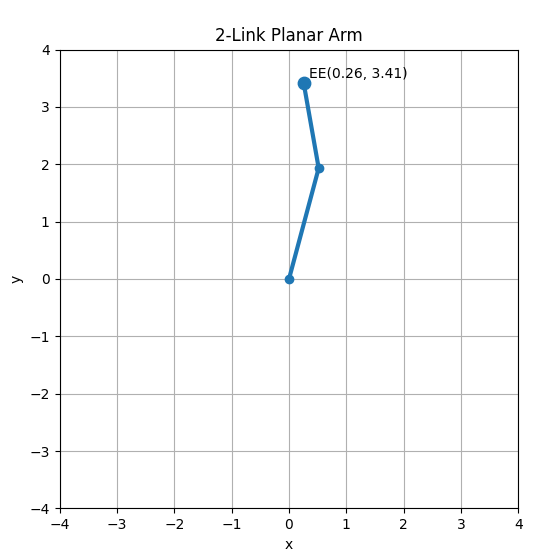

# 기초 로봇 공학

대부분의 사람들은 일정 수준의 인지 능력과 근육 제어 능력, 그리고 문제 해결 능력을 가지고 있습니다.
따라서 물체를 옮기는 상황에서도 물체의 위치, 필요한 힘의 크기, 손의 이동 경로 등을 별도로 계산하지 않고 직관적으로 행동할 수 있습니다.

그러나 로봇은 이러한 직관을 가지지 않습니다.
예를 들어 로봇에게 “탁자 위에 있는 물통을 짚어라” 라는 명령을 내린다고 가정해봅시다.

이때 로봇은 다음과 같은 정보를 모두 수치적으로 알아야 합니다.

- 탁자와 물통의 정확한 위치

- 물통을 잡기 위한 손(혹은 집게)의 목표 위치

- 해당 위치에 도달하기 위한 각 관절의 각도

- 물체를 잡은 이후 이동해야 할 위치

즉, 로봇은 모든 행동을 정확한 수치 계산을 통해 수행해야 합니다.

이 문제를 해결하기 위해 등장하는 개념이 바로 **좌표계(Coordinate System)** 와 **기구학(Kinematics)** 입니다.

좌표계는 로봇과 주변 환경에 존재하는 물체들의 위치와 자세를 수치적으로 표현하는 기준을 제공하며,
기구학은 로봇이 특정 위치와 자세에 도달하기 위해 각 관절을 어떻게 움직여야 하는지를 수학적으로 계산하는 방법을 제공합니다.

이 두 개념은 로봇을 제어하는 데 있어 가장 기본이 되는 요소이며,
PhysicAI Arm을 직접 제어하는 과정뿐만 아니라,
추후 시뮬레이션 및 인공지능 기반 제어에서도 핵심적으로 사용됩니다.

이 장에서는 원활한 실습을 위해 로봇공학의 기초적인 개념만을 다룹니다.
이미 관련 내용을 숙지하고 있다면 다음 장으로 넘어가도 무방합니다.

본 장을 이해하기 위해 필요한 선수 지식은 다음과 같습니다.

- 삼각함수
- 선형대수
    - 행렬의 정의 및 연산
    - 역행렬
    - 벡터 및 공간 개념
- Python
  - 기초 문법
  - numpy
  - matplotlib

## 로봇공학 기초 용어

아래 사진은 매우 간단한 구조의 로봇 매니퓰레이터입니다. 이 사진을 사용하여 로봇공학 용어를 풀어 설명합니다.


또한, 이 매니퓰레이터를 도표 형태로 간략하게 표현하면 다음과 같이 나타낼 수 있습니다.


<br><br>

### 링크(link) 

링크란 로봇의 강체(rigid body)를 말하며, 이는 곧 형태가 고정되어 변하지 않는 몸체 역할을 담당하고 있습니다. 보통 하나의 링크에 서로 다른 두 조인트를 연결시키는 경우가 많습니다. 우리 몸에 비유하자면 팔의 뼈를 생각할 수 있습니다.

링크는 아래 그림과 같이 위치해 있습니다.


### 조인트(joint)

조인트란 두 강체, 즉 링크를 연결하고 그 사이에 제약된 상대운동을 가능하게 하는 기계 요소입니다. 즉, 연결된 링크가 움직이게 해주는 역할을 담당하고 있습니다. 우리 몸에 비유하자면 팔의 관절, 혹은 손목을 생각할 수 있습니다.

조인트는 아래 그림과 같이 위치해 있습니다.


조인트는 여러가지 여러 종류를 가지고 있습니다. 회전을 하는 Revolute Joint, 직선 이동 운동을 하는 Prismatic Joint, 회전과 직선 이동을 동시에 하는 Cylindrical Joint 등이 있습니다. PhysicAI Arm은 Revolute Joint만을 사용합니다.


### 자유도(DOF, degree of freedom)

자유도란 기계 시스템의 기구학적 구성(kinematic configuration)을 완전히 정하는 데 필요한 독립 변수를 의미합니다. 즉, 로봇의 상태를 지정하는 변수를 말합니다.

Revolute Joint의 경우 자유도 변수를 각도, 즉 $\theta$ (라디안) 을 사용합니다. 조인트의 각도가 얼마나 회전하였는 지를 라디안으로 표현하는데, 이 각도는 로봇이 회전할 수 있는 범위 안에선 자유롭게 지정할 수 있습니다. 단, 조인트의 종류마다 자유도 변수가 다르다는 것을 유의해야 합니다.

자유도는 로봇의 구성단위가 아닌 표현 방식이기에 눈에 직접적으로 띄지 않습니다. 하지만 위 그림에 화살표를 표현하여 그린다면 아래와 같이 표시할 수 있습니다.


### End-Effector

End-Effector(EE)란 로봇이 실질적으로 작업을 수행할 수 있게 하는 장치를 말합니다. EE에는 임의의 장치를 부착해도 무관합니다. 예를 들어 Pick and place 과제를 수행하는 로봇팔을 설계할 때 물건을 집을 수 있는 집게를 부착할 수 있습니다. 또한, 자동으로 주유를 하는 로봇팔을 설계할 경우 주유 펌프를 EE에 부착할 수 있습니다. 하지만, EE와 매니퓰레이터는 분리되어져 있다고 명시되어져 있어 실질적인 매니퓰레이터 기구학 연산에 포함되지 않습니다. (ISO 8373)

EE는 아래 그림과 같이 위치하여 있습니다.


### Base

Base란 매니퓰레이터의 첫 번째 링크가 붙는 구조물로 정의할 수 있습니다. 이는 곧 로봇 팔 전체가 기대는 기준 구조물이자 좌표계로 지정되는 곳입니다. 좌표계에 대한 자세한 내용은 후술합니다. 

## 좌표계

### 좌표계란?

좌표계는 공간의 점을 숫자로 표현하기 위한 기준을 의미합니다. 주어진 좌표 공간을 이루는 좌표축들의 비반복 순서 집합으로 정의하고, 그 축의 순서에 따라 기록합니다. 점을 표현하는 방식을 기준을 정의하면 그 이후 선, 면으로 확장하게 됩니다. 

좌표계는 축과 순서 및 단위를 어떻게 정의하냐에 따라 달라지는 데, 대표적인 분류로 직교 좌표계(Cartesian coordinate system)과 극좌표계(Polar coordinate system)로 구분할 수 있습니다. 

직교좌표계란 유클리드 공간에서 서로 직교하는 직선 축으로 점의 위치를 표현하는 2차원 또는 3차원 좌표계를 의미합니다. 여기서 모든 축은 같은 길이 단위를 사용해야 유효합니다. 2차원 좌표계는 점의 위치를 ($x$, $y$) 로 표현합니다. 이는 원점에서 $x$ 축 방향으로 얼마나 이동했고, $y$ 축 방향으로 얼마나 이동했는 지 나타냅니다. 3차원 좌표계는 ($x$, $y$, $z$) 로 표현합니다.


<br>

이에 반해 극좌표계는 유클리드 평면에서 한 점의 위치를 원점으로부터 거리와 기준 방향으로부터의 각도로 나타내는 2차원 좌표계 입니다. 점 $P(r, \theta)$ 으로 표현되며, $r$ 는 원점에서 점까지의 거리이고, $\theta$ 는 기준축으로부터 점을 향하는 방향각입니다. 각도의 표준 단위는 라디안(rad, $\theta$) 입니다. 


<br>

조금 더 직관적으로 둘을 비교하자면, 직교좌표계는 '오른쪽으로 얼마, 위로 얼마' 로 점을 표시한다면 극좌표계는 '얼마나 멀리, 어느 방향으로 향했는가' 로 말합니다. 이 둘은 사용하는 곳에 따라 저마다의 장단점이 뚜렷하게 구분되고 있습니다.

교재에서 사용된 로봇 좌표계는 국제 표준(ISO 9787)으로 채택된 직교 오른손 좌표계를 사용합니다.

**실습 : Matplotlib로 직교좌표계 내에서 단위벡터 표현하기**

아래 코드는 matplotlib로 직교좌표계를 표시하고 이 위에 단위 벡터를 표시하는 코드입니다. 표현하고자 하는 점을 직교좌표계 방식으로 값을 지정하고 (변수 `point`), 원점에서 이 점까지의 벡터를 표시하는 코드입니다.

```python
import numpy as np
import matplotlib.pyplot as plt

point = np.array([3.0, 2.0])

plt.figure(figsize=(6, 6))
plt.quiver(0, 0, 1, 0, angles='xy', scale_units='xy', scale=1)
plt.quiver(0, 0, 0, 1, angles='xy', scale_units='xy', scale=1)
plt.plot([0, point[0]], [0, point[1]], marker='o')
plt.text(point[0] + 0.1, point[1] + 0.1, f'P({point[0]:.1f}, {point[1]:.1f})')
plt.xlim(-1, 5)
plt.ylim(-1, 5)
plt.gca().set_aspect('equal')
plt.grid(True)
plt.xlabel('x')
plt.ylabel('y')
plt.title('2D Coordinate Plot')
plt.show()
```


> [!Note]
> `point` 변수의 벡터 값을 변경해서 값에 따라 그래프가 달라지는 것을 확인해보세요.

### 기준 좌표계와 로컬 좌표계

로봇에서 좌표계를 표현할 때는 하나의 좌표계만 사용하는 것이 아니라, 여러 개의 좌표계를 구분하여 사용합니다. 하나의 좌표계에서 여러 개의 점을 표현할 수 있듯이, 하나의 공간 안에도 여러 개의 좌표계가 함께 존재할 수 있습니다. 이러한 구분이 왜 필요한지는 뒤에서 다시 설명하고, 먼저 좌표계가 어떻게 나뉘는지부터 살펴보겠습니다.

국제 표준에서는 좌표계를 그 기능에 따라 더 세분하여 구분하기도 합니다. 하지만 이 교재에서는 이해를 돕기 위해 기준 좌표계(world coordinate system) 와 로컬 좌표계(local coordinate system) 의 두 가지로만 나누어 설명하겠습니다.

기준 좌표계는 공간 전체를 설명하기 위한 기준이 되는 좌표계입니다. 즉, 다른 좌표계나 물체의 위치와 방향을 나타낼 때 기준이 되는 좌표계입니다.

로컬 좌표계는 로봇의 특정 링크, 조인트, 또는 공간 안의 물체에 부착되어 함께 움직이는 좌표계입니다. 따라서 링크나 물체의 위치와 방향이 변하면, 그에 따라 해당 로컬 좌표계의 위치와 방향도 함께 변합니다.

### 왜 한 공간에 여러 개의 좌표계가 필요한가

위에서 설명하였듯 하나의 공간의 좌표를 정의하는 기준 좌표계가 존재하고, 여러 물체 및 로봇에 부착된 로컬 좌표계 또한 부착합니다. 그렇다면 왜 기준 좌표계 외의 다른 좌표계들이 필요한 것일까요?

여러 좌표계가 필요한 가장 큰 이유는 하나의 좌표계가 모든 문제를 가장 잘 설명해주지 않기 때문입니다. 예를 들어 방 전체에서 로봇이 어디에 있는 지를 알고 싶을 땐 기준 좌표계로 표시하는 것이 가장 편할 것입니다. 하지만 로봇이 짚을 물체를 표시할 때는 어떨까요? 기준 좌표계로도 표현할 수 있지만 결국 물체를 짚는 건 로봇의 EE, 혹은 gripper 입니다. 이의 입장에서 보았을 땐 기준 좌표계로 표시하는 것 보단 자신의 위치에서 물체가 어디있는 지 표시하는 지가 훨씬 편할 것입니다. 당장 인간이 물건을 짚을 때를 생각하더라도, 물체를 짚을 때 눈과의 거리를 생각하기 보단 손과의 거리를 생각해서 물건을 짚어야지 정확하게 짚을 수 있을 것입니다.

또 다른 이유는 센서와 구동기가 본질적으로 각자 자기 좌표계에서 세계를 본다는 점입니다. 장비에 부착된 카메라는 자신의 위치에서 물체를 관찰하고, Base는 베이스 좌표계에서 자신의 자세를 기록합니다. 이들을 전부 기준 좌표계로만 표시한다면 덜 직관적이면서도 계산하기 매우 복잡할 것입니다.

따라서 여러 좌표계를 도입하는 것이 오히려 문제를 작고 단순한 조각으로 나누어 줍니다. 공간은 하나로 정의될 지언정, 그 공간을 이해하고 사용해야 하는 관점은 하나가 아니기 때문입니다. 결국 이런 좌표계들은 서로 다른 목적과 장치를 하나의 일관된 계산 체계로 묶기 위해 반드시 필요하다고 볼 수 있습니다.

### 회전 행렬

회전 행렬(Rotation Matrix)이란 한 좌표계의 축이 다른 좌표계에서 어느 방향을 향하는 지 담고 있는 행렬을 말합니다. 각 회전 행렬의 열은 자식 좌표계의 축 방향표를 담으며, 특정 열 벡터의 값은 곧 해당하는 축의 회전 방향을 의미합니다. 보통 회전행렬을 로봇 방향을 표현하는 방법으로 다룹니다.

기호 $R^A_B$ 는 '좌표계 B를 좌표계 A의 관점에서 표현한 회전 행렬' 을 의미합니다. 즉, 좌표계 A의 관점으로 봤을 때 좌표계 B의 각 축이 얼마나 회전하였는 지를 담았는 가를 말합니다.

### 2D 회전 행렬

우선 2차원의 경우를 생각해 봅니다.

임의의 2차원 좌표계에서 (1, 0) 벡터 $\vec{v}$ 가 존재한다고 가정합니다. 이 벡터를 $\theta$ 만큼 반시계 방향 회전시키면 회전 결과는 ($\cos \theta$, $\sin \theta$) 가 되고, 아래 행렬처럼 표시할 수 있습니다.

$$R(\theta)=\begin{bmatrix} \cos \theta & - \sin \theta \\ \sin \theta & \cos \theta \end{bmatrix}$$

이 행렬은 임의의 직교정규 기저에서도 같은 형태를 지니는, 즉 회전이라는 변환의 기본 형태입니다. 이 식의 대각 성분 $\cos \theta$ 는 원래 축 성분이 같은 축 방향에 얼마나 남아있는 지를 나타냅니다. 반면 비대각 성분인 $\sin \theta$ 는 원래 한 축 성분이 다른 축 방향으로 얼마나 옮겨 가는지를 의미합니다. 쉽게 풀어내자면 회전이 일어났을 때 $x$ 성분 일부가 $y$ 로 들어가고, $y$ 성분 일부가 $x$ 로 들어갑니다. 이 '축 성분의 섞임' 을 숫자로 나타내 것이 바로 $\sin \theta$ 와 $\cos \theta$ 입니다.

또 하나 중요한 점은 상술한 행렬의 열 입니다. 첫 번째 열은 $x$ 축 단위 벡터가 회전 후 어디를 향하는지를 뜻하고, 두 번째 열은 $y$ 축 단위벡터가 회전 후 어디를 향하는 지를 뜻합니다. 예를 들어 $\theta = 90^\circ$ 라면 첫 번째 열은 $(0, 1)^T$ 가 되어, 원래의 $x$ 축이 회전 후 $y$ 축 방향을 가리킨다는 뜻이 됩니다. 

### 회전 행렬이 가져야 할 성질

일반적으로 어떠한 물체를 회전한다고 가정해봅니다. 물체를 회전하는 도중 물리적인 충격 등의 현상을 받지 않는 이상 회전은 결코 물체의 형태를 임의로 변환하지 않습니다. 

여기서의 회전 또한 마찬가지입니다. 회전은 벡터의 길이를 보존하는 선형변환이며, 그 결과로 회전을 하더라도 해당 열벡터의 내적도 함께 보존됩니다. 따라서 회전 행렬의 열벡터는 모두 길이가 1이고 서로 수직이어야 합니다. 이런 행렬을 orthogonal matrix라고 합니다.

이 성질로 인해 회전 행렬 $R$ 에 대해

$$R^{T}R=I$$

가 성립합니다. 즉, inverse가 transpoe와 같습니다. 

### 실습 : 회전행렬을 통한 연산 시각화

다음은 2차원 좌표계를 회전연산하였을 때 변화되는 벡터를 시각화한 코드입니다. 

```python
import numpy as np
import matplotlib.pyplot as plt

point = np.array([3.0, 2.0])
theta_deg = 40
theta = np.deg2rad(theta_deg)

frame_0 = np.eye(2)

R = np.array([
    [np.cos(theta), -np.sin(theta)],
    [np.sin(theta),  np.cos(theta)]
])

frame_rot = R
rotated_point = R @ point

alpha = np.arctan2(point[1], point[0])
beta = np.arctan2(rotated_point[1], rotated_point[0])

arc_angles = np.linspace(alpha, beta, 100)
arc_radius = np.linalg.norm(point) * 0.35
arc_x = arc_radius * np.cos(arc_angles)
arc_y = arc_radius * np.sin(arc_angles)

mid_angle = (alpha + beta) / 2

plt.figure(figsize=(8, 8))

plt.plot([0, point[0]], [0, point[1]], marker='o',
         label=f'original vector P({point[0]:.2f}, {point[1]:.2f})')

plt.plot([0, rotated_point[0]], [0, rotated_point[1]], marker='o',
         label=f'rotated vector P\'({rotated_point[0]:.2f}, {rotated_point[1]:.2f})')

plt.plot(arc_x, arc_y, linestyle='--')
plt.text(
    arc_radius * np.cos(mid_angle) + 0.1,
    arc_radius * np.sin(mid_angle) + 0.1,
    rf'$\theta={theta_deg}^\circ$'
)

plt.text(point[0] + 0.1, point[1] + 0.1,
         f'P({point[0]:.2f}, {point[1]:.2f})')

plt.text(rotated_point[0] + 0.1, rotated_point[1] + 0.1,
         f'P\'({rotated_point[0]:.2f}, {rotated_point[1]:.2f})')

matrix_text = (
    "Original frame matrix:\n"
    f"{np.array2string(frame_0, precision=2, suppress_small=True)}\n\n"
    "Rotated frame matrix:\n"
    f"{np.array2string(frame_rot, precision=2, suppress_small=True)}"
)

plt.gcf().text(
    0.02, 0.02, matrix_text,
    fontsize=10,
    family='monospace',
    bbox=dict(facecolor='white', alpha=0.8, edgecolor='gray')
)

max_val = max(np.abs(point).max(), np.abs(rotated_point).max()) + 1
plt.xlim(-max_val, max_val)
plt.ylim(-max_val, max_val)
plt.gca().set_aspect('equal')
plt.grid(True)
plt.axhline(0)
plt.axvline(0)
plt.xlabel('x')
plt.ylabel('y')
plt.title(f'2D Vector Rotation by {theta_deg}°')
plt.legend()
plt.show()

print("Original frame matrix:")
print(frame_0)
print()
print("Rotated frame matrix:")
print(frame_rot)
```

`point` 변수는 2차원 기준 좌표계에 찍히는 점의 위치를 표현한 것이며, `theta_deg`, `theta` 변수는 이 좌표계에 회전할 각도를 명시해준 것입니다. 이 지정한 `theta` 값을 활용하여 회전 행렬을 구한 뒤, 기준 좌표계에 찍힌 `point` 변수에 행렬곱 연산을 시켜줍니다. 그 이후의 코드는 이를 그래프로 시각화 시켜주는 구체적인 matplotlib 코드입니다.

실행 결과는 아래와 같습니다.


출력 값

```
Original frame matrix:
[[1. 0.]
 [0. 1.]]

Rotated frame matrix:
[[ 0.76604444 -0.64278761]
 [ 0.64278761  0.76604444]]
```

> [!Note]
> `point` 및 `theta_deg` 변수의 값을 변경해서 값에 따라 그래프가 달라지는 것을 확인해보세요. 

### 좌표계의 전위와 회전

한 공간에서 두 개의 좌표계가 존재할 때, 이 사이의 관계를 설명하는 방법은 회전(rotation)과 전위(translation, 평행이동) 입니다. 전위는 한개의 축을 기반으로 +x, +y, +z 방향으로 이동한 것입니다. 회전은 한 개의 축을 기준으로 회전한 것을 말합니다.

### Position, Orientation

Position은 3차원 공간에서 한 점

Pose

## 순기구학의 원리

순기구학(Forward Kinematics)

```python
import numpy as np
import matplotlib.pyplot as plt

l1 = 2.0
l2 = 1.5
theta1 = np.deg2rad(75)
theta2 = np.deg2rad(25)

joint1 = np.array([l1 * np.cos(theta1), l1 * np.sin(theta1)])
ee = joint1 + np.array([l2 * np.cos(theta1 + theta2), l2 * np.sin(theta1 + theta2)])

x = [0, joint1[0], ee[0]]
y = [0, joint1[1], ee[1]]

reach = l1 + l2

plt.figure(figsize=(6, 6))
plt.plot(x, y, marker='o', linewidth=3)
plt.scatter(ee[0], ee[1], s=80)
plt.text(ee[0] + 0.1, ee[1] + 0.1, f'EE({ee[0]:.2f}, {ee[1]:.2f})')
plt.xlim(-reach - 0.5, reach + 0.5)
plt.ylim(-reach - 0.5, reach + 0.5)
plt.gca().set_aspect('equal')
plt.grid(True)
plt.xlabel('x')
plt.ylabel('y')
plt.title('2-Link Planar Arm')
plt.show()
```



## 역기구학의 원리

역기구학(Inverse Kinematics)
