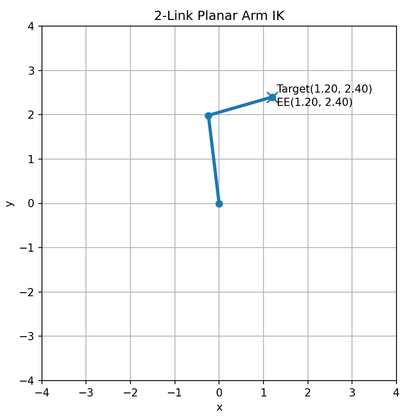

# 순기구학

순기구학(Forward Kinematics)이란 링크 두 부분 사이 좌표계 관계를, 그 링크의 관절값(joint values)에 기초하여 수학적으로 결정하는 것을 의미합니다. 그리고 매니퓰레이터의 경우 Base의 좌표계와 EE의 좌표계 사이의 관계를 구하는 문제라고도 설명될 수 있습니다. 

즉, 쉽게 말해 관절값을 알고 있을 때 로봇 손 끝, 즉 EE가 어디에 있고 어느 방향을 향하는가를 구하는 과정이라고 볼 수 있습니다. 여기서 입력은 로봇의 설정, 즉 '어떠한 시점에서 로봇의 형상을 완전히 결정하는 모든 조인트 값의 집합' 입니다. 그리고 출력은 base 좌표계에 대한 EE 좌표계의 위치와 방향입니다. 

순기구학의 원리는 각 조인트의 바로 앞 좌표계와 다음 좌표계 사이에 하나의 로컬 변환(local transform)을 만드는 것입니다. 이 로컬 변환은 앞에서 배운 동차변환행렬로 쓸 수 있습니다. 그러면 base에서부터 첫 번째 링크, 첫 번째 링크에서 두 번째 링크, 두 번째 링크에서 n번째 링크처럼 기구학 체인(kinematic chain) 을 따라 변환을 차례대로 곱해 나가면 최종적으로 EE의 자세가 게산될 수 있습니다.

수식으로 쓰면, 각 링크 사이의 변환을 $^{i-1}T_{i}(q_{i})$ 라고 할 때 전체 변환은 아래처럼 표현됩니다.

$$^{0}T_{n} = ^{0}T_{1}(q_{1})^{1}T_{2}(q_{2})\cdots ^{n-1}T_{n}(q_{n})$$

여기서 $q_{i}$ 는 각 조인트의 관절값입니다.

위 과정을 식으로 정리하는 대표적인 방법 중 하나가 DH 파라미터입니다. DH 파라미터는 각 링크의 길이와 비틀림으로, 각 조인트를 링크 offset과 조인트 각으로 기술하고 이로부터 조인트 사이의 동차변환행렬을 계산하는 것입니다. 

정리하자면, 순기구학은 주어진 관절값으로부터 로봇의 손 끝 자세를 구하는 문제입니다. 그리고 이 계산의 본질은 각 조인트가 만드는 좌표계 변환을 동차변환행렬로 나타내고, 이를 base부터 EE까지 차례대로 곱하는 것입니다.

## 실습 1 : 2 link 로봇 EE 자세 파악하기

아래는 관절각이 주어졌을 때, 각 링크의 위치와 최종 EE 자세를 계산하여 이를 시각화 시킨 코드입니다. 조인트는 Revolute Joint를 사용합니다.

```python
import numpy as np
import matplotlib.pyplot as plt

l1 = 2.0
l2 = 1.5
theta1 = np.deg2rad(75)
theta2 = np.deg2rad(25)

T01 = np.array([
    [np.cos(theta1), -np.sin(theta1), l1 * np.cos(theta1)],
    [np.sin(theta1),  np.cos(theta1), l1 * np.sin(theta1)],
    [0.0, 0.0, 1.0]
])

T12 = np.array([
    [np.cos(theta2), -np.sin(theta2), l2 * np.cos(theta2)],
    [np.sin(theta2),  np.cos(theta2), l2 * np.sin(theta2)],
    [0.0, 0.0, 1.0]
])

T02 = T01 @ T12

joint1 = T01[:2, 2]
ee = T02[:2, 2]

x = [0, joint1[0], ee[0]]
y = [0, joint1[1], ee[1]]

reach = l1 + l2

plt.figure(figsize=(6, 6))
plt.plot(x, y, marker='o', linewidth=3)
plt.scatter(ee[0], ee[1], s=80)
plt.text(ee[0] + 0.1, ee[1] + 0.1, f'EE({ee[0]:.2f}, {ee[1]:.2f})')
plt.xlim(-reach - 0.5, reach + 0.5)
plt.ylim(-reach - 0.5, reach + 0.5)
plt.gca().set_aspect('equal')
plt.grid(True)
plt.xlabel('x')
plt.ylabel('y')
plt.title('2-Link Planar Arm')
plt.show()
```

변수 `l1`, `l2` 는 각각의 링크 길이를 의미하며, `theta1`, `theta2` 변수는 각 관절의 회전각을 의미합니다. 

`T01` 은 베이스 좌표계에서 첫 번째 링크 끝 좌표계까지의 동차변환행렬입니다. 즉, 첫 번째 조인트 회전 `theta1` 과 첫 번째 링크 길이 `l1` 을 반영해서 첫 번째 링크 끝점이 어디에 놓이는 지 나타냅니다.

`T12` 는 첫 번째 링크 좌표계에서 두 번째 링크 끝 좌표계까지의 동차변환행렬입니다.

<br>

이 후 아래 코드를 통해 동차변환행렬을 연산합니다. 이를 계산하면, 베이스 좌표계에서 본 최종 EE 좌표계가 나옵니다. 즉, FK의 핵심임 로컬 좌표계 변환을 체인으로 곱해서 최종 손 끝 자세를 구하는 것입니다.

```python
T02 = T01 @ T12
```

$$T_{02}=T_{01}T_{12}$$

<br>

`joint1 = T01[:2, 2]` 는 첫 번째 링크 끝점의 $x,y$ 좌표를 꺼내오는 부분입니다. 2차원 동차변환행렬에서 마지막 열의 앞 두 값은 해당 좌표계 원점의 위치를 뜻하므로, 이것이 곧 첫 번째 관절 위치가 됩니다.

`ee = T02[:2, 2]` 는 최종 EE 위치를 꺼내는 부분입니다

`reach` 변수란 로봇팔이 이론적으로 도달할 수 있는 최대 거리를 말합니다.

---

출력 결과는 아래와 같습니다.


<br>

이 예제를 통해 관절값이 정해지면 각 링크의 위치도 정해지고 최종 EE 위치도 자동으로 정해져서 계산될 수 있는 것을 확인할 수 있습니다.

# 역기구학의 원리

앞에서 설명한 순기구학은 관절값을 알고 있을 때 EE 자세를 구하는 과정이라고 설명하였습니다. 그리고 그 반대를 구하는 것이 역기구학(Inverse Kinematics)입니다. 역기구학은 링크의 두 부분 사이 좌표계 관계를 바탕으로, 조인트의 관절값을 수학적으로 결정하는 것입니다. 매니퓰레이터의 경우 보통 EE와 Base 좌표계 사이의 관계로부터 관절값을 구하는 것입니다.

쉽게 다시 말하자면, EE의 원하는 위치와 방향으로 보내기 위해 각 관절을 어떻게 움직여야 하는가를 구하는 과정입니다. 여기서 입력은 원하는 EE의 자세를 넣고, 출력은 그 자세를 만들 수 있는 설정값, 즉 조인트 값의 집합입니다.

역기구학은 아래와 같이 식을 작성할 수 있습니다.

$$f(q) = ^{0}T_{n,des}$$

위 식을 만족하는 관절값 $q$ 를 찾는 문제입니다. 여기서 중요한 점은, 역기구학이 단순히 순기구학의 함수를 뒤집어서 출력되는 게 아니라는 것입니다. 실제 로봇에서는 이 식을 만족하는 관절값을 직접 유도해야 하거나, 경우에 따라서 수치적으로 탐색해야 합니다.

역기구학이 순기구학보다 어려운 점은, 정답이 하나로 정해지지 않을 수 있기 때문입니다. 어떤 목표 자세에 대해서 서로 다른 여러 관절 구성이 같은 EE 자세를 만들 수 있습니다. 또한 조인트 수가 많아질수록 가능한 해의 수가 늘어날 수 있다고 설명합니다.

반대로, 원하는 자세가 항상 가능한 것도 아닙니다. 여러 해 가운데 일부가 조인트 값 범위 및 물리적 제한 때문에 실제로 사용하지 못하는 것도 존재할 수 있습니다. 즉, 수학적으로 해가 잇을 것처럼 보여도 실제 로봇에서는 고려해야할 상황이 훨씬 많을 수 있습니다. 따라서 역기구학에서는 단순히 해를 구하는 것을 넘어서 그 해가 실제 로봇에서 가능한 동작을 수행할 수 있는 해인가를 확인해야 합니다.

정리하자면 아래 표와 같습니다.

| -- | 순기구학 | 역기구학 |
| --- | ----- | ------ |
| 입력 | 관절값 | EE 자세 |
| 출력 | EE 자세 | 관절값 |
| 해의 개수 | 1개 | 여러 개이거나 없음 |


## 실습 : 2 link 로봇의 EE 위치에 따른 관절값 구하기

아래는 EE 위치가 주어졌을 때, 그 위치에 도달할 수 있는 관절각을 계산하여 이를 시각화 시킨 코드입니다. 조인트는 Revolute Joint를 사용합니다.

```python
import numpy as np
import matplotlib.pyplot as plt

l1 = 2.0
l2 = 1.5
target = np.array([1.2, 2.4])
elbow_up = False

r2 = target[0] ** 2 + target[1] ** 2
c2 = (r2 - l1 ** 2 - l2 ** 2) / (2 * l1 * l2)

if np.abs(c2) > 1.0:
    raise ValueError("Target is outside reachable workspace.")

c2 = np.clip(c2, -1.0, 1.0)
s2 = np.sqrt(1.0 - c2 ** 2)

if not elbow_up:
    s2 = -s2

theta2 = np.arctan2(s2, c2)
theta1 = np.arctan2(target[1], target[0]) - np.arctan2(l2 * s2, l1 + l2 * c2)

joint1 = np.array([l1 * np.cos(theta1), l1 * np.sin(theta1)])
ee = joint1 + np.array([l2 * np.cos(theta1 + theta2), l2 * np.sin(theta1 + theta2)])

print(f"theta1 = {np.rad2deg(theta1):.2f} deg")
print(f"theta2 = {np.rad2deg(theta2):.2f} deg")
print(f"target = ({target[0]:.3f}, {target[1]:.3f})")
print(f"ee = ({ee[0]:.3f}, {ee[1]:.3f})")

reach = l1 + l2

plt.figure(figsize=(6, 6))
plt.plot([0, joint1[0], ee[0]], [0, joint1[1], ee[1]], marker='o', linewidth=3)
plt.scatter(target[0], target[1], s=100, marker='x')
plt.text(target[0] + 0.1, target[1] + 0.1, f'Target({target[0]:.2f}, {target[1]:.2f})')
plt.text(ee[0] + 0.1, ee[1] - 0.2, f'EE({ee[0]:.2f}, {ee[1]:.2f})')
plt.xlim(-reach - 0.5, reach + 0.5)
plt.ylim(-reach - 0.5, reach + 0.5)
plt.gca().set_aspect('equal')
plt.grid(True)
plt.xlabel('x')
plt.ylabel('y')
plt.title('2-Link Planar Arm IK')
plt.show()
```

`target` 변수는 EE가 도달해야 하는 목표 위치입니다. 또한 `elbow_up` 변수는 역기구학에서 나올 수 있는 복수 해를 선택하기 위한 값입니다. 팔꿈치가 위로 꺾이거나, 아님 아래로 꺾이게끔 하는 형태를 선택할 수 있습니다.

<br>

아래 코드는 목표점까지의 제곱입니다. 이 값은 추후 두 링크와 목표점이 이루는 삼각형 관계를 계산할 때 사용됩니다.

```python
r2 = target[0] ** 2 + target[1] ** 2
```

$$r^{2} = x^{2} + y^{2}$$

<br>

2개의 조인트와 하나의 목표점을 꼭지점으로 하면 하나의 삼각형을 만들 수 있습니다. 이를 이용해 코사인 법칙을 활용하여 두 번째 관절각 $\theta_{2}$ 에 대한 코사인 값을 알 수 있습니다.

```python
c2 = (r2 - l1 ** 2 - l2 ** 2) / (2 * l1 * l2)
```

$$\cos \theta_{2} = \frac{r^{2}-l^{2}_{1}-l^{2}_{2}}{2l_{1}l_{2}}$$

<br>

코사인 값을 알아냈다면, 두 번째 관절각을 계산합니다. $\sin \theta_{2}$ 와 $\cos \theta_{2}$를 이용해 $\theta_{2}$ 를 복원합니다.

```python
c2 = np.clip(c2, -1.0, 1.0)
s2 = np.sqrt(1.0 - c2 ** 2)

if not elbow_up:
    s2 = -s2

theta2 = np.arctan2(s2, c2)
```

$$\sin \theta_{2} = \pm \sqrt{1-\cos^{2}\theta_{2}}$$

이때 $\pm$ 이 나오는 이유가 바로 IK의 다중해 때문입니다. 같은 코사인 값에 대해 두 가지 부호를 가질 수 있습니다. 이 후 `atan2` 를 통해 계산합니다.

<br>

아래 코드 및 식은 역기구학에서 가장 중요한 식 중 하나입니다. 먼저 목표점을 향하는 전체 방향을 잡고, 그 다음 링크 2가 차지하는 기하학적 각도를 빼서 링크 1의 실제 각도 $\theta_{1}$ 를 구합니다.

```python
theta1 = np.arctan2(target[1], target[0]) - np.arctan2(l2 * s2, l1 + l2 * c2)
```

$$\theta_{1} = arctan2(y,x) - arctan2(l_{2}\sin\theta_{2},l_{1} + l_{2}\cos\theta_{2})$$

<br>

그 아래 코드는 검증 및 시각화를 담당합니다.

---

실행 결과는 아래와 같습니다.

