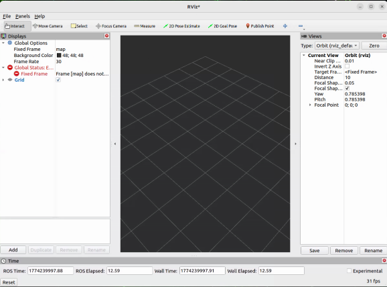
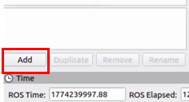
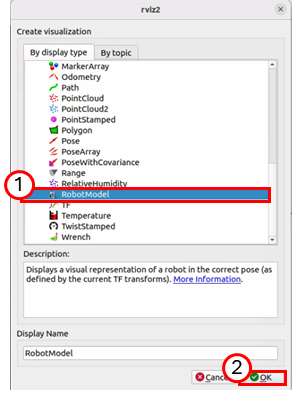
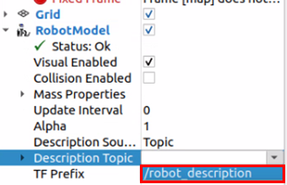
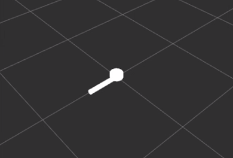
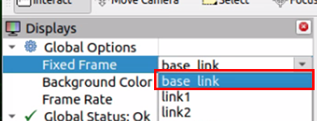
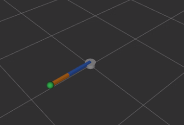
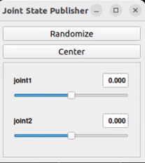
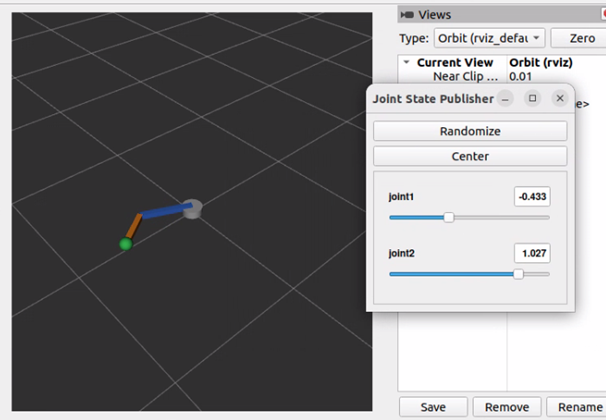
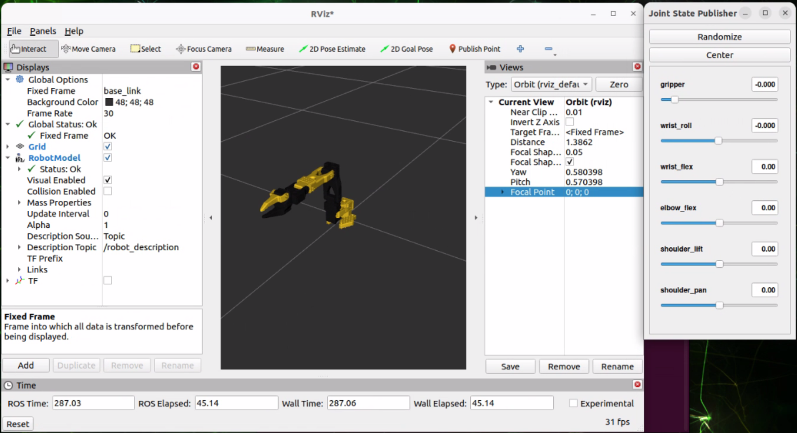

# 로봇 모델링

로봇 모델링이란 **실제 로봇을 컴퓨터가 이해할 수 있는 구조로 변환**하는 작업입니다. 모델링을 통해 만들어진 로봇 모델은 로봇의 형상과 구조를 기술하고, 어떤 부품이 어디에, 어떤 방식으로 연결되는지 담겨 있습니다. 이 모델을 활용하여 현재 각 부품의 좌표가 어딘지, 좌표계가 서로 어떤 관계에 있는지 시간에 따라 추적할 수 있고, 실제 동작처럼 정밀하게 제어하고 재현할 수 있습니다.

## URDF

URDF(Unified Robot Description Format)는 ROS에서 널리 사용되는 로봇 기술 형식이며, 로봇의 형상 및 구성을 표현하는 데 사용됩니다. 

URDF에서 사용할 수 있는 여러 키워드 중, 가장 핵심은 link와 joint입니다. URDF는 궁극적으로 하나의 루트 링크를 가진 트리 구조로써, 링크나 조인트가 독립적으로 놓이는 것이 아니라 **부모 링크와 조인트의 관계를 명확하게 나타내는 것**이어야 합니다. 인간의 팔이 어깨에서부터 시작한다고 가정하면 팔꿈치, 손목 순으로 뼈와 근육을 통해 이어져 있습니다. 매니퓰레이터도 마찬가지로 Base부터 시작해 EE까지 연결 구조를 명확하게 나타내주어야 합니다.

또한, 각 부품의 위치 및 방향 또한 지정할 수 있습니다. 특정 링크를 길게 하거나 조인트의 방향을 링크와 수직으로 설정하는 등 다양한 로봇의 형태에 따라 URDF에서도 자유롭게 기술합니다.

URDF 태그에 관한 더 자세한 내용은 아래 사이트를 참고해 주시기 바랍니다.

- https://wiki.ros.org/urdf/XML

### URDF 예시

다음은 URDF 예시입니다.

```xml
<?xml version="1.0"?>
<robot name="simple_planar_arm">

  <link name="base_link">
    <visual>
      <origin xyz="0 0 0.03" rpy="0 0 0"/>
      <geometry>
        <cylinder radius="0.08" length="0.06"/>
      </geometry>
    </visual>
  </link>

  <link name="upper_arm_link">
    <visual>
      <origin xyz="0.20 0 0" rpy="0 0 0"/>
      <geometry>
        <box size="0.40 0.04 0.04"/>
      </geometry>
    </visual>
  </link>

  <joint name="shoulder_joint" type="revolute">
    <parent link="base_link"/>
    <child link="upper_arm_link"/>
    <origin xyz="0 0 0.06" rpy="0 0 0"/>
    <axis xyz="0 0 1"/>
    <limit lower="-1.57" upper="1.57" effort="1.0" velocity="1.0"/>
  </joint>

</robot>
```

위 URDF 파일은 하나의 조인트와 두 개의 링크로 이루어져 있습니다.

먼저 링크를 살펴보겠습니다. `base_link`는 Base와 같은 역할을 하며 일반적으로 기준 좌표계로 둡니다. 또한, `<link>` 태그 안에 `<visual>` 태그를 통해 실제로 보이는 부분을 명시했습니다.`<origin>` 태그로 링크가 어디에 위치해야 하는지 명시했고, `<geometry>` 태그를 통해 링크를 이루는 물체의 크기와 종류를 명시합니다.

다음은 조인트를 살펴보겠습니다. 우선 조인트의 종류는 `<joint>` 태그 속성으로 `type="revolute"` 구문을 통해 회전 조인트임을 확인합니다. 태그 안을 살펴보면 `<parent link="..."/>`, `<child link="..."/>`가 명시됩니다. 이들은 앞서 설명했던 대로 링크와 조인트의 연결 관계를 명확하게 보여줍니다. 트리는 `base_link` → `shoulder_joint` → `upper_arm_link`로 이어집니다. 또한 `<origin>` 태그로 조인트의 위치를 명시하고, `<axis>` 태그로 좌표계 축 방향을 명시, `<limit>` 태그로 조인트 자유도의 범위를 지정해 주었습니다.

## TF

3장 기초 로봇공학에서 좌표계가 무엇이고 각 조인트마다 좌표계가 부착되며 특정 연산을 통해 매니퓰레이터의 위치와 방향이 바뀔 수 있다고 배웠습니다. 그렇다면 이를 실전 로봇 제어에 도입하려면 어떻게 해야 할까요? 로봇을 제어할 때마다 행렬 연산을 하는 건 너무 번거로운 일일 것입니다.

ROS2에서는 이를 위해 tf2라는 **좌표 변환 라이브러리**를 사용합니다. tf2는 여러 좌표계 사이의 관계를 시간에 따라 관리합니다.

조인트의 값이 변하면 링크들의 자세는 연쇄적으로 변합니다. 이전 장의 순기구학에서 확인했듯이, 단 한 개의 조인트를 미세하게 제어하더라도 해당 조인트의 운동 값에 따라 매니퓰레이터의 위치와 방향이 변합니다. 이렇듯 각 조인트에 연쇄적으로 영향을 받는 좌표계들의 정보를 실시간으로 받습니다. 각 링크 및 조인트의 체인 정보 또한 담겨 있어 매니퓰레이터 제어를 위해 꼭 필요한 정보입니다.

일반적으로 몸체를 기준으로 하여 좌표축 방향을 x 전방, y 좌측, z 상향으로 둔다고 정리합니다.

## Robot State Publisher

위 챕터를 통해 TF가 무엇이고 왜 필요한지에 대해 살펴보았습니다. 그렇다면 실질적으로 TF를 발행하려면 어떻게 해야 할까요?

ROS2에서는 `robot_state_publisher` 패키지를 제공합니다. 이 패키지는 ROS2 프로그램이 시작할 때 먼저 URDF로 작성된 로봇 운동학 트리 모델을 입력으로 받습니다. 이후 특정 topic을 구독해 각 조인트 상태를 읽은 다음 그 상태 값을 바탕으로 각 링크의 3차원 자세를 계산한 뒤 TF로 내보냅니다.

고정 조인트의 TF는 `/tf_static`, 움직이는 조인트의 TF는 `/tf`로 발행됩니다.


## 실습: 2축 매니퓰레이터 모델링

지금까지 로봇 모델링에 필요한 정보들을 알아보았습니다. 이제 직접 URDF를 작성하고 패키지를 만들어 ROS2의 시각화 도구인 RViz에서 시각화하는 과정을 실습해 보겠습니다.

### 패키지 생성

먼저 PhysicAI Arm에 연결 후, 다음 명령어를 입력하여 패키지를 생성합니다.

```sh
source ~/ros2_base/install/setup.bash

mkdir -p ~/ros_ws/src
cd ~/ros_ws/src

ros2 pkg create --build-type ament_python hello_robot_model
```

### URDF 파일 작성

`hello_robot_model` 패키지 경로 아래에 `urdf` 폴더를 생성한 뒤, 해당 폴더에 `simple_2r_arm.urdf`라는 이름의 URDF 파일을 생성합니다. 이후, 아래의 내용을 입력합니다.

```xml
<?xml version="1.0"?>
<!-- urdf/simple_2r_arm.urdf -->
<robot name="simple_2r_arm">

  <material name="gray">
    <color rgba="0.7 0.7 0.7 1.0"/>
  </material>

  <material name="blue">
    <color rgba="0.2 0.4 0.8 1.0"/>
  </material>

  <material name="orange">
    <color rgba="0.9 0.5 0.1 1.0"/>
  </material>

  <material name="green">
    <color rgba="0.2 0.7 0.3 1.0"/>
  </material>

  <link name="world"/>

  <link name="base_link">
    <visual>
      <origin xyz="0 0 0.03" rpy="0 0 0"/>
      <geometry>
        <cylinder radius="0.08" length="0.06"/>
      </geometry>
      <material name="gray"/>
    </visual>
  </link>

  <joint name="world_to_base" type="fixed">
    <parent link="world"/>
    <child link="base_link"/>
    <origin xyz="0 0 0" rpy="0 0 0"/>
  </joint>

  <link name="link1">
    <visual>
      <origin xyz="0.20 0 0" rpy="0 0 0"/>
      <geometry>
        <box size="0.40 0.04 0.04"/>
      </geometry>
      <material name="blue"/>
    </visual>
  </link>

  <joint name="joint1" type="revolute">
    <parent link="base_link"/>
    <child link="link1"/>
    <origin xyz="0 0 0.06" rpy="0 0 0"/>
    <axis xyz="0 0 1"/>
    <limit lower="-1.57" upper="1.57" effort="1.0" velocity="1.0"/>
  </joint>

  <link name="link2">
    <visual>
      <origin xyz="0.15 0 0" rpy="0 0 0"/>
      <geometry>
        <box size="0.30 0.04 0.04"/>
      </geometry>
      <material name="orange"/>
    </visual>
  </link>

  <joint name="joint2" type="revolute">
    <parent link="link1"/>
    <child link="link2"/>
    <origin xyz="0.40 0 0" rpy="0 0 0"/>
    <axis xyz="0 0 1"/>
    <limit lower="-1.57" upper="1.57" effort="1.0" velocity="1.0"/>
  </joint>

  <link name="tool_link">
    <visual>
      <geometry>
        <sphere radius="0.05"/>
      </geometry>
      <material name="green"/>
    </visual>
  </link>

  <joint name="tool_joint" type="fixed">
    <parent link="link2"/>
    <child link="tool_link"/>
    <origin xyz="0.30 0 0" rpy="0 0 0"/>
  </joint>

</robot>
```

### package.xml 파일 수정

아래 코드를 참고하여 패키지 내 `package.xml` 파일을 수정합니다.

```xml
...
  <depend>robot_state_publisher</depend>
  <depend>joint_state_publisher_gui</depend>
  <depend>rviz2</depend>
...
```

### launch 파일 생성

`hello_robot_model` 패키지 경로 아래에 `launch` 폴더를 생성한 뒤, 해당 폴더에 `bringup.launch.py`라는 이름의 파이썬 파일을 생성합니다. 이후, 아래의 내용을 입력합니다.

```python
# launch/bringup.launch.py

from launch import LaunchDescription
from launch_ros.actions import Node
from ament_index_python.packages import get_package_share_directory
import os

def generate_launch_description():
    pkg_dir = get_package_share_directory('hello_robot_model')
    urdf_path = os.path.join(pkg_dir, 'urdf', 'simple_2r_arm.urdf')

    with open(urdf_path, 'r', encoding='utf-8') as f:
        robot_description = f.read()

    return LaunchDescription([
        Node(
            package='robot_state_publisher',
            executable='robot_state_publisher',
            parameters=[{'robot_description': robot_description}]
        ),
        Node(
            package='joint_state_publisher_gui',
            executable='joint_state_publisher_gui'
        ),
        Node(
            package='rviz2',
            executable='rviz2'
        )
    ])
```

이 launch 파일에서 실행되는 노드는 다음과 같습니다.

- `robot_state_publisher`
- `joint_state_publisher_gui` : 각 조인트의 값을 GUI를 통해 조절할 수 있게 하는 노드입니다.
- `rviz2` : 시각화 도구입니다. 자세한 내용은 뒤에서 다시 설명합니다.

### setup.py 수정

아래 코드를 참고하여 패키지 내 `setup.py` 파일을 수정합니다.

```python
...
    data_files=[
        ('share/ament_index/resource_index/packages',
            ['resource/' + package_name]),
        ('share/' + package_name, ['package.xml']),
        ('share/' + package_name + '/urdf', ['urdf/simple_2r_arm.urdf']),
        ('share/' + package_name + '/launch' , ['launch/bringup.launch.py'])
    ], 
...
```

### 빌드 및 실행

터미널에서 아래 명령어를 입력하여 패키지를 빌드한 뒤 실행합니다.

```sh
cd ~/ros_ws
colcon build --symlink-install --packages-select hello_robot_model
source ./install/setup.bash
ros2 launch hello_robot_model bringup.launch.py
```

### RViz2 시각화

RViz2는 ROS2용 3D 시각화 툴입니다. 로봇 모델링과 주변 환경, 센서 데이터 등을 시각화하기 위해 사용됩니다. RViz2에서 출력되는 요소들은 ROS2의 topic을 구독하여 topic에서 받은 값을 화면 출력에 반영합니다.

RViz2에 대한 자세한 내용은 아래 링크를 참고하시기 바랍니다.

- https://docs.ros.org/en/humble/Tutorials/Intermediate/RViz/RViz-User-Guide/RViz-User-Guide.html

위 과정을 통해 프로그램을 실행하면 다음 사진과 같이 RViz 기본 화면이 실행됩니다.



<br><br>

왼쪽 아래에 'Add' 버튼을 눌러 Display를 추가하는 창을 엽니다.



<br><br>

표시되는 창에서 로봇 모델을 표시할 Display 창을 선택합니다. `rviz_default_plugins` > `RobotModel`을 선택합니다.



<br><br>

'OK' 버튼을 클릭하면 RViz2 좌측 'Displays' 패널에 'RobotModel' 항목이 추가된 것을 확인합니다. 이 항목을 확장하여 'Description Topic' 항목을 클릭해 아래 사진과 같이 `/robot_description` topic을 받도록 설정합니다.



<br>

Topic 적용 시 아래와 같이 표시되는 것을 확인합니다.



<br><br>

위 작업을 통해 로봇 모델링 파일을 불러다 배치하는 것은 성공하였습니다. 하지만 Display 패널에는 에러가 출력되고, 표시되는 로봇도 아무런 색상 없이 흰색으로만 표시됩니다. 에러가 출력되는 이유는 RViz2의 Fixed Frame이 현재 발행되는 TF 프레임과 맞지 않기 때문입니다. Global Options의 Fixed Frame을 `\base_link`로 설정하면 정상적으로 표시됩니다.

앞서 로봇 모델링은 트리 구조로 연결되어 있다고 설명하였습니다. 이에 이 정보를 URDF에 기재하여 표시하는데, 문제는 URDF에서 base가 어디인지를 명확하게 설정하지 않고 있습니다. 따라서 아래 사진과 같이 RViz2가 기준으로 삼을 링크를 지정한다면 정상적으로 로봇의 속성이 표시됩니다.

Displays 패널의 Global Options에서 Fixed Frame을 `base_link`로 설정합니다.



<br>

base를 설정하면 아래 사진과 같이 속성이 잘 반영되어 출력되는 것을 확인합니다.



### 조인트 변경 확인

프로그램 실행 시 아래와 같이 조인트 값을 GUI를 통해 변경할 수 있는 프로그램이 실행됩니다.



<br>

이 GUI의 각 조인트에 해당되는 슬라이더 바를 조절하면 조인트 값을 바꿔 보고, 해당 조인트 값이 정상적으로 반영되는지 RViz2를 통해 확인합니다.



## PhysicAI Arm 모델링 정보

PhysicAI Arm 장비에서 각 좌표계 및 위치를 계산하기 위해서는 동일하게 로봇 모델링 파일이 필요합니다. PhysicAI Arm의 각 링크 및 조인트의 정보는 아래와 같습니다.

**Link**

| Name | length (mm) |
| ---- | ----------- |
| base_link | 46.84 |
| shoulder_link | 79.38 |
| upper_arm_link | 116.09 |
| lower_arm_link | 134.37 |
| wrist_link | 58.17 |
| gripper_link | 33.49 |


**Joint**

대부분의 joint는 Revolute Joint이며, Gripper Joint는 별도로 정의합니다.

| Name | Range ($\theta$) | axis xyz |
| ---- | ----------- | ----- |
| shoulder_pan | -1.92 ~ 1.92 | x / y / yaw |
| shoulder_lift | -1.75 ~ 1.75 | y / z / pitch |
| elbow_flex | -1.69 ~ 1.69 | y / z / pitch |
| wrist_flex | -1.66 ~ 1.66 | y / z / pitch |
| wrist_roll | -2.74 ~ 2.74 | roll |
| gripper | -0.17 ~ 1.75 | - |

위 정보들을 바탕으로 URDF를 작성하여 로봇 모델링 파일을 만들고 TF를 발행합니다. 원활한 실습을 위해 모델링 진행 및 TF 발행, 그리고 다음 챕터에서 소개할 제어 topic까지 모두 포함된 PhysicAI Arm 제어 패키지를 제공합니다.

다음 명령어를 통해 다운로드하고 설치한 뒤 실행합니다.

```sh
mkdir -p ~/physicai_arm_ws/src
cd ~/physicai_arm/src
git clone https://github.com/hanback-lab/PhysicAI-Arm-ROS
cd physicai_arm
chmod +x launch/*.launch.py
cd ../..
colcon build --symlink-install --packages-select physicai_arm
```

다음 명령어를 통해 패키지를 실행합니다. 실질적인 제어 방법은 다음 챕터에서 이어집니다.

```
source ./install/setup.bash
ros2 launch physicai_arm bringup.launch.py
```

## 연습 과제 : PhysicAI Arm 로봇 모델을 RViz2에 출력하기

요구되는 다음 조건에 맞춰 PhysicAI Arm을 RViz2에 출력하고, 각 조인트의 움직임이 시각화되도록 launch 파일을 수정하여 패키지를 실행하시기 바랍니다.

**과제 조건**

- 본 챕터의 목차 *PhysicAI Arm 모델링 정보*를 참고하여 실행 원본 패키지를 준비한 후 복사하고, 임의의 이름으로 변경하여 작업을 진행하시오. 
- 패키지 내 `launch/bringup.launch.py` 경로에 있는 launch 파일을 수정하여 아래 노드들이 추가적으로 실행되도록 변경하시오.
  - `rviz2`
  - `joint_state_publisher_gui`
- `joint_state_publisher_gui`는 현재 `joint_states`에 값을 발행하도록 설정되어 있습니다. `remapping` 옵션을 사용하여 `/joint_states` topic이 `/joint_targets`로 매핑되도록 설정하십시오.
- `physicai_arm` 패키지 실행 후, `/robot_description` topic에 발행되고 있는 모델링 정보를 RViz2에 출력하시오.
- `joint_state_publisher_gui`를 통해 조인트가 실시간으로 변하는지 확인하시오.

출력이 완료되면 아래와 같이 표시됩니다.



<br>

> [!Warning]
> 값을 변경할 땐 슬라이더 바를 천천히 조절해가며 제어해 주십시오. (초당 권장 변경 값 : 0.1) 너무 빠른 속도로 로봇을 제어하게 될 경우 장비가 파손될 위험이 있습니다.

> [!NOTE]
> RViz2의 Display 기능 중 'TF'라는 기능이 있습니다. 이는 각 조인트의 부착된 좌표계를 시각화합니다. TF를 붙인 뒤 조인트 각도를 조절하면서 각 조인트의 부착된 좌표계가 어떻게 변화되는지 눈으로도 확인해 보세요. 