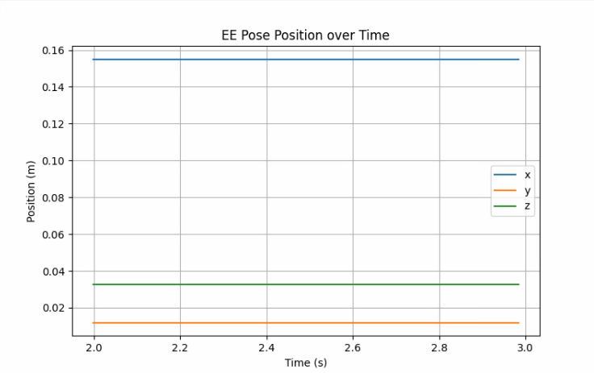
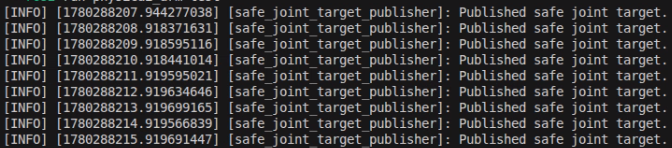
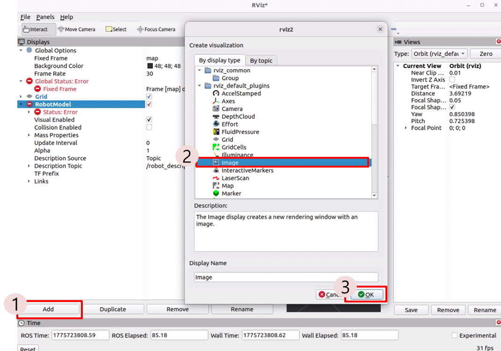
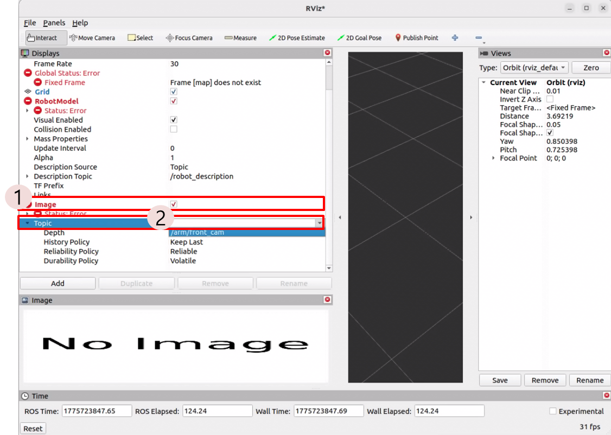
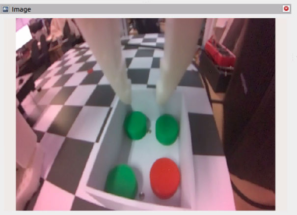
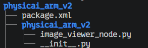

# Robot Control

이전 챕터에서는 컴퓨터가 로봇을 이해할 수 있도록 로봇 모델을 표현하는 방법을 배웠습니다. 이 챕터에서는 ROS2와 기초 로봇 공학 지식을 바탕으로 topic을 발행해 로봇을 실제로 제어하는 방법을 살펴봅니다. 

제어 패키지 다운로드 및 실행은 [4장의 4.1. Robot Modeling](/Chapter04.%20Robot%20Modeling/4-1.%20Robot%20Modeling.md#연습-과제-:-PhysicAI-Arm-로봇-모델을-RViz2에-출력하기)을 참고해 주시기 바랍니다. 모든 실습은 bringup 런치파일을 실행한 뒤 진행합니다.

## topic 구조

제공되는 제어 패키지의 topic은 다음과 같습니다.

| topic | 메시지 | Pub/Sub | 설명 |
| ----- | ---- | --- | ---- | 
| /joint_states | sensor_msgs/JointState | Pub | 각 조인트의 관절 값 발행 | 
| /joint_targets | sensor_msgs/JointState | Sub | 각 조인트의 관절 값 구독
| /robot_description | std_msgs/String | Pub | 로봇의 구조를 담은 URDF 문자열 |
| /safety/torque_enable | std_msgs/Bool | Sub | 토크 인터락 구독 |
| /tf | tf2_msgs/TFMessage | Pub | TF 값 발행 |
| /tf_static | tf2_msgs/TFMessage | Pub | 정적 TF 값 발행 |

## Safety 인터락

모든 산업용 로봇들은 발생할 수 있는 안전사고에 대비하여 안전 관련 기능이 탑재되어 있습니다. 대표적으로 수행 중인 동작을 즉시 정지하는 긴급 정지 기능이 있습니다.

본 장비에도 모터에 부여된 토크를 일시적으로 비활성화하는 안전 관련 topic이 존재합니다. 제어 패키지를 실행하면 로봇은 가장 기본 자세로 이동하고 각 모터에 토크가 활성화되어 손 등의 방법을 통해 임의로 로봇 자세를 변경할 수 없습니다. 로봇 제어 측면에서는 이런 토크 활성화가 필수적이지만, 실습 등의 요인으로 어떤 경우는 이 토크를 비활성화해 로봇의 자세를 임의로 조작해야 할 때도 존재합니다.

제어 패키지는 `safety/torque_enable` topic을 구독하여 Safety 인터락 기능을 활성화하거나 비활성화합니다. 이 topic은 `std_msgs/Bool` 메시지를 사용해 통신하는데, 이 메시지는 ROS2 표준 메시지 중 하나이며 `True/False`와 같은 불리언 값을 담아 통신합니다.

먼저 모터의 토크를 비활성화해 보겠습니다. 새 터미널을 연 다음 아래 명령어를 입력합니다. 아래 명령어를 실행하면 손으로 로봇의 자세를 임의로 조정할 수 있는 것을 확인할 수 있습니다. 로봇을 손으로 조작하며 각 모터의 관절 값을 변경해 보세요.

```sh
source ~/ros2_base/install/setup.bash
ros2 topic pub --once /safety/torque_enable std_msgs/Bool "{data: false}"
```

ROS2 topic을 발행/구독하는 방법은 앞서 해보았듯이 패키지를 생성한 뒤 실행할 수도 있지만, 터미널과 같은 CLI에서 패키지 생성 없이 바로 topic을 발행하거나 구독할 수 있습니다.

본 교재에서는 실습을 위한 최소 수준의 ROS2 CLI를 사용합니다. 자세한 정보는 아래 링크를 확인하시기 바랍니다.

- https://docs.ros.org/en/humble/Tutorials/Beginner-CLI-Tools.html

다시 토크 값을 활성화하려면 터미널에 아래 명령어를 입력합니다.

```sh
ros2 topic pub --once /safety/torque_enable std_msgs/Bool "{data: true}"
```

## 현재 관절 값 읽기

> [!NOTE]
> 이 실습은 로봇을 손으로 임의 조작할 것이므로, 토크를 비활성화시킨 뒤 실습을 진행합니다.

ROS2 CLI를 통해 topic을 구독하여 각 조인트의 관절 값을 확인해 봅니다. 


해당 topic에서 받는 메시지는 `sensor_msgs/JointState`입니다. 이 메시지는 한 로봇의 각 관절의 상태를 효과적으로 표현할 수 있는 ROS2 표준 센서 메시지입니다. 이 메시지는 로봇이 현재 어떤 자세를 하고 있는지를 표현하는 핵심 데이터 구조이기에 여러 노드 및 현장에서 널리 쓰이는 메시지 타입입니다.

메시지 구조는 다음과 같습니다.

```
std_msgs/Header header

string[] name
float64[] position
float64[] velocity
float64[] effort
```

아래 내용은 메시지를 자세히 분석한 내용입니다.

### Header

```
std_msgs/Header header
```

해당 필드는 타임스탬프와 프레임 정보를 포함하며 로봇 상태가 언제 측정되었는지 나타냅니다. 이 메시지 역시 ROS2 표준 메시지이며, 해당 메시지의 상세한 내용은 다음과 같습니다.

| 필드 | 설명 |
| --- | --- |
| stamp | 데이터가 생성된 시간 |
| frame_id | 기준 좌표계 |

### name

```
string[] name
```

해당 필드는 각 관절의 이름을 담은 문자열 배열입니다. 해당 배열은 URDF 또는 로봇 모델에서 정의된 joint 이름과 반드시 동일해야 합니다.

여기서 중요한 점은 바로 순서입니다. 아래 소개할 다른 필드의 배열(position, velocity 등)과 순서가 반드시 동일해야 합니다.

### position

```
float64[] position
```

해당 필드는 각 관절의 위치(Position) 값을 나타냅니다. FK 계산에서 가장 핵심적으로 사용되는 값입니다.

### velocity

```
float64[] velocity
```

해당 필드는 각 관절의 속도를 나타냅니다. Revolute 조인트의 경우 속도를 rad/s 단위로 표현합니다. 

### effort

```
float64[] effort
```

해당 필드는 각 관절에 작용하는 힘이나 토크를 나타냅니다. Revolute 조인트의 경우 Nm 단위를 사용합니다.


### 실제 데이터 확인해 보기

터미널에 아래 명령어를 입력합니다.

```sh
ros2 topic echo /joint_states
```

아래는 topic을 구독했을 때 출력 예입니다.

```
header:
  stamp:
    sec: 28026
    nanosec: 109639488
  frame_id: ''
name:
- shoulder_pan
- shoulder_lift
- elbow_flex
- wrist_flex
- wrist_roll
- gripper
position:
- -0.07976700097005335
- -1.7978254834019713
- 1.5723303075827821
- -0.04295146206079795
- 0.007669903939428206
- -0.0046019423636569235
velocity: []
effort: []
```

이 메시지를 보고 우리는 다음과 같이 해석할 수 있습니다.

- shoulder_pan의 관절각은 -0.079767
- shoulder_lift의 관절각은 -1.797825
- 이하 생략

또한, 메시지를 더 살펴보면 velocity와 effort 배열의 값이 생략된 것을 확인할 수 있습니다. 현재 본 장비에서 관절 제어 속도가 고정되어 있어, 별도로 확인할 필요가 없기 때문입니다. 또한 정밀 토크 연산을 할 필요 없기 때문에 불필요한 데이터는 생략한 것으로 볼 수 있습니다. 이처럼 각 메시지의 모든 필드에 데이터를 다 채워 넣을 필요가 없으며, 필요한 것들만 걸러내어 사용할 수 있는 것을 확인할 수 있습니다.

현재 로봇의 토크를 비활성화해두었기 때문에 로봇의 관절각을 임의로 조정할 수 있습니다. 손으로 로봇의 자세를 변경해가며 각 관절에 해당하는 관절 값이 제대로 변하는지 확인해 보시기 바랍니다.

### 실습 1 현재 관절값 저장하기

앞서 배운 `ros2 topic echo` 명령어가 아닌 Python을 이용하여 관절값을 저장해 보겠습니다. JointState topic 값을 구독하여 joint_log.csv 파일로 저장하는 예제입니다.

```python
import rclpy
from rclpy.node import Node
from sensor_msgs.msg import JointState
import csv
import os
from datetime import datetime

class JointStateRecorder(Node):
    def __init__(self):
        super().__init__("joint_state_recorder")
        now = datetime.now().strftime("%Y%m%d_%H%M%S")
        self.file_path = os.path.expanduser(f"~/joint_state_log_{now}.csv")
        self.file = open(self.file_path, "w", newline="", buffering=1)
        self.writer = csv.writer(self.file)
        self.header_written = False
        self.sub = self.create_subscription(
            JointState,
            "/follower/joint_states",
            self.callback,
            10
        )
        self.get_logger().info(f"Saving joint states to {self.file_path}")

    def callback(self, msg):
        if not self.header_written:
            header = ["time"] + list(msg.name)
            self.writer.writerow(header)
            self.header_written = True
        time_sec = msg.header.stamp.sec + msg.header.stamp.nanosec * 1e-9
        row = [time_sec] + list(msg.position)
        self.writer.writerow(row)
        self.get_logger().info(
            ", ".join([f"{n}: {p:.3f}" for n, p in zip(msg.name, msg.position)])
        )

    def destroy_node(self):
        self.file.flush()
        os.fsync(self.file.fileno())
        self.file.close()
        self.get_logger().info(f"Saved to {self.file_path}")
        return super().destroy_node()

def main(args=None):
    rclpy.init(args=args)
    node = JointStateRecorder()
    try:
        rclpy.spin(node)
    except KeyboardInterrupt:
        pass
    finally:
        node.destroy_node()
        rclpy.shutdown()

if __name__ == "__main__":
    main()
```

```
time,shoulder_pan,shoulder_lift,elbow_flex,wrist_flex,wrist_roll,gripper
1780287951.4729958,-0.11044661672776616,-1.787087617886772,1.4296700943094176,1.368310862793992,0.11044661672776616,-0.0030679615757712823
1780287951.493293,-0.11044661672776616,-1.787087617886772,1.4296700943094176,1.368310862793992,0.11044661672776616,-0.0030679615757712823
1780287951.5138323,-0.11044661672776616,-1.787087617886772,1.4296700943094176,1.368310862793992,0.11044661672776616,-0.0030679615757712823
1780287951.5328646,-0.11044661672776616,-1.787087617886772,1.4296700943094176,1.368310862793992,0.11044661672776616,-0.0030679615757712823
1780287951.5602129,-0.11044661672776616,-1.787087617886772,1.4296700943094176,1.368310862793992,0.11044661672776616,-0.0030679615757712823
1780287951.575388,-0.11044661672776616,-1.787087617886772,1.4296700943094176,1.368310862793992,0.11044661672776616,-0.0030679615757712823
```

## EE 자세 추론, 지정

가장 기본적으로 필요한 관절각을 어떻게 읽는지 이해했으니, 이제 EE의 자세를 추론하거나 지정하는 방법을 알아봅시다. 

EE를 제어하는 데 사용하는 메시지는 `geometry_msgs/PoseStamped`입니다. 이 메시지는 특정 시점과 좌표계에서의 위치(Position)와 방위(Orientation)를 표현하는 메시지입니다. 단순한 좌표가 아닌 '언제, 어떤 좌표계 기준에서, 어디에 있고 어떤 방향을 보고 있는가'를 동시에 표현하는 것입니다.

PoseStamped 메시지 구조는 아래와 같습니다.

```
std_msgs/Header header
geometry_msgs/Pose pose
```

### header

앞서 설명한 `std_msgs/Header`와 필드 구성은 동일합니다. 다만 `frame_id`의 중요성이 매우 큽니다. 위치 및 방위는 좌표계에 따라 그 값이 전부 달라집니다. 어떤 frame_id, 어떤 좌표계를 기준으로 잡았는지 반드시 확인해야 합니다.

### pose

Pose는 두 부분으로 나누어집니다.

```
geometry_msgs/Point position
geometry_msgs/Quaternion orientation
```

**Position (위치)**

```
geometry_msgs/Point position
```

```
float64 x
float64 y
float64 z
```

- 단위 : 미터(m)
- 기준 : `header.frame_id`

이 필드는 기준 좌표계에서의 3D 위치를 표현합니다.

**Orientation (방위)**

```
geometry_msgs/Quaternion orientation
```

```
float64 x
float64 y
float64 z
float64 w
```

해당 필드 및 메시지는 기준 좌표계에서의 3D 방위를 표현합니다. 여기서 방위를 표현할 때 **Quaternion(쿼터니언)** 을 사용해서 표현합니다.

쿼터니언이란 방위를 표현하는 또 하나의 방식입니다. 좌표계의 회전을 담은 회전 행렬과 같은 역할을 합니다. 쿼터니언은 3차원 회전을 표현하는 방법 중 하나로 x, y, z, w 네 값으로 자세를 나타냅니다.

회전이 없는 기본 자세는 보통 다음과 같이 표현합니다.

```
orientation:
  x: 0.0
  y: 0.0
  z: 0.0
  w: 1.0
```

### 순기구학 연산을 통한 EE 자세 추론

> [!NOTE]
> 이 예제는 손 등으로 로봇을 임의로 조작할 것이므로 토크를 비활성화시킨 뒤 실습합니다.

앞 챕터에서 배운 순기구학/역기구학의 원리가 담긴 노드를 실행해 EE 자세 추론 및 지정을 해보겠습니다. 연산과 수행에 필요한 패키지는 전부 미리 구현되어 있으며 본 교재에서는 메시지를 구독 및 발행하여 값을 해석하고 지정하는 데 초점을 둡니다.

EE 자세를 추론하는 흐름은 다음과 같습니다.

1. 각 관절 값을 읽은 뒤 `JointState` 메시지를 담은 topic 발행
2. `JointState` 메시지를 읽은 뒤 파싱하여 순기구학(FK) 연산
3. 연산된 값을 `PoseStamped`로 변환하여 `/ee_pose` topic에 메시지 발행


터미널에 아래 명령어를 입력해 순기구학 연산 노드를 실행하여 현재 EE의 위치를 추정합니다.

```sh
source ~/physicai_arm_ws/install/setup.bash
ros2 run physicai_arm fk_calc
```

해당 노드를 실행하면 자동 연산 및 변환을 진행합니다. 발행되는 `PoseStamped` 메시지는 새 터미널을 열어 아래 명령어를 입력해 확인해 볼 수 있습니다.

```sh
source ~/physicai_arm_ws/install/setup.bash
ros2 topic echo /ee_pose
```

아래는 topic을 구독했을 때 출력 예시입니다.

```
header:
  stamp:
    sec: 1775205990
    nanosec: 29821297
  frame_id: base_link
pose:
  position:
    x: 0.17734785193739291
    y: 0.11006601991523621
    z: 0.04189928461211839
  orientation:
    x: 0.012889602852207969
    y: 0.0
    z: 0.0
    w: 1.0
```

이 메시지를 보고 다음과 같이 해석할 수 있습니다.

- 현재 기준 좌표계는 `base_link`로 두고 있음
- 위 좌표계를 기준으로 한 EE의 위치는 (0.177, 0.11, 0.041)에 위치함. 이는 x축으로 0.177m, y축으로 0.11m, z축으로 0.041m 위치에 있다는 의미
- 위 좌표계를 기준으로 한 EE의 방위는 쿼터니언 (x, y, z, w) = (0.013, 0, 0, 1.0)로 표현됨

현재 로봇의 토크를 비활성화해두었기 때문에 로봇의 관절각을 임의로 조정할 수 있습니다. 손으로 로봇의 자세를 변경해가며 EE의 자세가 올바르게 변하는지 확인하시기 바랍니다.

### 역기구학 연산을 통한 EE 자세 지정

> [!Important]
> 이 예제는 온보드에서 topic 발행 등을 활용해 로봇을 제어합니다. 토크를 활성화시킨 뒤 실습합니다.

EE 자세를 지정하는 방법은 다음과 같습니다.

1. 지정하고 싶은 로봇 자세를 `PoseStamped` 메시지로 담아 `/target_pose` topic에 메시지 발행
2. `PoseStamped` 메시지를 읽은 뒤 파싱하여 역기구학(IK) 연산
3. 연산된 값을 `JointState`로 변환하여 `/joint_targets` topic에 메시지 발행

터미널에 아래 명령어를 입력해 역기구학 연산 노드를 실행합니다.

```sh
source ~/physicai_arm_ws/install/setup.bash
ros2 run physicai_arm ik_calc
```

새 터미널에서 아래 명령어로 `/target_pose`에 원하는 EE 자세를 담은 PoseStamped 메시지를 발행하면, 입력값에 따라 로봇 자세가 변경됩니다.

```sh
source ~/physicai_arm_ws/install/setup.bash
ros2 topic pub --once /target_pose geometry_msgs/msg/PoseStamped "{
  header: {
   frame_id: 'base_link'
  },
  pose: {
    position: {x: 0.19, y: 0, z: 0.09},
    orientation: {x: -0.156, y: 0.957, z: -0.04, w: 0.243}
  }
}"
```

> [!Warning]
> 메시지 단위는 m입니다. 임의로 너무 큰 값을 주지 마십시오. 장비가 파손될 수 있습니다.


### Leader 제어

위와 같이 topic을 발행해서 EE를 원하는 자세로 지정할 수 있었습니다. 하지만 EE가 취해야 할 자세를 정확하게 모르거나, 연속적으로 자세를 변경해야 할 경우 위 방법은 매우 번거롭습니다.

따라서 조작기의 일종인, Leader(검은 팔)를 활용해 로봇을 제어합니다. Leader(검은 팔)를 활용하면 EE의 각 축에 따른 위치 및 방위를 조정할 수 있습니다.

Leader(검은 팔)를 통해 제어할 수 있는 노드가 준비되어 있으며, 아래 명령어를 통해 실행합니다.

```sh
ros2 run physicai_arm teleoperation
```

### 실습 2 EE 위치 기록기

앞서 배운 `ros2 topic echo` 명령어가 아닌 Python을 이용하여 ee_pose를 기록해 보겠습니다. ee_pose topic 값을 구독하여 Matplotlib를 활용해 ee_pose의 경로를 그래프로 시각화하겠습니다. 다음 예제는 ee_pose를 10초 동안 저장한 뒤, 시각화하는 실습입니다.

```python
import xml.etree.ElementTree as ET

import numpy as np
import rclpy
from geometry_msgs.msg import PoseStamped
from rclpy.node import Node
from rclpy.qos import QoSDurabilityPolicy, QoSProfile, QoSReliabilityPolicy
from sensor_msgs.msg import JointState
from std_msgs.msg import Float64MultiArray, String
from scipy.spatial.transform import Rotation


def rx(a):
    c, s = np.cos(a), np.sin(a)
    return np.array([[1.0, 0.0, 0.0], [0.0, c, -s], [0.0, s, c]])


def ry(a):
    c, s = np.cos(a), np.sin(a)
    return np.array([[c, 0.0, s], [0.0, 1.0, 0.0], [-s, 0.0, c]])


def rz(a):
    c, s = np.cos(a), np.sin(a)
    return np.array([[c, -s, 0.0], [s, c, 0.0], [0.0, 0.0, 1.0]])


def rpy(v):
    return rz(v[2]) @ ry(v[1]) @ rx(v[0])


def rot(axis, q):
    x, y, z = np.array(axis, dtype=float) / np.linalg.norm(axis)
    c, s, C = np.cos(q), np.sin(q), 1.0 - np.cos(q)
    return np.array([
        [c + x * x * C, x * y * C - z * s, x * z * C + y * s],
        [y * x * C + z * s, c + y * y * C, y * z * C - x * s],
        [z * x * C - y * s, z * y * C + x * s, c + z * z * C],
    ])


def tf(xyz, R):
    T = np.eye(4)
    T[:3, :3] = R
    T[:3, 3] = np.array(xyz, dtype=float)
    return T


class PhysicAIArmFKNode(Node):
    def __init__(self):
        super().__init__('physicai_arm_fk_node')
        self.state = {}
        self.chain = []
        self.names = []
        q = QoSProfile(depth=1)
        q.durability = QoSDurabilityPolicy.TRANSIENT_LOCAL
        q.reliability = QoSReliabilityPolicy.RELIABLE
        self.create_subscription(String, '/robot_description', self.urdf_cb, q)
        self.create_subscription(JointState, '/follower/joint_states', self.js_cb, 50)
        self.pub = self.create_publisher(PoseStamped, '/ee_pose', 50)

    def urdf_cb(self, msg):
        root = ET.fromstring(msg.data)
        child_to_joint = {}
        for j in root.findall('joint'):
            o = j.find('origin')
            a = j.find('axis')
            xyz = [0.0, 0.0, 0.0] if o is None else [float(v) for v in o.attrib.get('xyz', '0 0 0').split()]
            rr = [0.0, 0.0, 0.0] if o is None else [float(v) for v in o.attrib.get('rpy', '0 0 0').split()]
            axis = [1.0, 0.0, 0.0] if a is None else [float(v) for v in a.attrib.get('xyz', '1 0 0').split()]
            child = j.find('child').attrib['link']
            child_to_joint[child] = {
                'name': j.attrib['name'],
                'type': j.attrib['type'],
                'parent': j.find('parent').attrib['link'],
                'child': child,
                'xyz': xyz,
                'rpy': rr,
                'axis': axis,
            }
        chain = []
        child = 'gripper_frame_link'
        while child != 'base_link':
            if child not in child_to_joint:
                self.get_logger().warning('gripper_frame_link chain not found in robot_description')
                return
            chain.insert(0, child_to_joint[child])
            child = child_to_joint[child]['parent']
        self.chain = chain
        self.names = [j['name'] for j in chain if j['type'] in ('revolute', 'continuous', 'prismatic')]
        self.get_logger().info('robot_description loaded')

    def fk(self):
        T = np.eye(4)
        for j in self.chain:
            T = T @ tf(j['xyz'], rpy(j['rpy']))
            if j['type'] in ('revolute', 'continuous'):
                T = T @ tf([0.0, 0.0, 0.0], rot(j['axis'], self.state[j['name']]))
            elif j['type'] == 'prismatic':
                T = T @ tf(np.array(j['axis']) * self.state[j['name']], np.eye(3))
        return T

    def js_cb(self, msg):
        for n, p in zip(msg.name, msg.position):
            self.state[n] = p
        if not self.chain or not all(n in self.state for n in self.names):
            return
        T = self.fk()
        p = PoseStamped()
        p.header.stamp = self.get_clock().now().to_msg()
        p.header.frame_id = 'base_link'
        p.pose.position.x = float(T[0, 3])
        p.pose.position.y = float(T[1, 3])
        p.pose.position.z = float(T[2, 3])
        q = Rotation.from_matrix(T[:3,:3]).as_quat()
        p.pose.orientation.x = q[0]
        p.pose.orientation.y = q[1]
        p.pose.orientation.z = q[2]
        p.pose.orientation.w = q[3]
        self.pub.publish(p)


def main(args=None):
    rclpy.init(args=args)
    node = PhysicAIArmFKNode()
    rclpy.spin(node)
    node.destroy_node()
    rclpy.shutdown()


if __name__ == '__main__':
    main()
```

```sh
# Terminal 1

source ~/physicai_arm_ws/install/setup.bash
ros2 launch physicai_arm bringup.launch.py
```

```sh
# Terminal 2

source ~/physicai_arm_ws/install/setup.bash
ros2 run physicai_arm fk_calc
```

```sh
# Terminal 3

python3 ee_pose_logger.py
```



**실습 : 안전 제한을 둔 Joint Target 발행기**

역기구학 연산을 통해 EE 자세 지정을 할 때 너무 큰 관절값을 막는 예제입니다. 안전 제한을 통해 실제 로봇에 적용했을 때 위험한 상황을 피할 수 있습니다.

```py
import rclpy
from rclpy.node import Node
from sensor_msgs.msg import JointState

JOINT_LIMITS = {
    "shoulder_pan": (-1.92, 1.92),
    "shoulder_lift": (-1.75, 1.75),
    "elbow_flex": (-1.69, 1.69),
    "wrist_flex": (-2.74, 2.74),
    "wrist_roll": (-3.14, 3.14),
    "gripper": (-0.17, 1.75),
}

class SafeJointTargetPublisher(Node):
    def __init__(self):
        super().__init__("safe_joint_target_publisher")
        self.pub = self.create_publisher(JointState, "/follower/joint_targets", 10)
        self.timer = self.create_timer(1.0, self.publish_target)

    def clamp(self, name, value):
        lower, upper = JOINT_LIMITS[name]
        return max(lower, min(upper, value))

    def publish_target(self):
        names = list(JOINT_LIMITS.keys())
        target = {
            "shoulder_pan": 0.0,
            "shoulder_lift": -0.8,
            "elbow_flex": 1.0,
            "wrist_flex": -0.3,
            "wrist_roll": 0.0,
            "gripper": 0.2,
        }
        msg = JointState()
        msg.header.stamp = self.get_clock().now().to_msg()
        msg.name = names
        msg.position = [self.clamp(name, target[name]) for name in names]
        self.pub.publish(msg)
        self.get_logger().info("Published safe joint target.")

def main(args=None):
    rclpy.init(args=args)
    node = SafeJointTargetPublisher()
    rclpy.spin(node)
    node.destroy_node()
    rclpy.shutdown()

if __name__ == "__main__":
    main()
```



## Topic을 받아 이미지 시각화

카메라에서 발행되는 이미지를 확인하기 위해 RViz를 이용해 시각화합니다. 카메라 노드에서 발행하는 topic을 이용하여 RViz에 카메라 이미지를 실시간으로 출력해 확인합니다.

새 터미널을 열고 ROS2 환경을 설정한 후, RViz를 실행합니다.

```sh
ros2 launch physicai_arm bringup.launch.py
ros2 run rviz2 rviz2
```

RViz가 실행되면 좌측 하단의 Add 버튼을 눌러 디스플레이를 추가합니다. 창이 뜨면 Image를 선택한 뒤 OK를 누르면 됩니다.



Display 메뉴창에서 Image를 찾아 누른 뒤, Topic에서 `/arm/front_cam`과 `/arm/top_cam` 중 원하는 카메라 위치를 찾아 선택합니다.



topic 선택이 완료되면, 다음과 같이 카메라 이미지가 표시되는 것을 확인합니다.



## 카메라 이미지 처리

RViz를 이용하면 이미지를 단순히 시각화하여 확인하는 것에 적합하나, 이미지를 처리하고 활용하려면 OpenCV를 활용하는 것이 적합합니다. 이미지 가공, 객체 찾기, 제어 연결까지 할 수 있습니다.

카메라 노드를 실행한 뒤, 해당 노드에서 발행하는 이미지 topic을 구독하여 OpenCV를 통해 시각화하는 코드를 작성해 보겠습니다.

```sh
cd ~/physicai_arm_ws/src
ros2 pkg create --build-type ament_python physicai_arm_v2
```

`~/physicai_arm_ws/src/physicai_arm_v2/physicai_arm_v2` 경로 안에 `image_viewer_node.py`라는 이름의 파일을 생성합니다. 해당 파일에는 카메라 노드로부터 topic을 받아 cv_bridge를 통해 변환하여 이미지로 표시하는 코드를 작성합니다. 해당 코드는 front 카메라를 기준으로 작성되었습니다. 파일 경로는 아래와 같습니다.




<br>

```python
import rclpy
from rclpy.node import Node
from sensor_msgs.msg import Image
from cv_bridge import CvBridge
import cv2
import os

os.environ["DISPLAY"] = ":0"
os.environ["XAUTHORITY"] = "/home/soda/.Xauthority"

class ImageViewerNode(Node):
    def __init__(self):
        super().__init__("image_viewer_node")

        self.declare_parameter("camera_name", "front")
        self.camera_name = self.get_parameter("camera_name").value
        self.topic_name = f"/arm/{self.camera_name}_cam"

        self.bridge = CvBridge()

        self.subscription = self.create_subscription(
            Image,
            self.topic_name,
            self.image_callback,
            10
        )

        self.get_logger().info(f"Subscribed to: {self.topic_name}")

    def image_callback(self, msg):
        try:
            img = self.bridge.imgmsg_to_cv2(msg, desired_encoding="bgr8")
            cv2.imshow(f"{self.camera_name}_cam_view", img)
            cv2.waitKey(1)
        except Exception as e:
            self.get_logger().error(f"Failed to display image: {e}")

    def destroy_node(self):
        cv2.destroyAllWindows()
        return super().destroy_node()


def main(args=None):
    rclpy.init(args=args)
    node = ImageViewerNode()

    try:
        rclpy.spin(node)
    except KeyboardInterrupt:
        pass

    node.destroy_node()
    rclpy.shutdown()


if __name__ == "__main__":
    main()
```

작성한 노드 파일을 저장한 뒤 `setup.py` 파일을 수정합니다. 새로운 노드를 추가할 때마다 `setup.py` 파일에 추가한 노드를 등록해야 합니다. `entry_points`의 `console_scripts` 안에 노드명과 파일명을 아래와 같이 적으면 됩니다.

```python
...
    entry_points={
        'console_scripts': [
            'image_viewer_node=physicai_arm_v2.image_viewer_node:main'
        ],
    },
...
```

파일 수정이 끝나면 패키지 빌드를 진행합니다.

```sh
cd ~/physicai_arm_ws
colcon build --symlink-install --packages-select physicai_arm_v2
```

노드 파일을 실행하기 전, 앞서 실행했던 bringup 런치파일은 다른 터미널에서 계속 실행 중이어야 합니다. 새로운 패키지를 빌드한 후, 새 터미널을 열어 ROS2 환경을 불러오고 `image_viewer_node.py` 파일을 실행합니다. 

```sh
ros2 run physicai_arm_v2 image_viewer_node
```

두 노드를 실행하면 화면에 카메라 이미지가 실시간으로 출력되는 것을 확인할 수 있습니다.


----

## 복습 퀴즈

1. `/joint_states`와  `/joint_targets`의 차이는 무엇인가?

<br>

2. 로봇의 토크를 비활성화하려면 어떤 topic에 어떤 메시지를 발행해야 하는가?

<br>

3. 다음 명령어의 의미를 설명하라

```sh
ros2 topic pub --once /safety/torque_enable std_msgs/Bool "{data: false}"
```

<br>

4. sensor_msgs/Jointstate 메시지에서 name 배열과 position 배열의 순서가 반드시 같아야 하는 이유는 무엇인가?

<br>

5. 아래 메시지를 보고 elbow_flex의 관절각을 쓰시오.

```sh
name:
- shoulder_pan
- shoulder_lift
- elbow_flex
position:
- 0.1
- -0.5
- 1.2
```

<br>

6. JointState에서 Revolute Joint의 position 단위는 무엇인가?

<br>

7. `/ee_pose` topic은 어떤 메시지 타입을 사용하며 무엇을 표현하는가?

<br>

8. PoseStamped에서 header.frame_id가 중요한 이유는 무엇인가?

<br>

9. 기본 회전이 없는 Quaternion 값은 무엇인가?

<br>

10. FK와 IK의 입력/출력을 각각 쓰시오.

<br>

11. `/target_pose`를 발행하면 로봇이 움직이기까지 내부적으로 어떤 흐름을 거치는가?

<br>

12. OpenCV로 ROS2 image topic을 처리할 때 cv_bridge가 필요한 이유는 무엇인가?