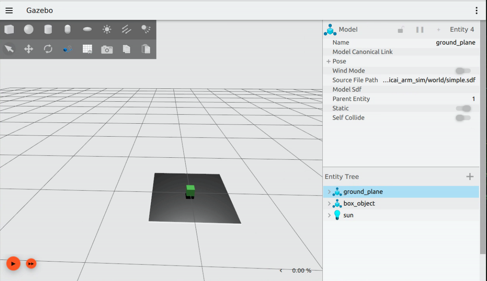

# Basic Simulation

## Gazebo란?


Gazebo란 로봇 공학에서 3D 환경 속 로봇, 센서, 물체 등을 **실제와 유사한 물리 엔진으로 시뮬레이션**하는 오픈 소스 도구입니다. ROS2와 연동성이 매우 높으며 로봇팔을 비롯한 자율주행, 제어 알고리즘 등을 안전하게 테스트하고 검증하는 데 사용됩니다.

Gazebo의 특징은 다음과 같습니다.

- **고성능 물리 엔진** : 3D 모델의 움직임, 충돌, 중력, 공기 저항 등을 시뮬레이션합니다.
- **센서 시뮬레이션** : 카메라, LiDAR 등의 센서 데이터 생성 및 노이즈 등을 구현합니다.
- **ROS2 연동성** : ROS2 환경에서의 로봇 행동을 시뮬레이션할 수 있습니다.
- **플러그인 및 커스터마이징** : 로봇, 센서, 환경을 제어하기 위한 커스텀 플러그인을 제공하거나 개발합니다.

본 교재에서는 Gazebo Fortress 버전을 사용합니다.

ROS2 연동 관련 내용은 다음 장에서 소개합니다.

Gazebo에 대한 좀 더 자세한 내용은 아래 링크를 참고해 주시기 바랍니다.

- https://gazebosim.org/docs/fortress/getstarted/


## Gazebo 실행

Gazebo는 `ign` 명령어를 통해 실행할 수 있습니다. 터미널을 연 뒤, 다음 명령어로 Gazebo를 실행합니다.

```sh
source ~/ros2_base/install/setup.bash
ign gazebo shapes.sdf
```


## sdf 기초

SDF(Simulation Description Format)는 로봇 시뮬레이터에서 **사용할 환경(world), 물체(object), 로봇(robot)을 기술하는 XML 형식** 파일입니다. Gazebo에서는 world 전체를 구성하거나 단일 모델을 정의하고 조명과 센서, 물리 설정까지 SDF로 표현합니다. SDF의 루트 태그는 `<sdf>`이며, 그 아래에 `<world>`, `<model>`, `<actor>`, `<light>` 같은 요소가 있습니다.

대표적으로 많이 쓰이는 태그는 다음과 같습니다.

1. `<world>`   
    \<world>는 시뮬레이션 전체를 감싸는 태그입니다. world 안에는 모델, 장면 설정, 물리 엔진 설정, 플러그인 등이 들어갑니다. 즉, Gazebo에서 하나의 맵 또는 하나의 시뮬레이션 환경입니다.

2. `<model>`   
    \<model>은 로봇 한 대, 박스 하나, 테이블 하나처럼 하나의 물리 객체를 정의하는 태그입니다. 하나 이상의 \<link>와 필요하면 \<joint>를 포함할 수 있습니다.

3. `<link> & <joint>`   
    \<link>는 모델을 구성하는 강체이며, \<joint>는 두 link를 연결하는 태그입니다. 'Robot Modeling'에서 소개된 URDF의 link, joint 태그와 같은 역할을 합니다.

4. `<pose>`   
    \<pose>는 위치와 자세를 나타내는 태그입니다. Gazebo 튜토리얼 기준 형식은 다음과 같습니다.

    ```
    <pose>X Y Z R P Y</pose>
    ```

    여기서 앞의 X Y Z는 위치, 뒤의 R P Y는 roll, pitch, yaw입니다. 또한 pose는 기본적으로 부모 XML 요소의 좌표계를 기준으로 해석되며, relative_to로 기준 프레임을 명시합니다.

5. `<visual>`   
    \<visual>은 화면에 보이는 모양을 정의합니다. 내부에 \<geometry>를 두고, 필요하면 <material>을 추가해 색상도 지정합니다.

6. `<collision>`   
    \<collision>은 충돌 판정용 형상을 정의합니다. \<visual>과 모양이 같을 수도 있지만, 계산량을 줄이기 위해 더 단순한 형상을 쓰는 경우도 많습니다.

7. `<geometry>`   
    \<geometry>는 실제 형상을 담는 태그입니다. 공식 문서 기준으로 \<box>, \<cylinder>, \<sphere>, \<plane>, \<mesh> 등을 사용합니다.

SDF에 관한 자세한 내용은 아래 링크에서 확인할 수 있습니다.

- https://gazebosim.org/docs/fortress/sdf_worlds/


### 실습 : 간단한 world 만들기

SDF 파일을 직접 작성하여 간단한 world를 구성한 뒤 Gazebo에 표시하는 예제를 살펴보겠습니다.

원하는 작업 위치에서 `simple.sdf` 파일을 생성한 뒤, 다음 내용을 입력합니다. 이후 아래 실행 명령도 같은 작업 위치(디렉터리)에서 수행해야 합니다.

```xml
<?xml version="1.0" ?>
<sdf version="1.9">
    <world name="basic_world">
      <light name="sun" type="directional">
        <cast_shadows>true</cast_shadows>
        <pose>0 0 10 0 0 0</pose>
        <diffuse>0.8 0.8 0.8 1.0</diffuse>
        <specular>0.2 0.2 0.2 1.0</specular>
        <attenuation>
            <range>1000</range>
            <constant>0.9</constant>
            <linear>0.01</linear>
            <quadratic>0.001</quadratic>
        </attenuation>
        <direction>-0.5 0.1 -0.9</direction>
        </light>

        <model name="ground_plane">
        <static>true</static>
        <link name="link">
            <collision name="collision">
            <geometry>
                <plane>
                <normal>0 0 1</normal>
                <size>1 1</size>
                </plane>
            </geometry>
            </collision>
            <visual name="visual">
            <geometry>
                <plane>
                <normal>0 0 1</normal>
                <size>1 1</size>
                </plane>
            </geometry>
            </visual>
        </link>
        </model>

        <model name="box_object">
        <static>false</static>
        <pose>0 0 0.05 0 0 0</pose>
        <link name="body">
            <collision name="collision">
            <geometry>
                <box>
                <size>0.1 0.1 0.1</size>
                </box>
            </geometry>
            </collision>
            <visual name="visual">
            <geometry>
                <box>
                <size>0.1 0.1 0.1</size>
                </box>
            </geometry>
            <material>
                <ambient>0.1 0.7 0.1 1</ambient>
                <diffuse>0.1 0.7 0.1 1</diffuse>
            </material>
            </visual>
        </link>
        </model>

    </world>
</sdf>
```

`<world>` 태그 아래 한 개의 `<light>`와 두 개의 `<model>` 태그가 존재하는 것을 확인할 수 있습니다. 즉, 조명과 모델이 포함되어 있습니다. 모델은 총 두 개입니다. 하나는 바닥을 상징하는 평면이고, 다른 하나는 정육면체 모양의 박스입니다. `box_object`모델은 `<pose>` 태그로 위치와 자세를 지정하며, `ground_plane`은 별도의 `\pose` 없이 원점 기준으로 배치됩니다. 이후 과정에서 이를 실행해 보면 작게 표시되는 것을 확인할 수 있는데, 이는 Gazebo의 기본 길이 단위가 'm'이고 예제 박스의 크기가 '0.1m'로 설정되어 있기 때문입니다. 초기 카메라 시점에 따라 더 작게 느껴질 수 있습니다.

터미널에 아래와 같이 입력하여 결과물을 확인합니다. 사진과 같이 바닥 및 박스가 생성됩니다.

```sh
source ~/ros2_base/install/setup.bash
ign gazebo simple.sdf
```



