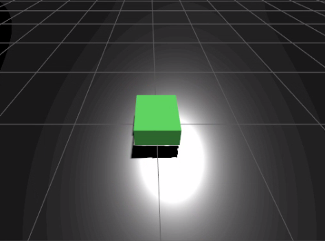
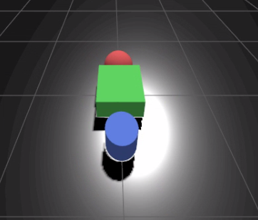
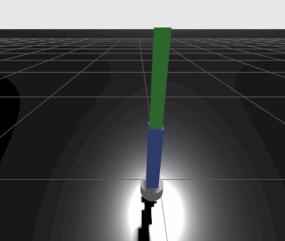

# Basic Simulation

## MuJoCo란?


MuJoCo(Multi-Joint dynamics with Contact)는 로봇과 같은 다양한 기계 시스템의 움직임을 물리적으로 시뮬레이션하는 소프트웨어입니다. 가상의 환경에서 로봇의 움직임을 현실과 유사하게 재현해 줍니다. 현재 MuJoCo는 로봇 제어, 강화 학습, 모방 학습, 물리 기반 인공지능 연구 분야에서 널리 활용되고 있습니다.

MuJoCo의 **특징**은 다음과 같습니다.

- **물리 시뮬레이션** : 실제 물리 법칙을 기반으로 물체의 움직임을 계산합니다.
- **관절 시뮬레이션** : 로봇의 각 관절 구조와 동역학을 계산하여 자연스럽게 움직이도록 합니다.
- **충돌 및 접촉 계산** : 물체와의 접촉(가해지는 힘, 접촉력, 위치, 마찰력)을 계산하여 결과를 제공합니다.

**성능**은 다음과 같습니다.

- **빠른 시뮬레이션 속도** : CPU 기반으로 동작하여 GPU 없이도 높은 성능을 발휘합니다. 강화학습에 요구되는 수천 개의 환경을 병렬로 실행할 수 있습니다.
- **효율적인 연산** : 접촉 및 관절 dynamics를 수치적으로 안정적이고 빠르게 계산하도록 설계되었습니다. 실시간 제어 및 대규모 학습에 적합합니다.

다음은 **지원 포맷**입니다.
- **MJCF(MuJoCo XML Format)** : MuJoCo 전용 XML 포맷으로, 로봇의 관절, 센서, 액추에이터 등을 상세하게 정의할 수 있습니다.
- **URDF(Unified Robot Description Format)** : ROS에서 자주 사용되는 로봇 기술 포맷으로 MuJoCo에서도 변환하여 사용할 수 있습니다.
- **Python API** : 'mujoco' 패키지를 통해 Python 코드로 시뮬레이션을 제어하고 데이터를 수집할 수 있습니다.

**활용 사례**
- **강화 학습 환경** : Ant, HalfCheetah, Humanoid 등 다양한 MuJoCo 계열 로봇 제어 벤치마크 환경에서 활용됩니다.
- **모방 학습** : 사람이나 다른 로봇의 동작 데이터를 기반으로 로봇이 동작을 학습하는 연구에 활용됩니다.
- **복잡한 관절 시스템 연구** : 로봇 손, 이족보행 로봇 등 자유도가 높은 시스템의 동작 제어 연구에 널리 사용됩니다.
- **물리 기반 AI 연구** : DeepMind, OpenAI 등 주요 AI 연구기관에서 로봇 제어 알고리즘 개발 및 검증에 활용됩니다.


MuJoCo에 대한 좀 더 자세한 내용은 아래 링크를 참고해 주시기 바랍니다.

- https://mujoco.readthedocs.io/en/stable/overview.html

## Gazebo란?


Gazebo란 로봇공학에서 3D 환경 속 로봇, 센서, 물체 등을 **실제와 유사한 물리 엔진으로 시뮬레이션**하는 오픈소스 도구입니다. ROS2와의 연동성이 높으며, 로봇 팔·자율주행·제어 알고리즘 등을 안전하게 테스트하고 검증하는 데 사용됩니다.

Gazebo의 특징은 다음과 같습니다.

- **고성능 물리 엔진** : 3D 모델의 움직임, 충돌, 중력 등을 시뮬레이션합니다.
- **센서 시뮬레이션** : 카메라, LiDAR 등의 센서 데이터 생성 및 노이즈 등을 구현합니다.
- **ROS2 연동성** : ROS2 환경에서의 로봇 행동을 시뮬레이션할 수 있습니다.
- **플러그인 및 커스터마이징** : 로봇, 센서, 환경을 제어하기 위한 커스텀 플러그인을 제공하며 직접 개발할 수도 있습니다.

본 교재에서는 Gazebo Fortress 버전을 사용합니다.

Gazebo에 대한 좀 더 자세한 내용은 아래 링크를 참고해 주시기 바랍니다.

- https://gazebosim.org/docs/fortress/getstarted/


## Gazebo 실행

Gazebo는 `ign` 명령어를 통해 실행할 수 있습니다. 터미널을 연 뒤, 다음 명령어로 Gazebo를 실행합니다.

```sh
source ~/ros2_base/install/setup.bash
ign gazebo shapes.sdf
```


## SDF 기초

SDF(Simulation Description Format)는 로봇 시뮬레이터에서 **사용할 환경(world), 물체(object), 로봇(robot)을 기술하는 XML 형식** 파일입니다. Gazebo에서는 SDF가 world 파일도 정의할 수 있고, 단일 model 파일도 정의할 수 있습니다. 또한 조명과 센서, 물리 설정까지 SDF로 표현합니다. SDF의 루트 태그는 `<sdf>`이며, 그 아래에 `<world>`, `<model>`, `<actor>`, `<light>` 같은 요소가 있습니다.

대표적으로 많이 쓰이는 태그는 다음과 같습니다.

1. `<world>`   
    \<world>는 시뮬레이션 전체를 감싸는 태그입니다. world 안에는 모델, 장면 설정, 물리 엔진 설정, 플러그인 등이 들어갑니다.Gazebo에서는 하나의 맵 또는 시뮬레이션 환경에 해당합니다.

2. `<model>`   
    \<model>은 로봇 한 대, 박스 하나, 테이블 하나처럼 하나의 물리 객체를 정의하는 태그입니다. 하나 이상의 \<link>와 필요하면 \<joint>를 포함할 수 있습니다.

3. `<link> & <joint>`   
    \<link>는 모델을 구성하는 강체이며, \<joint>는 두 링크를 연결하는 태그입니다. 'Robot Modeling'에서 소개된 URDF의 link, joint 태그와 같은 역할을 합니다.

4. `<pose>`   
    \<pose>는 위치와 자세를 나타내는 태그입니다. SDF의 opse 표현 방식은 다음과 같습니다.

    ```
    <pose>X Y Z R P Y</pose>
    ```

    여기서 앞의 X Y Z는 위치, 뒤의 R P Y는 roll, pitch, yaw입니다. 또한 pose는 기본적으로 부모 XML 요소의 좌표계를 기준으로 해석되며, `relative_to`로 기준 프레임을 명시합니다.

5. `<visual>`   
    \<visual>은 화면에 보이는 모양을 정의합니다. 내부에 \<geometry>를 두고, 필요하면 \<material>을 추가해 색상도 지정합니다.

6. `<collision>`   
    \<collision>은 충돌 판정용 형상을 정의합니다. \<visual>과 모양이 같을 수도 있지만, 계산량을 줄이기 위해 더 단순한 형상을 쓰는 경우도 많습니다.

7. `<geometry>`   
    \<geometry>는 실제 형상을 담는 태그입니다. 공식 문서 기준으로 \<box>, \<cylinder>, \<sphere>, \<plane>, \<mesh> 등을 사용합니다.

SDF에 관한 자세한 내용은 아래 링크에서 확인할 수 있습니다.

- https://gazebosim.org/docs/fortress/sdf_worlds/


## Gazebo에서의 URDF

Gazebo Fortress는 공식적으로 URDF를 지원합니다. 내부적으로 libsdformat 라이브러리가 URDF를 SDF로 자동 변환해서 로드하는 방식입니다. URDF 파일만으로 world를 구성할 순 없고, `world.sdf` 파일을 연 뒤, 그 파일에 직접 물체를 스폰하는 방식을 이용해야 합니다. Gazebo를 연 뒤, 물체를 스폰하는 명령어는 아래와 같습니다.

```sh
ign gazebo world.sdf
```

```sh
ign service -s /world/empty/create \
  --reqtype ignition.msgs.EntityFactory \
  --reptype ignition.msgs.Boolean \
  --timeout 1000 \
  --req 'sdf_filename: "/path/to/robot.urdf", name: "my_robot"'
```

URDF는 단일 로봇 모델만 기술하는 포맷이므로 SDF의 `<world>`, `<light>`, `<plane>` 등 일부 요소는 직접 변환되지 않습니다. 바닥면은 시뮬레이터 기본 제공 환경을 활용하고, 조명은 Isaac Sim/Gazebo에서 별도로 추가해야 합니다.

### 실습 : 간단한 world 만들기

sdf 파일을 직접 작성하여 간단한 world를 구성한 뒤 Gazebo에서 표시하는 예제를 살펴보겠습니다.


```xml
<?xml version="1.0" ?>
<sdf version="1.9">
    <world name="basic_world">
      <light name="sun" type="directional">
        <cast_shadows>true</cast_shadows>
        <pose>0 0 10 0 0 0</pose>
        <diffuse>0.8 0.8 0.8 1.0</diffuse>
        <specular>0.2 0.2 0.2 1.0</specular>
        <attenuation>
            <range>1000</range>
            <constant>0.9</constant>
            <linear>0.01</linear>
            <quadratic>0.001</quadratic>
        </attenuation>
        <direction>-0.5 0.1 -0.9</direction>
        </light>

        <model name="ground_plane">
        <static>true</static>
        <link name="link">
            <collision name="collision">
            <geometry>
                <plane>
                <normal>0 0 1</normal>
                <size>1 1</size>
                </plane>
            </geometry>
            </collision>
            <visual name="visual">
            <geometry>
                <plane>
                <normal>0 0 1</normal>
                <size>1 1</size>
                </plane>
            </geometry>
            </visual>
        </link>
        </model>

        <model name="box_object">
        <static>false</static>
        <pose>0 0 0.05 0 0 0</pose>
        <link name="body">
            <collision name="collision">
            <geometry>
                <box>
                <size>0.1 0.1 0.1</size>
                </box>
            </geometry>
            </collision>
            <visual name="visual">
            <geometry>
                <box>
                <size>0.1 0.1 0.1</size>
                </box>
            </geometry>
            <material>
                <ambient>0.1 0.7 0.1 1</ambient>
                <diffuse>0.1 0.7 0.1 1</diffuse>
            </material>
            </visual>
        </link>
        </model>

    </world>
</sdf>
```


**실습 : 박스 설치하기**

다음은 박스 하나를 공간에 배치하는 가장 기본적인 예제입니다. `base_link`는 로봇의 기준 좌표계 역할을 하는 빈 링크입니다. URDF는 반드시 루트 링크가 하나 있어야 합니다. `<inertial>`은 물리 시뮬레이션에 필수입니다. 없으면 Isaac Sim에서 물체가 이상하게 움직입니다. `<joint>`의 `<origin>`이 SDF의 `<pose>` 역할을 합니다.

```xml
<?xml version="1.0"?>
<robot name="test_world">

  <link name="box_object">
    <visual>
      <geometry>
        <box size="0.1 0.1 0.1"/>
      </geometry>
      <material name="green">
        <color rgba="0.1 0.7 0.1 1"/>
      </material>
    </visual>
    <collision>
      <geometry>
        <box size="0.1 0.1 0.1"/>
      </geometry>
    </collision>
    <inertial>
      <mass value="1.0"/>
      <inertia ixx="0.000167" iyy="0.000167" izz="0.000167"
               ixy="0" ixz="0" iyz="0"/>
    </inertial>
  </link>

</robot>
```


**실습 : 박스 크기와 위치 바꿔보기**

박스의 크기를 0.5m 크기로 키우고, 바닥에 정확히 놓이도록 z 위치를 조정합니다.

```xml
<?xml version="1.0"?>
<robot name="box_resized">

  <link name="box_object">
    <visual>
      <geometry>
        <box size="0.5 0.5 0.5"/>
      </geometry>
      <material name="green">
        <color rgba="0.1 0.7 0.1 1"/>
      </material>
    </visual>
    <collision>
      <geometry>
        <box size="0.5 0.5 0.5"/>
      </geometry>
    </collision>
    <inertial>
      <mass value="1.0"/>
      <inertia ixx="0.0208" iyy="0.0208" izz="0.0208"
               ixy="0" ixz="0" iyz="0"/>
    </inertial>
  </link>

</robot>
```

> [!Note]
> 1. 박스 크기가 0.5m일 때 z 위치를 0.25로 둔 이유는 무엇인가요?
> 2. z 위치를 1.0으로 바꾸면 어떤 일이 발생할까요?
> 3. `<static>false</static>`를 `<static>true</static>`로 바꾸면 어떻게 될까요?



**실습 : 공과 원기둥 추가하기**

서로 다른 geometry 타입(box, sphere, cylinder)을 한 파일에 배치해보겠습니다. 각 오브젝트는 별도의 `<link>`로 정의하고, `base_link`에서 `floating` joint로 연결합니다. 위치는 `<joint>`의 `<origin xyz="...">`으로 지정합니다.

```xml
<?xml version="1.0"?>
<robot name="multi_objects">

  <link name="box_object">
    <visual>
      <geometry><box size="0.5 0.5 0.5"/></geometry>
      <material name="green"><color rgba="0.1 0.7 0.1 1"/></material>
    </visual>
    <collision>
      <geometry><box size="0.5 0.5 0.5"/></geometry>
    </collision>
    <inertial>
      <mass value="1.0"/>
      <inertia ixx="0.0208" iyy="0.0208" izz="0.0208"
               ixy="0" ixz="0" iyz="0"/>
    </inertial>
  </link>

  <link name="sphere_object">
    <visual>
      <geometry><sphere radius="0.2"/></geometry>
      <material name="red"><color rgba="0.8 0.1 0.1 1"/></material>
    </visual>
    <collision>
      <geometry><sphere radius="0.2"/></geometry>
    </collision>
    <inertial>
      <mass value="1.0"/>
      <inertia ixx="0.016" iyy="0.016" izz="0.016"
               ixy="0" ixz="0" iyz="0"/>
    </inertial>
  </link>

  <joint name="sphere_joint" type="fixed">
    <parent link="box_object"/>
    <child link="sphere_object"/>
    <origin xyz="0.5 0 0" rpy="0 0 0"/>
  </joint>

  <link name="cylinder_object">
    <visual>
      <geometry><cylinder radius="0.15" length="0.5"/></geometry>
      <material name="blue"><color rgba="0.1 0.2 0.8 1"/></material>
    </visual>
    <collision>
      <geometry><cylinder radius="0.15" length="0.5"/></geometry>
    </collision>
    <inertial>
      <mass value="1.0"/>
      <inertia ixx="0.0224" iyy="0.0224" izz="0.01125"
               ixy="0" ixz="0" iyz="0"/>
    </inertial>
  </link>

  <joint name="cylinder_joint" type="fixed">
    <parent link="box_object"/>
    <child link="cylinder_object"/>
    <origin xyz="-0.5 0 0" rpy="0 0 0"/>
  </joint>

</robot>
```



### 로봇 모델링

앞서 배운 URDF의 link와 joint를 활용하여 실제 로봇 팔 구조를 모델링해 보겠습니다. 단순한 도형 배치에서 나아가 관절로 연결된 다중 링크 구조를 작성해 보겠습니다.

로봇은 링크(Link)와 조인트(Joint)의 트리 구조로 표현됩니다.

```
base_link
    └── joint1 (revolute)
            └── link1
                    └── joint2 (revolute)
                                └── link2
```

2개의 관절(Revolute Joint)로 연결된 간단한 로봇 팔을 모델링하겠습니다. 실제 로봇 팔의 최소 구성 단위로 base → link1 → link2 순서로 연결합니다.

```xml
<?xml version="1.0"?>
<robot name="two_link_arm">

  <link name="base_link">
    <visual>
      <geometry>
        <cylinder radius="0.05" length="0.1"/>
      </geometry>
      <material name="gray">
        <color rgba="0.5 0.5 0.5 1"/>
      </material>
    </visual>
    <collision>
      <geometry>
        <cylinder radius="0.05" length="0.1"/>
      </geometry>
    </collision>
    <inertial>
      <mass value="2.0"/>
      <inertia ixx="0.01" iyy="0.01" izz="0.0025"
               ixy="0" ixz="0" iyz="0"/>
    </inertial>
  </link>

  <link name="link1">
    <visual>
      <origin xyz="0 0 0.15" rpy="0 0 0"/>
      <geometry>
        <box size="0.05 0.05 0.3"/>
      </geometry>
      <material name="blue">
        <color rgba="0.1 0.2 0.8 1"/>
      </material>
    </visual>
    <collision>
      <origin xyz="0 0 0.15" rpy="0 0 0"/>
      <geometry>
        <box size="0.05 0.05 0.3"/>
      </geometry>
    </collision>
    <inertial>
      <origin xyz="0 0 0.15" rpy="0 0 0"/>
      <mass value="1.0"/>
      <inertia ixx="0.0077" iyy="0.0077" izz="0.00042"
               ixy="0" ixz="0" iyz="0"/>
    </inertial>
  </link>

  <joint name="joint1" type="revolute">
    <parent link="base_link"/>
    <child link="link1"/>
    <origin xyz="0 0 0.05" rpy="0 0 0"/>
    <axis xyz="0 1 0"/>
    <limit lower="-1.57" upper="1.57" effort="100" velocity="1.0"/>
    <dynamics damping="0.5" friction="0.0"/>
  </joint>

  <link name="link2">
    <visual>
      <origin xyz="0 0 0.15" rpy="0 0 0"/>
      <geometry>
        <box size="0.04 0.04 0.3"/>
      </geometry>
      <material name="green">
        <color rgba="0.1 0.7 0.1 1"/>
      </material>
    </visual>
    <collision>
      <origin xyz="0 0 0.15" rpy="0 0 0"/>
      <geometry>
        <box size="0.04 0.04 0.3"/>
      </geometry>
    </collision>
    <inertial>
      <origin xyz="0 0 0.15" rpy="0 0 0"/>
      <mass value="0.5"/>
      <inertia ixx="0.0039" iyy="0.0039" izz="0.000027"
               ixy="0" ixz="0" iyz="0"/>
    </inertial>
  </link>

  <joint name="joint2" type="revolute">
    <parent link="link1"/>
    <child link="link2"/>
    <origin xyz="0 0 0.3" rpy="0 0 0"/>
    <axis xyz="0 1 0"/>
    <limit lower="-1.57" upper="1.57" effort="100" velocity="1.0"/>
    <dynamics damping="0.5" friction="0.0"/>
  </joint>

</robot>
```




## MuJoCo와 Gazebo 비교

| 항목       | MuJoCo   | Gazebo |
| -------- | -------- | ------ |
| 물리 계산 속도 | 매우 빠름    | 보통     |
| 접촉 계산    | 우수       | 보통     |
| ROS2 연동  | 별도 설정 필요 | 매우 쉬움  |
| 강화 학습     | 매우 적합    | 적합     |
| 실제 로봇 연동 | 가능       | 가능     |
| 연구 활용    | 매우 많음    | 많음     |

---

## 복습 퀴즈


1. SDF는 무엇을 기술하기 위한 파일 형식인가?

<br>

2. \<world> 태그와 \<model> 태그의 차이는 무엇인가?

<br>

3. \<link>와 \<joint>는 각각 어떤 역할을 하는가?

<br>

4. \<visual>과 \<collision>의 차이는 무엇인가?

<br>

5. 다음 pose값의 의미를 설명하시오.

```
<pose>0 0 0.05 0 0 0</pose>
```

<br>

6. SDF에서 위치 단위는 기본적으로 무엇인가?

<br>

7. ground_plane에 별도의 \<pose>가 없다면 어디에 배치되는가?

<br>

8. `<pose>X Y Z R P Y</pose>`에서 각 값은 무엇을 의미하는가?

<br>

9. \<sphere>, \<cylinder>, \<box> 태그에서 각각 크기를 정하는 하위 태그는 무엇인가?