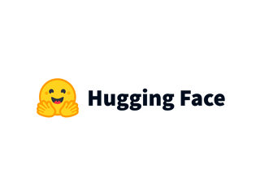

# VLA 개요

## 기존 인공지능 제어기의 흐름과 VLA의 등장

로봇을 제어하는 가장 기본적인 인공지능 제어기 흐름은 **관찰(Observation) -> 행동(Action) -> 피드백(Feedback)** 의 반복이었습니다.

먼저 로봇은 카메라 영상, 센서값, 관절 상태와 같은 정보를 통해 현재 상황을 관찰합니다. 그런 다음 제어기는 이 정보를 바탕으로 지금 필요한 행동을 계산한 뒤, 로봇이 실제로 움직인 결과를 다시 센서로 확인하고 그 결과를 다음 판단에 반영합니다. 이 구조는 직관적이고도 견고하여 다양한 방식의 인공지능 제어기에서 공통적으로 나타나는 구조입니다.

이 흐름은 로봇의 입력과 출력, 그리고 피드백으로 명확하게 단계적으로 구분할 수 있어 로봇의 동작을 분석하기 쉽다는 장점이 있습니다. 이는 작업이 명확하고 환경 변화가 크지 않은 경우에는 충분히 안정적인 성능을 낼 수 있습니다. 

하지만 이 흐룸은 문제점을 가지는 것이 지정된 목표 이외의 작업을 진행시키기 어렵습니다. 기존 제어기는 대개 "현재 보이는 상태에서 어떤 행동을 해야 하는가" 를 학습하지만, 작업 목표 자체는 미리 고정되어져 있는 경우가 많습니다. 그래서 같은 장면을 보더라도 작업의 의미를 자연스럽게 변형시키게 어려워 그 유연성이 떨어집니다. 결국 인식과 제어 방법을 인공지능이 알더라도 추가적인 목표에 대응하기 어려워 확장성이 많이 떨어집니다.

이 시점에서 등장한 것이 **VLA(Vision-Language-Action)** 입니다. VLA는 기존의 관찰 -> 행동 구조를 버리는 것이 아닌 그 사이에 **언어 기반 목표 조건** 을 명시적으로 포함시킵니다. 즉, 로봇은 여전히 카메라 영상과 상태 정보를 관찰하면서 추가로 자연어 명령까지 받아들여 최종 행동을 결정합니다. 덕분에 로봇은 단순히 '지금 무엇이 보이는 가' 에 반응하는 수준을 넘어 '지금 무엇을 해야하는가' 를 언어를 통해 새로운 조건으로 받아 행동을 바꾸는 방식으로 확장되는 것입니다.

작성 시점에서의 VLA와 로봇 정책은 보통 한 순간의 action만 내보내는 것이 아닌 미래의 여러 step을 묶은 **Action chunk** 를 생성하는 흐름 또한 나타나고 있습니다. 이는 정책이 '지금 당장 한 번만 움직이라' 고 한 줄의 명령만 출력하는 것이 아닌, 짧은 구간에 대한 행동 계획을 한 번에 내놓는다는 뜻입니다. 따라서 모델마다 한개다 action이 출력되는 지, 여러 개의 action chunk가 출력되는 지 구분됩니다.

정리하자면 VLA의 핵심은 결국 관측된 장면과 로봇 상태를 읽고, 언어로 주어진 목표를 반영해 짧은 행동 계획을 생성하는 정책을 말합니다. 인공지능 용어로썬 이를 **Policy(정책)** 이라고도 표현합니다.

### 참고 자료 : OpenVLA

VLA에 대한 상세한 정의는 아래 링크를 참고하여 주십시오.

- https://arxiv.org/abs/2406.09246

## Huggingface

Hugging Face는 오픈소스 인공지능 생태계를 중심으로 모델, 데이터셋, 데모 애플리케이션을 공유하고 협업할 수 있도록 만든 플랫폼입니다. 이들이 모두 모여져 있는 Hub는 수백만 개의 모델과 수십만 개의 데이터 셋, 그리고 매우 많은 데모 애플리케이션인 Spaces를 제공하는 협업 플랫폼이며, 사용자는 이곳에서 모델을 탐색하고, 실험하고, 공유하며 다시 활용할 수 있습니다. 즉, Hugging Face는 단순히 모델 파일만 올려두는 저장소가 아니라 인공지능 자산을 찾고, 문서화하고, 재사용하며 협헙하는 중심 공간입니다.

이러한 구조는 로보틱스 환경에서 의미가 큽니다. 로봇 인공지능은 보통 모델만 있다고 바로 쓸 수 있는 것이 아닌 어떤 입력을 기대하는 지, 어떤 데이터로 학습되었는지, 어떤 환경, 로봇 하드웨어를 전제로 하는 지 함께 확인해야 합니다. Hugging Face는 이런 정보를 model, dataset card, repository metadata 형태로 함께 제공하여 단순히 '좋아 보이는 모델' 을 선택하는 것이 아닌 자신의 로봇 실습 환경과 맞는 자산을 문서와 함께 읽고 선택할 수 있다는 장점이 있습니다.

Hugging Face의 링크 및 상세한 설명은 아래 링크를 통해 확인하여 주십시오. 이를 활용한 실습은 다음 장에서 진행합니다.

- https://huggingface.co/
- https://huggingface.co/docs