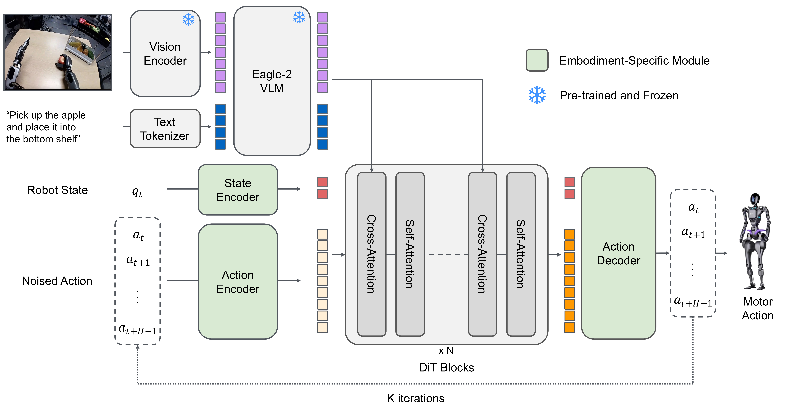

# LeIsaac & Isaac GR00T

이번 장에서는 VLA 실습 환경인 LeIsaac과 실질적인 추론 환경을 제공하는 Isaac GR00T에 대해서 알아보고, 실제로 PhysicAI Arm이 배치된 환경을 불러와 과제를 수행하는 과정에 대해 실습해보도록 하겠습니다.

이 장에서는 한백전자의 Genworks 환경에서 검증이 진행되었습니다.

## LeIsaac이란?

LeIsaac은 로봇 조작 실습을 위한 시뮬레이션 플랫폼입니다. Hugging Face에서 제공하는 LeRobot EnvHub과 연동되는 모방학습 환경이며, teleoperation, 데이터 수집, 정책 학습, 정책 평가를 하나로 연결되어져 있는 구조입니다. 앞서 설명한 VLA 구조 및 policy checkpoint를 빠르게 적용하여 테스트해볼 수 있는 환경을 제공함으로 써 원활한 실습 진행에 적합합니다.

EnvHub는 Hugging Face LeRobot이 제공하는 환경 및 배포, 공유 계층입니다.즉 Hub에서 시뮬레이션 환경을 한 줄 코드로 불러오는 기능을 가지고 있습니다. EnvHub의 장점은 환경을 별도 패키지로 설치하지 않고도 동적으로 로드할 수 있고 버전 관리에 용의하며 타인에게 공유함에 있어 편리함을 준다는 것입니다. 

여기서 핵심은 *EnvHub 자체는 추론을 하지 않는다* 는 점입니다. EnvHub의 역할은 그저 환경을 불러오고, reset/step이 가능한 통일된 인터페이스로 제공되는 것입니다. 같은 환경이라도 랜덤 액션 및 조작, 별도의 VLA 정책을 붙일 수 있습니다. 즉, 로보틱스가 동작될 하나의 무대라는 점입니다.

LeIsaac에 대한 좀 더 자세한 내용은 아래 링크를 참고하여 주시길 바랍니다.

- https://lightwheelai.github.io/leisaac/

그렇다면 대체 VLA 추론은 어디서 진행되는 걸까요? 바로 아래에 설명할 Isaac GR00T에서 이어집니다.

## Isaac GR00T란?

Isaac GR00T(이하 gr00t)는 NVIDIA가 공개한 로봇용 VLA(Vision-Language-Action) 계열 파운데이션 모델군입니다. NVIDIA Research는 초기 모델인 GR00T N1을 인간 시점 비디오, 실제·시뮬레이션 로봇 궤적, 합성 데이터까지 포함한 다양한 데이터로 학습된 generaliist robot model로 설명하며, 후속 모델버전은 N1.5 및 N1.6이 존재하며, 본 교재에서는 N1.5 버전을 사용합니다. 즉, gr00t 는 특정 한 과제를 위한 스크립트가 아닌, 언어와 시각, 로봇 상태를 함께 받아 다음 행동을 예측하는 범용 정책 모델로 이해하는 것이 좋습니다.



출처 : https://research.nvidia.com/labs/gear/gr00t-n1_5/

위 사진을 구조적으로 좀 더 살펴보자면, gr00t는 텍스트와 영상 정보를 해석하는 비전-언어 계측과, 그 결과를 바탕으로 연속적인 로봇 행동을 생성하는 행동 예측 계층이 결합된 형태입니다. 중요한 점은 이 모델이 단일 숫자 하나를 출력하는 것이 아닌, 행동 조각, 즉 Action chunk를 예측한다는 점입니다.

## 연결 구조

이렇게 환경 및 추론 모델군에 대해서 알아봤습니다. 이제 이것들을 어떻게 묶어서 사용할 수 있을까요?

gr00t 모델군을 제공한 NVIDIA 사에서는 환경 루프를 `env.reset() -> observation 변환 -> policy.get_action() -> action 변환 -> env.step()` 의 흐름으로 설명합니다. 다시 말해 '시뮬레이터 안에 AI가 들어 있다' 가 아닌 *'환경과 정책이 서로 데이터를 주고받는 구조'* 로 동작합니다.

이 때 gr00t에서는 **Inference server** 를 제공합니다. 이 서버는 원격 추론(remote inference)를 위한 빌트인 구조이며, ZeroMQ 기반으로 정책 서버 및 클라이언트를 연결합니다. 이 구조의 장점은 추론을 GPU 서버에서 돌리고 제어는 다른 머신에서 수행할 수 있게 해줍니다. 따라서 모델 쪽의 무거운 의존성을 제어 코드와 쉽게 분리할 수 있습니다. 

여기에 하나 더 필요한 건 바로 변환 계층(wrapper) 입니다. 대부분 시뮬레이터는 자신만의 관측 형식 및 행동 형식을 사용하며, gr00t 모델군 또한 자신만의 입출력 형식을 요구합니다. 그래서 이를 통합할 시 observation을 정책 API 형식으로 바꾸고, 이 출력을 다시 환경 action 방식으로 바꾸는 wrapper가 필요합니다. LeIsaac은 이를 LeRobot Dataset으로, GR00T는 LeRobot-compatible schema를 전제로 합니다.

결국 이 구조는 추론/실행을 구분한 점에 있어 실무 관점에 매우 중요하게 다뤄집니다. 구분이 이뤄지지 않을 경우 무거운 VLA 추론으로 인해 시간이 지연되어 로봇이 멈칫거리거나 동작이 끊기기 쉬워질 수 있습니다. 따라서 이 원격 추론은 무거운 VLA 정책을 실제 제어 루프에 붙이기 위한 필연적인 실행 구조라고 볼 수 있습니다.

## 실습 : Pick Orange 예제 진행

실습에서 사용할 예제에선 LightWheelAI 사에서 제공하는 'LeIsaac Pick Orange` 모델을 사용할 것입니다. 관련 Hugging Face 링크는 다음과 같습니다.

- https://huggingface.co/LightwheelAI/leisaac-pick-orange-v0

### 사전 준비 내용

실습을 진행하기에 앞서 다음 소프트웨어 환경이 미리 설정되어져하며, 권장되는 하드웨어 실습 환경은 최소 NVIDIA RTX 50 시리즈 이상 GPU 및 RAM 32GB 입니다. Genworks 환경에서는 미리 준비되어져 있습니다.

| Software | Version |
| -------- | ------- |
| Isaac Sim | 5.1 |
| Isaac Lab | 0.47.2 |
| PyTorch | 2.7.0 + cuda |
| huggingface_hub | 0.36.2 |

### LeIsaac 환경 설치

터미널에서 다음 명령얼

### 모델 및 gr00t 설치

터미널에서 다음 명령어를 입력해 pick-orange 모델을 준비합니다. 이 모델은 이미 PhysicAI Arm 맞춤으로 사전학습이 진행되어져 있으며 바로 추론에 사용할 수 있습니다.

설치 경로 `/path/to/` 는 본인 임의의 경로를 설정합니다.

```sh
hf download LightwheelAI/leisaac-pick-orange-v0 \
--local-dir /path/to/leisaac-pick-orange-v0
```

이 후 다음 명령어를 입력해 gr00t 실습 환경을 구축합니다.

```sh
git clone --branch n1.5-release --single-branch --recurse-submodules https://github.com/NVIDIA/Isaac-GR00T.git
```

### 서버 및 LeIsaac 환경 실행

터미널 두 개를 준비합니다. 첫 번째 터미널에서는 GR00T Inference 서버를, 두 번째 터미널에서는 LeIsaac 환경을 실행하도록 합니다.

먼저 첫 번째 터미널에는 아래와 같이 입력합니다. 이 때 `/path/to` 에는 모델 및 환경을 설치한 임의의 경로를 입력합니다.

```sh
# Terminal 1

cd /path/to/Isaac-GR00T
python scripts/inference_service.py --server \
  --model_path /path/to/leisaac-pick-orange-v0 \
  --embodiment_tag new_embodiment \
  --data_config so100_dualcam \
  --port 5555
```

서버가 실행된 후, 두 번째 터미널에서 아래와 같이 입력합니다. 이 때 `/path/to` 에는 LeIsaac을 설치한 경로를 입력합니다.

```sh
# Terminal 2

cd /path/to/leisaac
python scripts/evaluation/policy_inference.py   --task=LeIsaac-SO101-PickOrange-v0   --policy_type=gr00tn1.5   --policy_host=127.0.0.1   --policy_port=5555   --policy_timeout_ms=5000 --eval_rounds=10 --episode_length_s=30 --policy_action_horizon=16   --policy_language_instruction="Pick up the orange and place it on the plate"   --device=cuda   --enable_cameras
```

옵션을 자세히 살펴보면 `--policy_language_instruction` 에 '오랜지를 짚어 그릇에 위치시켜라' 라고 명시되어져 있습니다. 그 밖에도 서버 주소 및 포트, 에피소드 실행 시간이 명시되어져 있습니다.

프로그램을 실행할 시, 아래 사진과 같이 Isaac Sim이 실행되어 책상 위에 놓여진 오랜지를 짚어 옮기는 것을 확인할 수 있습니다.

