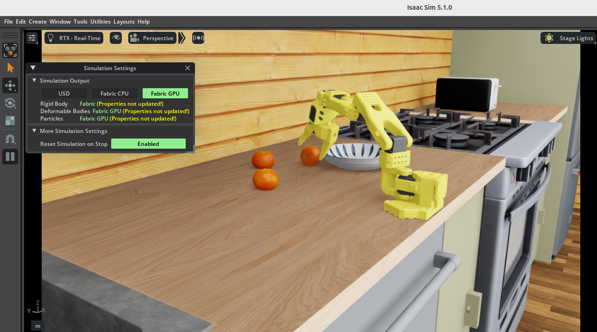

# LeIsaac & Isaac GR00T

이번 장에서는 VLA 실습 환경인 LeIsaac과 실질적인 추론 환경을 제공하는 Isaac GR00T에 대해 알아보겠습니다.

이 장은 한백전자의 Genworks 환경에서 검증이 이루어졌습니다. 실습을 위해선 Physical Arm Lite가 아닌 고성능 PC가 필요합니다. 권장되는 성능은 [아래 사전 준비](/Chapter07.%20AI%20Overview/7-2.%20LeIsaac%20&%20Isaac%20GR00T.md#사전-준비) 항목에 나와있습니다.


## LeIsaac이란?

LeIsaac은 **로봇 조작 실습을 위한 시뮬레이션 플랫폼**입니다. Hugging Face에서 제공하는 LeRobot EnvHub과 연동되는 모방 학습 환경입니다. `teleoperation`, 데이터 수집, 정책 학습, 정책 평가가 하나로 연결된 구조입니다. 앞서 설명한 VLA 구조 및 policy checkpoint를 빠르게 적용하여 테스트해 볼 수 있는 환경을 제공함으로써 원활한 실습 진행에 적합합니다.

EnvHub는 Hugging Face LeRobot이 제공하는 환경 배포 및 공유 계층입니다. Hub에서 시뮬레이션 환경을 코드 한 줄로 불러옵니다. EnvHub의 장점은 환경을 별도 패키지로 설치하지 않고도 동적으로 로드할 수 있고 버전 관리가 용이하며 다른 사람과 공유하기에도 편리하다는 점입니다.

여기서 핵심은 *EnvHub 자체는 추론을 하지 않는다* 는 점입니다. EnvHub의 역할은 그저 환경을 불러오고, reset/step이 가능한 통일된 인터페이스로 제공하는 것입니다. 같은 환경이라도 랜덤 액션 및 조작, 별도의 VLA 정책을 붙일 수 있습니다. 로보틱스 실험이 이루어지는 하나의 무대라고 볼 수 있습니다.

LeIsaac에 대한 좀 더 자세한 내용은 아래 링크를 참고해 주시기 바랍니다.

- https://lightwheelai.github.io/leisaac/

그렇다면 VLA 추론은 어디에서 이루어질까요? 이번 실습은 바로 아래에 설명할 Isaac GR00T에서 이어집니다. 다만 LeIsaac 자체는 다른 정책 백엔드와도 연결할 수 있습니다.

## Isaac GR00T란?

Isaac GR00T(이하 GR00T)는 NVIDIA가 공개한 로봇용 VLA(Vision-Language-Action) 계열 파운데이션 모델군입니다. NVIDIA Research는 초기 모델인 GR00T N1을 인간 시점 비디오, 실제·시뮬레이션 로봇 궤적, 합성 데이터까지 포함한 다양한 데이터로 학습된 'generalist robot model'이라고 설명합니다. 후속 모델 버전은 N1.5 및 N1.6 등이 존재하며, 본 교재에서는 N1.5 버전을 사용합니다. GR00T는 특정 과제 하나를 위한 스크립트가 아닌, 언어, 시각, 로봇 상태를 함께 받아 다음 행동을 예측하는 범용 정책 모델로 이해하는 것이 좋습니다.


출처 : https://research.nvidia.com/labs/gear/gr00t-n1_5/

위 사진의 구조를 조금 더 자세히 보면, GR00T는 텍스트와 영상 정보를 해석하는 비전-언어 인코더와 그 결과를 바탕으로 연속적인 로봇 행동을 예측하는 계층이 결합된 형태입니다. 이 계열 모델은 단일 step action만 예측하는 방식이 아니라, 여러 시점의 행동을 묶은 **action chunk**를 출력하도록 설계될 수 있습니다.

## 연결 구조

이렇게 환경 및 추론 모델군을 살펴봤습니다. 이제 이들을 어떻게 묶어 사용할 수 있을까요?

GR00T 모델군을 제공한 NVIDIA에서는 환경 루프를 `env.reset() → observation 변환 → policy.get_action() → action 변환 → env.step()`의 흐름으로 설명합니다. 다시 말해 '시뮬레이터 안에 AI가 들어 있다'는 구조가 아니라 *환경과 정책이 서로 데이터를 주고받는 구조* 로 동작합니다.

이 실습에서는 GR00T 추론을 원격으로 호출하기 위해 inference server 구조를 사용합니다. 별도 서버 프로세스를 실행한 뒤 클라이언트가 여기에 요청을 보내는 방식입니다. 이 구조의 장점은 추론을 GPU 서버에서 돌리고 제어는 다른 머신에서 수행할 수 있다는 점입니다. 따라서 모델 쪽의 무거운 의존성을 제어 코드와 쉽게 분리할 수 있습니다.

여기에 하나 더 필요한 건 바로 **변환 계층(wrapper)** 입니다. 대부분 시뮬레이터는 자신만의 관측 형식과 행동 형식을 사용하며, GR00T 모델군 또한 자신만의 입출력 형식을 요구합니다. 그래서 이를 통합할 때는 observation을 정책 API 형식으로 바꾸고, 이 출력을 다시 환경의 action 형식으로 바꾸는 wrapper가 필요합니다. 여기서 wrapper의 역할은 환경 관측을 정책 입력 형식으로 바꾸고, 정책 출력을 다시 환경 action 형식으로 변환하는 것입니다. 별도로 학습 데이터 저장 형식은 LeRobot Dataset 계열 포맷을 사용합니다.

결국 이 구조는 추론/실행을 구분한 점에서 실무적으로 매우 중요합니다. 구분이 이뤄지지 않을 경우, 무거운 VLA 추론으로 인해 시간이 지연되어 로봇이 멈칫거리거나 동작이 끊기기 쉬워질 수 있습니다. 따라서 이 원격 추론은 무거운 VLA 정책을 실제 제어 루프에 붙이기 위한 필연적인 실행 구조입니다.


## 실습: Pick Orange 예제 진행

실습에서 사용할 예제에서는 LightWheelAI사에서 제공하는 `LeIsaac Pick Orange` 모델을 사용하겠습니다. 관련 Hugging Face 링크는 다음과 같습니다.

- https://huggingface.co/LightwheelAI/leisaac-pick-orange-v0

### 사전 준비

실습에 앞서 Isaac Sim 및 GR00T가 요구하는 NVIDIA GPU, CUDA, 드라이버 조건을 공식 문서에서 확인하시기 바랍니다. Genworks 환경에서는 필요한 실행 환경이 미리 준비되어 있습니다. 원활한 실습을 위해 충분한 VRAM을 갖춘 NVIDIA GPU와 32GB 이상의 RAM을 권장합니다.

| Software | Version |
| -------- | ------- |
| Isaac Sim | 5.1 |
| Isaac Lab | 0.47.2 |
| PyTorch | 2.7.0 + CUDA |
| huggingface_hub | 0.36.2 |

### 모델 및 GR00T 설치

터미널에서 다음 명령어를 입력해 pick-orange 모델을 준비합니다. 이 모델은 이미 Physical Arm Lite에 맞게 사전 학습되어 있으며 바로 추론에 사용할 수 있습니다.

설치 경로 `/path/to/`는 본인 임의의 경로를 설정합니다.

```sh
hf download LightwheelAI/leisaac-pick-orange-v0 \
--local-dir /path/to/leisaac-pick-orange-v0
```

이후 다음 명령어를 입력해 GR00T 실습 환경을 구축합니다.

```sh
git clone --branch n1.5-release --single-branch --recurse-submodules https://github.com/NVIDIA/Isaac-GR00T.git
```

### 서버 및 LeIsaac 환경 실행

터미널 두 개를 준비합니다. 첫 번째 터미널에서는 GR00T inference server를, 두 번째 터미널에서는 LeIsaac 환경을 실행합니다.

먼저 첫 번째 터미널에 아래와 같이 입력합니다. 이때 `/path/to`에는 모델 및 환경을 설치한 임의의 경로를 입력합니다.

```sh
# Terminal 1

cd /path/to/Isaac-GR00T
python scripts/inference_service.py --server \
  --model_path /path/to/leisaac-pick-orange-v0 \
  --embodiment_tag new_embodiment \
  --data_config so100_dualcam \
  --port 5555
```

서버가 실행된 후, 두 번째 터미널에 아래와 같이 입력합니다. 이때 `/path/to`에는 LeIsaac을 설치한 경로를 입력합니다.

```sh
# Terminal 2

cd /path/to/leisaac
python scripts/evaluation/policy_inference.py \
  --task=LeIsaac-SO101-PickOrange-v0 \
  --policy_type=gr00tn1.5 \
  --policy_host=127.0.0.1 \
  --policy_port=5555 \
  --policy_timeout_ms=5000 \
  --eval_rounds=10 \
  --episode_length_s=30 \
  --policy_action_horizon=16 \
  --policy_language_instruction="Pick up the orange and place it on the plate" \
  --device=cuda \
  --enable_cameras
```

옵션을 보면 `--policy_language_instruction`에 '오렌지를 집어 접시 위에 놓아라'라고 명시되어 있습니다. 그 밖에 서버 주소 및 포트, 에피소드 실행 시간이 명시되어 있습니다.

프로그램을 실행하면 아래 사진과 같이 Isaac Sim이 실행되어, 책상 위에 놓인 오렌지를 집어 옮기는 모습을 확인할 수 있습니다.




----

## 복습 퀴즈

1. LeIsaac은 어떤 목적의 플랫폼인가?

<br>

2. LeIsaac에서 teleoperation, 데이터 수집, 정책 학습, 정책 평가는 어떤 관계로 연결되는가?

<br>

3. Hugging Face LeRobot EnvHub의 역할은 무엇인가?

<br>

4. EnvHub가 직접 VLA 추론을 수행하지 않는다는 말의 의미는 무엇인가?

<br>

5. Isaac GR00T는 어떤 종류의 모델군인가?

<br>

6. GR00T가 입력으로 사용하는 정보에는 어떤 것들이 있는가?

<br>

7. GR00T 구조에서 비전-언어 인코더는 어떤 역할을 하는가?

<br>

8. 다음 환경 루프의 각 단계를 설명하시오.

```
env.reset() → observation 변환 → policy.get_action() → action 변환 → env.step()
```

<br>

9. wrapper는 왜 필요하며 수행하는 두 가지 변환은 무엇인가?

<br>

10. 아래 옵션이 무엇을 지정하는지 작성하시오.<br>
a. --model_path<br>
b. --policy_host<br>
c. --policy_port<br>
d. --policy_action_horizon<br>
e. --enable_cameras

<br>

11. Inference server 구조를 사용하는 이유를 GPU 자원과 제어 코드 분리 관점에서 설명하시오.
