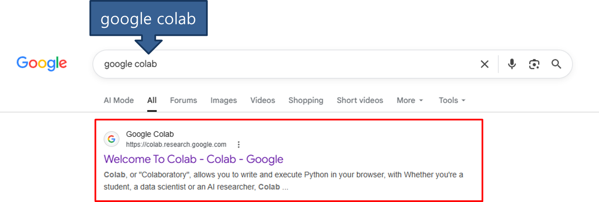
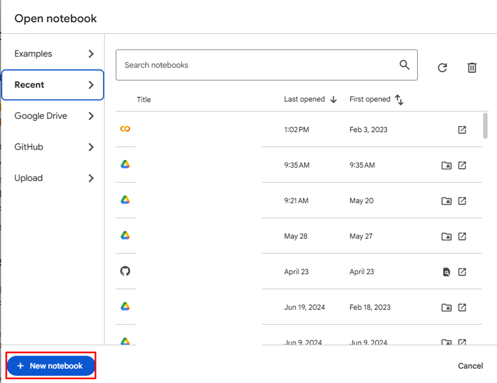
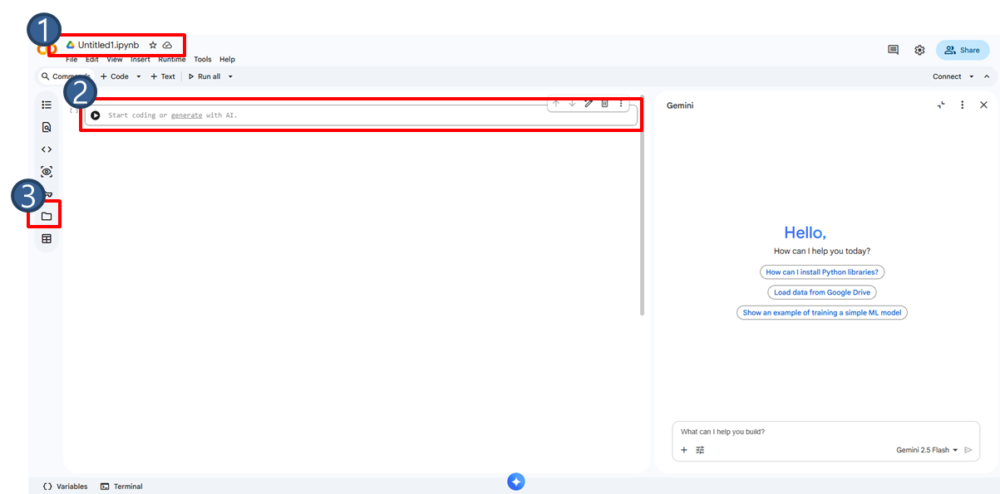
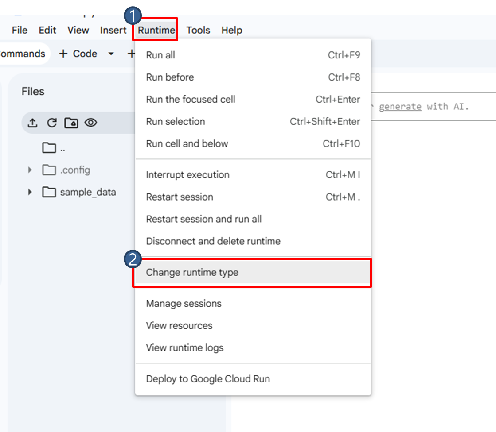
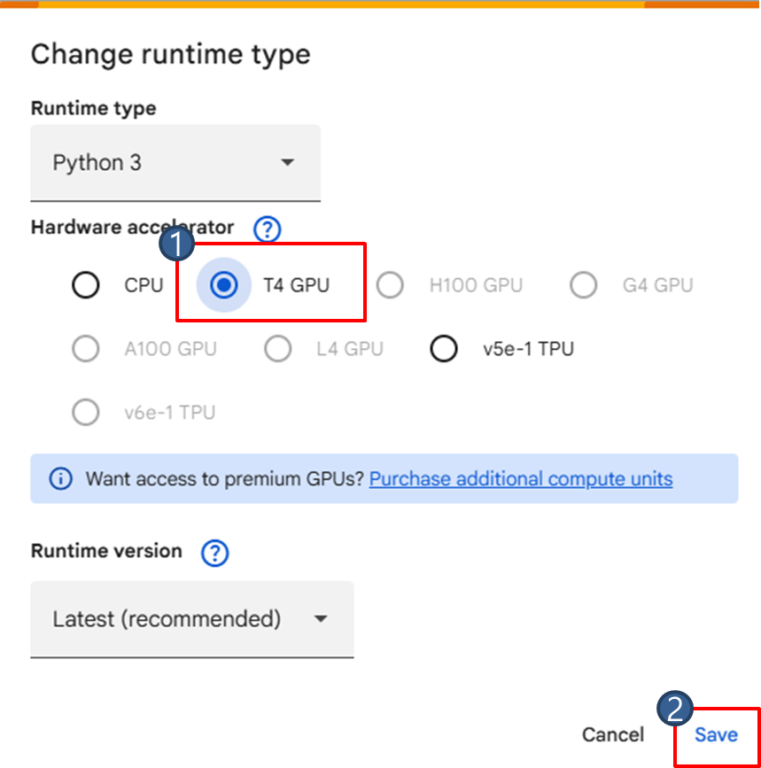

# Google Colab

Google Colab은 Jupyter Notebook 환경을 웹브라우저에서 사용할 수 있도록 Google에서 제공하는 클라우드 기반 개발 플랫폼입니다. 별도의 Python 환경을 설치하지 않고도 브라우저에서 바로 Python 코드를 실행할 수 있는 서비스입니다.

1. 설치 없이 이용 가능
일반적으로 Python 개발을 하려면 Python 설치, 가상환경 생성, 라이브러리 설치, CUDA 설치 등이 필요하지만 Colab은 브라우저만 있으면 Python 코드를 바로 실행할 수 있습니다.

2. GPU 사용 가능
딥러닝 학습에 필요한 GPU를 무료 또는 유료 플랜으로 사용할 수 있습니다. 본 교재의 Chapter8 예제는 무료 플랜에서도 실행할 수 있도록 구성되어 있지만, GPU 할당 여부와 사용 시간은 Colab 정책과 계정 상태에 따라 달라질 수 있습니다.

3. Jupyter Notebook 기반
코드를 셀 단위로 실행합니다.

4. Google Drive 연동
구글 드라이브를 마운트하여 파일을 읽고 저장할 수 있습니다.

5. AI/딥러닝 라이브러리 기본 제공
NumPy, PyTorch 등 주요 AI/딥러닝 라이브러리가 기본 제공되며, 필요한 패키지는 추가로 설치할 수 있습니다.

## 사전 준비

Colab을 이용하기 위해선 Google 계정이 필요합니다. 계정에 로그인한 뒤, Google Colab을 검색하여 들어갑니다.

Google Colab에 들어가면 아래와 같은 창이 뜹니다. `New notebook`을 클릭하여 새 노트북을 열어줍니다.

새 노트북을 열면 아래와 같은 창이 열립니다. 자주 사용하는 버튼을 설명하겠습니다. `1`에서는 파일명을 변경할 수 있고 `2`에서 코드를 입력합니다. `3`은 파일 패널이며, 여기에서 현재 런타임 파일을 확인하거나 Google Drive를 마운트할 수 있습니다. Google Drive를 마운트를 하지 않고 `/content` 아래에만 저장한 파일은 런타임이 초기화되거나 종료될 때 사라질 수 있습니다.

다음으로 학습을 위한 runtime을 설정하겠습니다. 기본적으로 CPU로 설정되어 있어 이를 GPU로 변경합니다. Runtime > Change runtime type 을 클릭합니다.

Change runtime type 창이 뜨면, Hardware accelerator를 GPU로 설정하고, 사용 가능한 경우 T4 GPU를 선택한 뒤 저장합니다.

