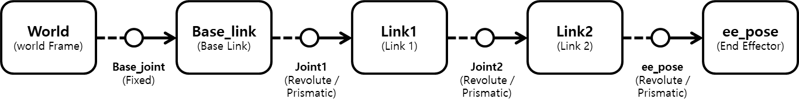
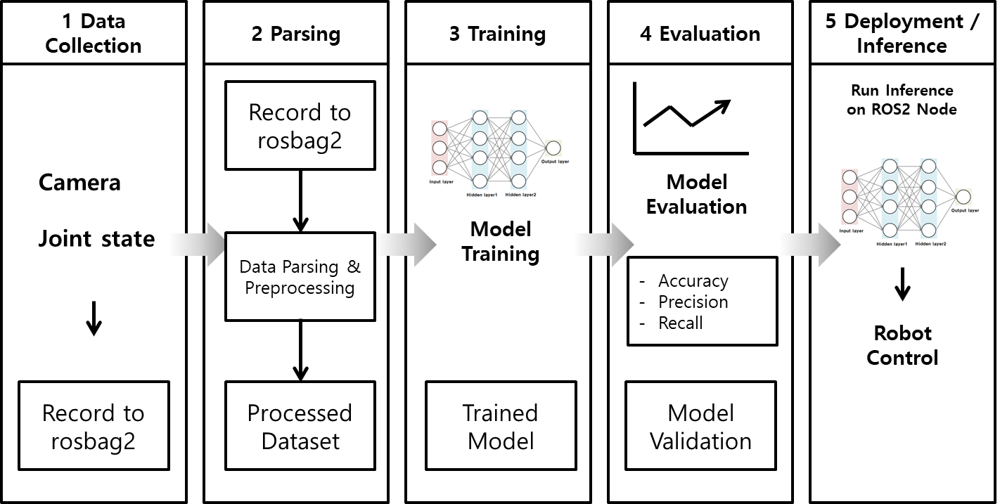
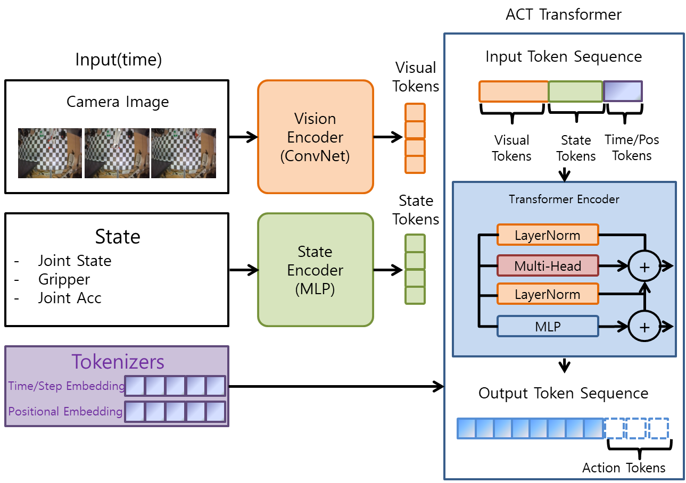
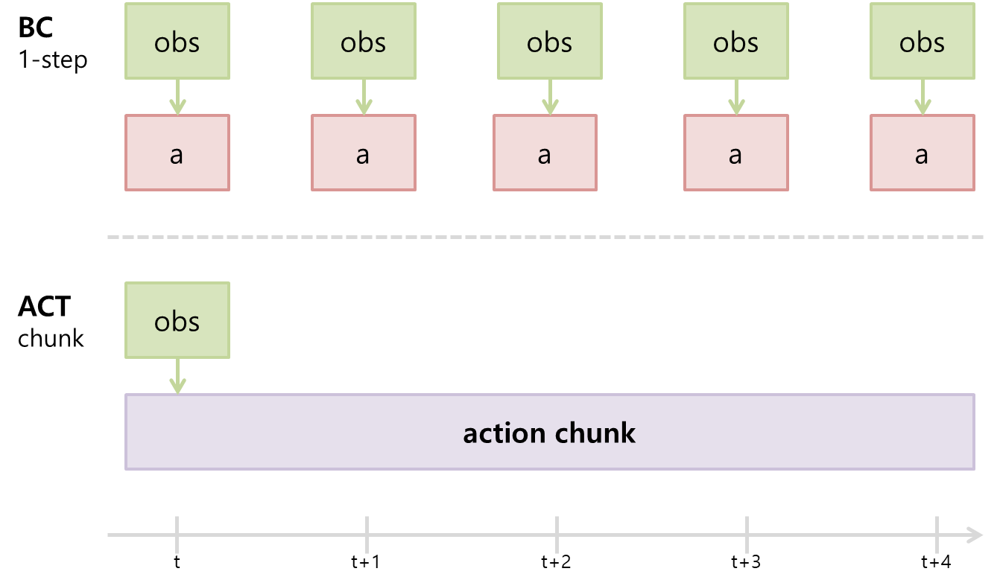

# LeRobot

이번 장에서는 LeRobot에 대해 알아보겠습니다.

## LeRobot이란?

LeRobot은 PyTorch를 기반으로 실제 로봇 공학에 필요한 모델, 데이터 셋, 도구를 제공하는 것을 목표로 합니다. 모방 학습과 강화 학습에 중점을 두고 실제로 적용 가능한 것으로 입증된 접근 방식을 포함하고 있습니다. 이미 사전 학습된 모델 세트, 사람이 직접 수집한 시뮬레이션 데이터 셋, 그리고 시뮬레이션 환경을 제공하여 누구나 쉽게 시작할 수 있도록 지원합니다.

LeRobot에 대한 자세한 내용은 아래 링크를 참고해 주시기 바랍니다.

- https://huggingface.co/docs/lerobot/index
- https://github.com/huggingface/lerobot

### 데이터 형식

LeRobotDataset은 로봇 학습 데이터를 일관된 형식으로 저장하고 불러오기 위한 포맷입니다. 관측 값, 행동 값, 시간축 정보, 카메라 영상 같은 다중 모달 데이터를 함께 다룰 수 있으며, Hugging Face Hub나 로컬 폴더에서 같은 방식으로 읽을 수 있습니다. Hugging Face Hub에서 색인, 검색 및 시각화를 위한 풍부한 메타데이터도 제공합니다.

### Imitation Learning

Imitation Learning(IL)은 모방학습으로, 특정 상황에서 전문가의 **행동 데이터를 모방하여 학습**하는 기법을 말합니다. 이번 장에서는 그중 가장 기본적인 **행동 복제(Behavioral Cloning)** 를 중심으로 다룹니다.

Imitation Learning은 직접적인 보상 설계가 필요 없고 강화 학습에 비해 학습 초기 단계에서 훨씬 빠르고 효율적입니다. 그러나 훈련 데이터가 없는 상황에서는 대처 능력이 떨어질 수 있고, 전문가의 데이터가 고품질이어야 좋은 성능을 낼 수 있습니다.

대표적인 방법은 다음과 같습니다.
1. **행동 복제(Behavioral Cloning)**: 전문가의 상태-행동 쌍을 직접 학습합니다.
2. **역강화학습(Inverse Reinforcement Learning)**: 전문가 행동으로부터 보상 함수를 추정합니다.
3. **상호작용 모방학습**: 학습 중 환경과 상호작용하면서 전문가 피드백을 반영합니다.





## Policy

Policy(정책)는 로봇, 강화학습, 모방학습에서 현재 상태를 보고 어떤 행동을 할지 결정하는 함수입니다. **입력(state) → 행동(action)** 을 만들어내는 것이라고 볼 수 있습니다. 수식은 아래와 같습니다.

```math
 a_t = \pi(s_t) 
```

state는 현재 로봇이 인식하고 있는 정보입니다. 예를 들어 카메라 이미지, 관절 각도, 그리퍼(gripper) 상태, 속도, 위치 등이 state가 될 수 있습니다. action은 policy가 출력하는 행동입니다. 예를 들어 joint target, velocity, torque, gripper control 등이 action이 될 수 있습니다. 전체적인 흐름은 보통 **센서 → state 생성 → policy 입력 → action 출력 → 로봇 움직임**의 구조를 지닙니다. 

LeRobot에서 말하는 policy는 주로 데이터를 학습해 행동을 예측하는 머신러닝 기반 정책을 뜻합니다. 예를 들어 ACT, SmolVLA, Pi0 같은 정책이 여기에 해당됩니다. Policy는 구현 방식에 따라 Rule-based policy, Classical control policy, Neural Network policy 등으로 나눌 수 있습니다. ACT는 이 중 Neural Network policy 계열의 대표적인 예시입니다.

그렇다면 모델과 policy의 차이는 무엇일까요? 모델은 더 넓은 의미로 AI 네트워크 전체를 가리키고, policy는 그중 행동(action)을 출력하는 모델을 뜻합니다. 모든 policy는 모델이지만, 모든 모델이 policy인 것은 아닙니다.

### ACT

많은 policy 중 이 장에서 사용할 policy는 ACT입니다. ACT는 **Action Chunking with Transformer**의 약자입니다. 로봇의 모방학습을 위한 Transformer 기반 정책 모델입니다. 특히 Hugging Face의 LeRobot에서 자주 사용되는 정책 중 하나입니다.



그렇다면 ACT는 왜 만들어졌을까요? 기존의 전형적인 Behavioral Cloning(BC)은 보통 현재 상태에서 다음 행동 하나를 예측하는 방식이 많습니다. 예를 들어 현재 이미지를 이용해 관절각 하나를 예측하는 형식입니다. 그런데 로봇은 작은 오차가 계속 누적됩니다. 0.1도 오차가 발생하면 다음 스텝에서 0.2도, 0.3도로 누적되어 결국 물체를 놓치게 됩니다. 특히 집기, 삽입, 양팔 협업, 정밀 조작(manipulation)에서는 이 문제가 매우 심각합니다. 이러한 문제를 해결하기 위해 **Action Chunking** 방식을 이용합니다. 행동을 하나씩 예측하지 않고, 앞으로의 행동 여러 개를 한 번에 예측하는 것입니다. 즉 현재 상태 → 미래 행동 시퀀스 전체 출력의 구조가 됩니다. 



대부분 기존의 BC는 매 스텝마다 다시 추론해야 했습니다. 하지만 ACT는 현재 이미지를 통해 앞으로 여러 개의 스텝 행동을 예측하는 방식으로, 여러 개의 joint trajectory를 하나의 chunk 단위로 한 번에 생성한다고 볼 수 있습니다. Chunk는 행동을 trajectory 단위로 다룹니다. 예를 들어 물체 쪽으로 이동 → 집기 → 목표 위치로 이동처럼 **연속된 행동 패턴을 함께 예측**하는 식입니다. 이를 통해 움직임이 부드럽고 목표 지향적이며 trajectory consistency가 높아집니다.


#### 한계

ACT에도 한계가 있습니다.

1. 일반화가 약함

훈련 데이터와 너무 다른 환경, 예를 들어 조명 변화, 카메라 위치 변화, 새로운 배경에 약할 수 있습니다.

2. 언어 이해 능력은 거의 없음

기본 ACT는 vision-to-action에 가까워서 language grounding은 약합니다.

3. 장기 계획 약함

복잡한 멀티 스텝 작업인 문 열기, 물건 찾기, 도구 사용 같은 작업에는 한계가 있습니다. 이러한 한계를 보완하기 위해 최근에는 언어 이해와 더 넓은 일반화를 함께 다루는 VLA 계열 모델(OpenVLA, SmolVLA, RT-2 등)도 활발히 연구되고 있습니다.

| 항목      | ACT   | Diffusion Policy |
| :-------: | :-----: | :----------------: |
| 속도      | 빠름    | 느림               |
| 구현 난이도  | 쉬움    | 어려움              |
| 데이터 요구량 | 적음    | 많음               |
| 안정성     | 높음    | 높음               |
| 다양성 표현  | 보통    | 매우 좋음            |
| 입문용     | 매우 좋음 | 중급 이상            |
