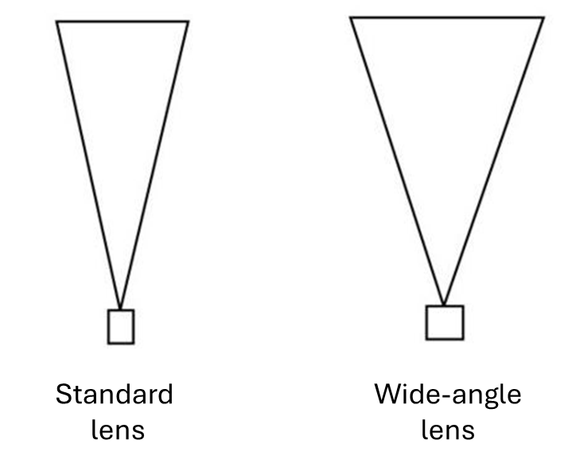
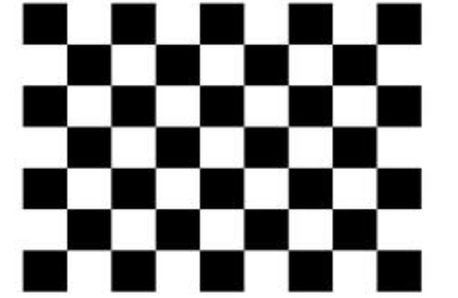
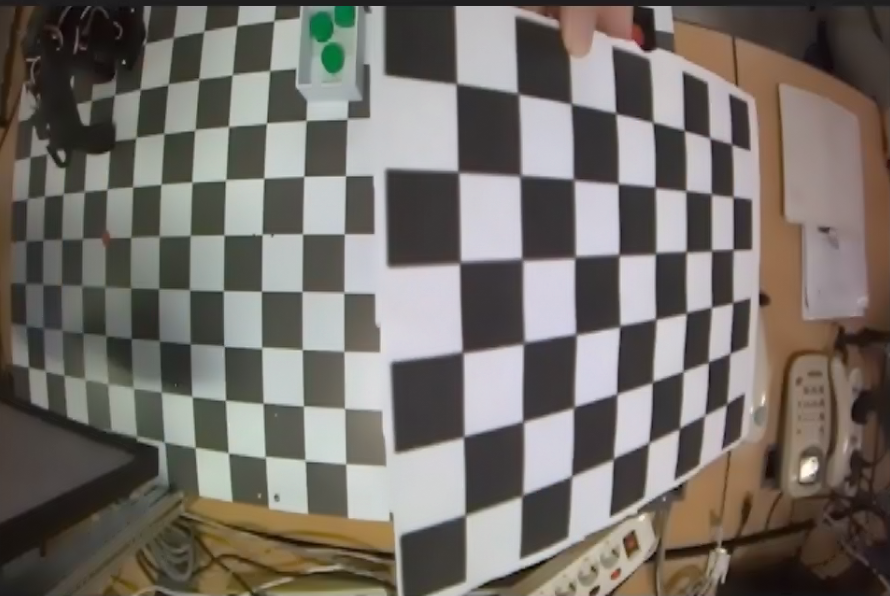
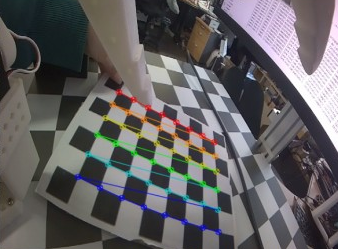
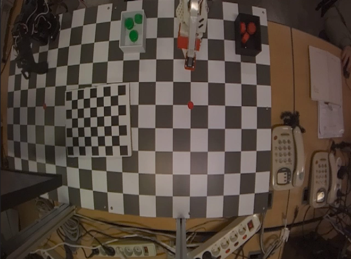
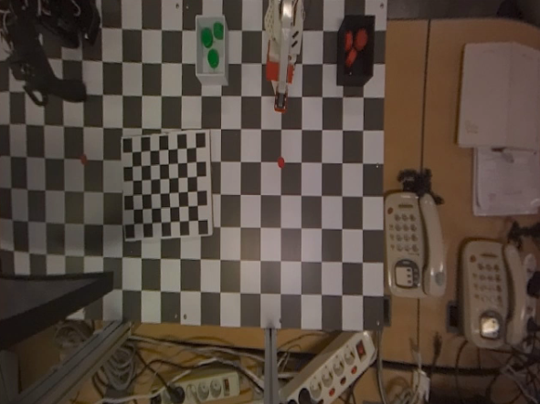

# Camera Calibration

카메라 캘리브레이션(Camera Calibration)은 **3차원 공간상의 물리적 세계와 카메라를 통해 얻어지는 2차원 이미지 평면 간의 복잡한 기하학적 관계를 정량적으로 모델링하고 분석**하는 과정입니다. 이렇게 얻은 결과는 수학적 변환 모델로 나타나며 카메라 렌즈 왜곡, 초점 거리, 광학적 중심 위치 등을 포괄합니다. 

이 모델을 활용하여 2D 이미지 좌표를 3D 세계 좌표로 매핑하거나, 그 역의 과정을 수행하는 데 기본 정보를 제공합니다. 다만 2D 이미지 좌표만으로 3D 세계 좌표를 유일하게 복원하려면 깊이 정보나 외부 파라미터 같은 추가 정보가 필요합니다. 카메라 캘리브레이션은 카메라 영상의 왜곡과 실제 공간 좌표를 보정하여, 카메라가 현실 세계를 어떻게 보고 있는지 수학적으로 모델링하는 과정입니다.

## 렌즈 왜곡

카메라 캘리브레이션을 수행하는 가장 대표적인 이유는 **렌즈 왜곡** 때문입니다. 실제 카메라는 완벽한 핀홀 카메라가 아닙니다. 이로 인해 직선이 휘어 보이고 물체의 크기가 가장자리에서 달라 보여 거리나 각도 계산이 틀어질 수 있습니다. 따라서 카메라 렌즈 특성과 왜곡, 위치 관계를 수학적으로 추정해야 합니다. 

PhysicAI Arm 장비의 Follower arm 위에서 관측하는 카메라를 살펴보겠습니다. 이 카메라는 수평 화각이 98도, 수직 화각이 75도인 광각 렌즈입니다. 광각 렌즈의 경우 아래 사진처럼 표준 렌즈보다 더 넓은 화각의 빛을 받아들일 수 있습니다. 다만 화각이 넓은 광각 렌즈는 구면-평면 간 변환 오차가 커지면서 중심은 정상이지만 주변부로 갈수록 직선이 바깥쪽으로 벌어져 휘어지는 **배럴 왜곡(Barrel Distortion)** 현상이 발생합니다. 이를 보정해 주지 않으면 실제 3차원 공간과 차이가 발생해 데이터셋 수집 과정에서 품질 좋은 데이터를 수집하기가 어려워집니다.



## 캘리브레이션

이제 PhysicAI Arm Camera를 사용해 실제 캘리브레이션 작업을 진행해 보겠습니다. 카메라 캘리브레이션은 Python, OpenCV를 활용하여 진행합니다. 해당 패키지에 관한 자세한 정보는 아래 사이트를 참고해 주시기 바랍니다. PhysicAI Arm에는 이미 설치되어 있으므로 따로 준비할 필요는 없습니다.

- https://www.python.org/
- https://opencv.org/

### 얻을 수 있는 것

카메라 캘리브레이션을 통해 대표적으로 다음 두 가지를 얻을 수 있습니다.

1. Intrinsic Parameters(내부 파라미터)
카메라가 영상을 어떤 비율과 중심으로 투영하는가를 나타냅니다.

```math
K =
\begin{bmatrix}
f_x & 0 & c_x \\
0 & f_y & c_y \\
0 & 0 & 1
\end{bmatrix}
```

- $f_x, f_y$: 초점 거리, 픽셀 단위
- $c_x, c_y$: 영상 중심점

2. Distortion Coefficients(왜곡 계수)
렌즈 왜곡 정보를 나타내는 값입니다.
- Radial distortion: 배럴 왜곡, 핀 쿠션 왜곡
- Tangential distortion: 렌즈가 삐뚤어진 경우

OpenCV에서는 보통

```math
(k_1, k_2, p_1, p_2, k_3)
```

의 형태로 사용합니다.

### 체커보드

OpenCV에서는 캘리브레이션에 주로 체커보드를 사용합니다. 체커보드 패턴은 1998년에 발표된 [Zhang의 논문](https://www.microsoft.com/en-us/research/wp-content/uploads/2016/02/tr98-71.pdf)에 수록되어 있습니다. 패턴이 뚜렷해 쉽게 감지할 수 있고, 각 사각형 코너들은 서로 다른 방향으로 급격한 기울기를 가지므로 위치 파악에 이상적입니다. 이로 인해 현재까지도 많이 사용되고 있습니다.

캘리브레이션 작업을 위해 아래 9x7 형태의 체커보드 이미지를 다운로드한 뒤 출력합니다. 캘리브레이션 작업에는 9x7칸(checker squares) 체커보드를 사용합니다. OpenCV의 `cv.findChessboardCorners()`에는 사각형 수가 아니라 내부 코너 수를 넣어야 하므로, 이 경우 'CHECKERBOARD=(8, 6)'으로 설정합니다.

[이미지 다운로드](https://github.com/hanback-lab/PhysicAI-Arm-Temp/blob/main/Chapter07.%20AI%20Overview/pds/checkerboard9x7.png)



### 전체 흐름

**1. 체커보드를 여러 각도에서 촬영**

카메라 캘리브레이션 작업을 진행하기 전, 체커보드 이미지를 준비해야 합니다. 렌즈에서 최소 30cm 떨어진 거리에서 체커보드 이미지를 촬영합니다.

현재 사용 중인 PhysicAI Arm의 카메라는 End device와 CSI 케이블로 연결되어 있습니다. 카메라 영상을 불러오기 위해서는 GStreamer 패키지를 활용하여 호출해야 합니다. End device에 설치된 OpenCV는 GStreamer 기능을 지원합니다.

- https://gstreamer.freedesktop.org/

체커보드를 다양한 위치와 각도로 옮겨 가며 최소 10장 이상의 사진을 찍습니다. 표시되는 GUI에 's' 키를 누르면 이미지가 저장됩니다. `cv2.imwrite` 명령어는 이미지를 캡처한 후 디스크에 저장합니다. 사진을 저장할 경로는 임의로 변경해도 무관합니다. 이 예제에서는 촬영한 체커보드 이미지를 `calibration_img/` 폴더에 저장한다고 가정합니다. 다른 경로를 사용할 경우 코드의 `glob.glob(...)` 경로도 함께 수정해야 합니다.

이미지 촬영을 완료한 후 지정한 경로에 다음과 같이 사진이 저장된 것을 확인할 수 있습니다.

```python
import cv2

gst = (
    "nvarguscamerasrc sensor-id=0 ! "
    "video/x-raw(memory:NVMM), width=1280, height=720, framerate=60/1, format=NV12 ! "
    "nvvidconv flip-method=0 ! "
    "video/x-raw, width=640, height=480, format=BGRx ! "
    "videoconvert ! "
    "video/x-raw, format=BGR ! "
    "appsink max-buffers=1 drop=true sync=false"
)

cam = cv2.VideoCapture(gst, cv2.CAP_GSTREAMER)

count = 0

try:
    while True:
        ret, img = cam.read()

        cv2.imshow("img", img)
        if ord('s') == cv2.waitKey(1):
            cv2.imwrite(f"calibration_img/cali_{count}.jpg", img)
            count += 1
except KeyboardInterrupt:
    pass
finally:
    cv2.destroyAllWindows()
```



**2. 코너 검출**

캘리브레이션 진행을 위해 체커보드의 코너를 찾습니다. `cv2.findChessboardCorners()` 명령어를 이용하여 코너를 찾을 수 있습니다. 촬영된 사진들을 불러와 아래 두 종류의 좌표를 찾습니다.

- objpoints: 각 이미지에서 동일한 패턴 점의 3D 좌표
- imgpoints: 각 이미지에서 검출된 2D 코너 좌표

objpoints는 3차원 세계(world) 좌표의 기준점입니다. imgpoints는 `cv2.findChessboardCorners()` 함수에서 추출된 코너들을 `cv2.cornerSubPix`를 통해 보정한 뒤 저장합니다. 



**3. 카메라 행렬 및 왜곡 계수 추출**

`cv2.calibrateCamera` 및 `cv2.getOptimalNewCameraMatrix` 함수를 사용하여 앞서 설명한 수학 모델을 바탕으로 계산된 값을 얻을 수 있습니다. `cv2.calibrateCamera()`는 원래 카메라 행렬(`mtx`)과 왜곡 계수(`dist`)를 추정합니다. 이후 `cv2.getOptimalNewCameraMatrix()`는 이 값을 바탕으로 왜곡 보정 시 사용할 새 카메라 행렬(`newcameramtx`)을 계산합니다.

`rvecs` 및 `tvecs`는 각 촬영 이미지에 대한 외부 파라미터로, 각각 회전 벡터(rotation vector)와 이동 벡터(translation vector)를 의미합니다. `newcameramtx`의 경우 캘리브레이션으로 얻은 카메라 행렬을 `alpha` 매개변수를 이용해 검정 여백(virtual pixels)을 조절한 새 카메라 행렬입니다.

**4. 이미지 비교**

이제 캘리브레이션을 적용한 이미지와 적용하지 않은 이미지를 비교해 가며 차이를 확인해 보겠습니다. `cv2.undistort` 함수를 통해 카메라 행렬(mtx)과 왜곡 계수(dist), 검정 여백이 조절된 카메라 행렬(newcameramtx)을 기반으로 원본 이미지를 보정합니다. 아래 사진처럼 캘리브레이션을 적용하면 원본 이미지보다 왜곡이 크게 줄어든 것을 확인할 수 있습니다.

<table>
 
</table>

과정이 모두 끝나면 캘리브레이션의 결과가 저장된 파일을 이용하여 추후 로봇 학습에서 이미지 왜곡을 보정하는 데 사용할 수 있습니다. 캘리브레이션 결과가 저장된 JSON 파일의 위치는 다음 장에서 나올 예제에 활용하기 위해 기억해 두시기 바랍니다.

### 전체 코드

```python
import cv2
import numpy as np
import glob

CHECKERBOARD=(8,6)

criteria = (cv2.TERM_CRITERIA_EPS + cv2.TERM_CRITERIA_MAX_ITER, 30, 0.001)

objp = np.zeros((CHECKERBOARD[0]*CHECKERBOARD[1],3), np.float32)
objp[:,:2] = np.mgrid[0:CHECKERBOARD[0], 0:CHECKERBOARD[1]].T.reshape(-1,2)
objpoints = []
imgpoints = []

images = glob.glob('calibration_img/*.jpg')

for frame in images:
    img = cv2.imread(frame)
    gray = cv2.cvtColor(img, cv2.COLOR_BGR2GRAY)

    ret, corners = cv2.findChessboardCorners(gray, CHECKERBOARD, None)

    if ret:
        objpoints.append(objp)

        corners2 = cv2.cornerSubPix(gray, corners, (11,11), (-1,-1), criteria)
        imgpoints.append(corners2)

        cv2.drawChessboardCorners(img, CHECKERBOARD, corners2, ret)
        cv2.imshow('Corners', img)
        cv2.waitKey(500)

cv2.destroyAllWindows()

ret, mtx, dist, rvecs, tvecs = cv2.calibrateCamera(
        objpoints, imgpoints, gray.shape[::-1], None, None
        )

h, w = (480, 640)
newcameramtx, roi = cv2.getOptimalNewCameraMatrix(mtx, dist, (w,h), 0, (w,h))
print("Camera Matrix:\n", mtx)
print("Distortion Coefficients:\n", dist)
print("New camera Matrix:\n", newcameramtx)

gst = (
    "nvarguscamerasrc sensor-id=0 ! "
    "video/x-raw(memory:NVMM), width=1280, height=720, framerate=60/1, format=NV12 ! "
    "nvvidconv flip-method=0 ! "
    "video/x-raw, width=640, height=480, format=BGRx ! "
    "videoconvert ! "
    "video/x-raw, format=BGR ! "
    "appsink max-buffers=1 drop=true sync=false"
)

cam = cv2.VideoCapture(gst, cv2.CAP_GSTREAMER)

ret, img = cam.read()
cv2.imwrite("before_cali.jpg", img)


dst = img.copy()
dst = cv2.undistort(dst, mtx, dist, None, newcameramtx)
cv2.imwrite("after_cali.jpg", dst)
cam.release()

import json

calibration_data = {
        "camera_matrix": mtx.tolist(),
        "dist_coeff": dist.tolist(),
        "new_camera_matrix": newcameramtx.tolist(),
}

with open("/home/soda/physicai_arm_ws/src/physicai_arm/physicai_arm/calibration.json", "w") as f:
    json.dump(calibration_data, f, indent=4)
```

----

## 복습 퀴즈

1. 카메라 캘리브레이션은 무엇을 모델링하는 과정인가?

<br>

2. 2D 이미지 좌표만으로 3D 세계 좌표를 유일하게 복원하기 어려운 이유는 무엇인가?

<br>

3. 광각 렌즈에서 배럴 왜곡이 발생하면 이미지가 어떻게 보이는가?

<br>

4. 렌즈 왜곡을 보정하지 않으면 로봇 학습 데이터 품질에 어떤 문제가 생길 수 있는가?

<br>

5. Intrinsic Parameters는 무엇을 나타내는가?

<br>

6. Distortion Coefficients는 무엇을 나타내는가?

<br>

7. Radial distortion과 Tangential distortion의 차이를 설명하시오.

<br>

8. 카메라 캘리브레이션에 체커보드를 많이 사용하는 이유는 무엇인가?

<br>

9. 9x7칸 체커보드를 `CHECKERBOARD=(8,6)`으로 설정하는 이유는 무엇인가?

<br>

10. objpoints와 imgpoints의 차이는 무엇인가?

<br>

11. 아래 함수가 무엇을 의미하는지 작성하시오.<br>
a. cv2.findChessboardCorners()<br>
b. cv2.cornerSubPix()<br>
c. cv2.calibrateCamera()<br>
d. cv2.getOptimalNewCameraMatrix()<br>
e. cv2.undistort()

<br>

12. 캘리브레이션 결과를 JSON 파일로 저장해 두면 다음 실습에서 어떻게 활용할 수 있는가?

<br>

13. 캘리브레이션 이미지가 한 방향, 한 거리에서만 촬영되면 어떤 문제가 생길 수 있는가?

<br>

