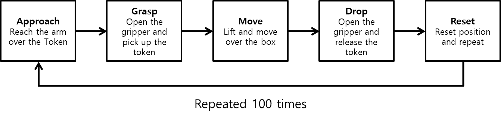
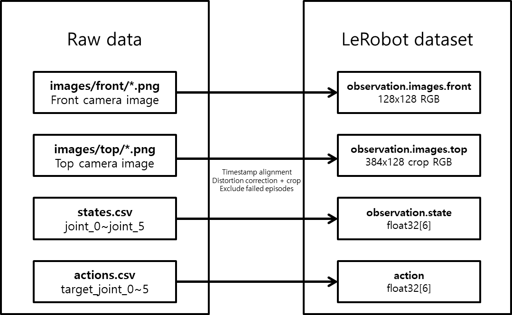
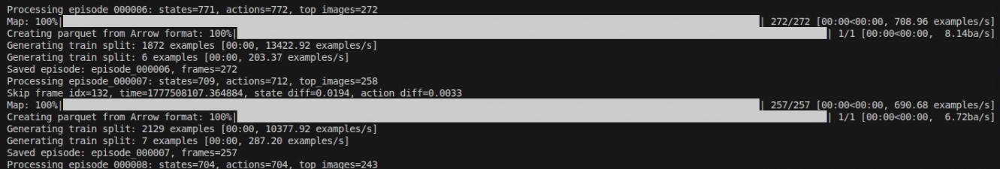
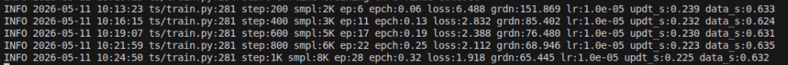

# Dataset & Training

## Data Collection

코드를 모두 작성했으면 학습에 필요한 데이터를 수집해야 합니다. 데이터 수집에는 세 개의 터미널이 필요합니다. 첫 번째 터미널에서는 로봇 bringup 런치파일을 실행하고, 두 번째 터미널에서는 teleoperation 노드를 실행합니다. 세 번째 터미널에서는 앞서 작성한 `logger_node`를 실행해 에피소드 데이터를 저장합니다. 수집해야 할 행동은 다음과 같습니다.

1. 토큰 위로 팔을 뻗는다.
2. 그리퍼를 연 후, 토큰을 집는다.
3. 들어 올린 후 박스 위로 팔을 옮긴다.
4. 그리퍼를 열어 토큰을 떨어트린다.
5. 위치를 초기화시킨 후 1~4를 반복한다.



```sh
# Terminal 1

ros2 launch physicai_arm bringup.launch.py
```
```sh
# Terminal 2

ros2 run physicai_arm teleoperation
```
```sh
# Terminal 3

ros2 run physicai_arm logger_node
```

### logger_node를 통한 데이터 수집

위에서 명령어를 통해 `logger_node`를 실행했다면 데이터 수집을 진행합니다. 첫 에피소드는 'start'를 입력하지 않아도 자동으로 시작됩니다. 노드를 시작하기 전 토큰 위치를 세팅하고 시작합니다. Leader(검은 팔)를 이용해 Follower(하얀 팔)를 조종하여 토큰을 집고 상자에 넣습니다. 한 번에 여러 행동을 하기보다는, 조금씩 끊어서 천천히 하기를 권장합니다. 해당 행동을 성공하면 's', 실패했다면 'f'를 입력합니다. 이 과정을 약 100회 정도 반복합니다. 데이터 수집이 끝났다면 'q'를 입력하여 노드를 종료합니다. 나머지 런치 파일과 노드도 `Ctrl+C`를 이용해 종료합니다.

## Parsing

우리가 수집한 데이터는 원시 데이터입니다. 이 데이터를 바로 사용할 수 있으면 편하겠지만, 원시 데이터는 LeRobot이 읽을 수 없습니다. 따라서 수집한 데이터를 LeRobot이 읽을 수 있도록 파싱해야 합니다. 파싱을 하기 전 원시 데이터의 구조는 다음과 같습니다.

```
episode_000001/
  images/front/000123_1700000.123.png
  images/top/000123_1700000.125.png
  states.csv
  actions.csv
```

`parsing_node`는 다음 작업을 수행합니다.
- 이미지와 state/action을 타임스탬프 기준으로 정렬합니다.
- top 이미지의 가운데 1/3 영역만 남기도록 crop합니다.
- LeRobot이 읽을 수 있는 데이터셋 형식으로 저장합니다.




```sh
ros2 run physicai_arm parsing_node
```

노드를 실행한 후 파싱이 진행되면 터미널에 다음과 같은 화면이 나옵니다. 모든 데이터가 파싱이 완료될 때까지 기다립니다.



## Training

데이터가 모두 준비되었다면 LeRobot을 활용하여 학습을 시작하겠습니다. 앞선 7장에서 설명했던 ACT를 이용하겠습니다. 파라미터는 아래와 같이 설정되어 있습니다. 학습이 잘 되지 않거나 파라미터를 조정하고 싶다면 수정해도 무관합니다. 괄호 안에 적어 둔 이름에 해당하는 변수 값을 수정하면 됩니다. 학습 상황을 모니터링하며 알맞게 파라미터를 조절하시기를 권장합니다. 데이터를 HuggingFace에 업로드하면 Google Colab 등 다른 환경에서 training이 가능합니다.


- 배치 사이즈(batch_size): 8
- 스텝 수(steps): 100000
- 입력 데이터 위치(dataset.repo_id): local/red_token_dataset
- 출력 데이터 위치(output_dir): outputs/train/pick_red_token
- 중간 저장(save_freq): 10000
- 로딩 프로세스 수(num_workers): 4
- 데이터 업로드 여부(policy.push_to_hub): true

```sh
lerobot-train \
  --policy.type=act \
  --dataset.repo_id=local/red_token_dataset \
  --batch_size=8 \
  --steps=100000 \
  --output_dir=outputs/train/pick_red_token \
  --job_name=pick_red_token \
  --policy.device=cuda \
  --wandb.enable=false \
  --policy.push_to_hub=true \
  --num_workers=4 \
  --save_freq=10000
```

해당 학습은 Google CoLab을 기준으로 6시간 정도 소요됩니다. 그러나 GPU 성능, 데이터 크기, `num_workers` 설정에 따라 학습 시간은 크게 달라질 수 있습니다. Google의 CoLab환경에서 학습하는 것을 권장합니다. 학습이 정상적으로 진행되기 시작하면 아래와 같은 로그가 터미널에 표시됩니다. 

학습이 끝나지 않더라도 `Ctrl+C`를 눌러 조기 중단을 할 수 있습니다. 조기 중단을 할 때 주의점은 모델이 **중간 저장**이 되었는지 꼭 확인해야 합니다. 저장이 되지 않았을 경우, 마지막 checkpoint 이후의 학습 진행 상태와 모델 파라미터 변화는 복구할 수 없습니다. 

파라미터를 수정하지 않은 경우 현재 학습은 10,000번에 한 번씩 중간의 내용이 저장됩니다. 저장된 checkpoint부터 학습을 다시 시작하려면 아래 명령어를 입력하면 됩니다.

```sh
lerobot-train \
  --config_path=outputs/train/pick_red_token/checkpoints/last/pretrained_model/train_config.json \
  --resume=true
```



|항목|이름|의미|
|---|----|----|
|step|step|가중치 업데이트 횟수|
|smpl|samples|지금까지 본 총 프레임 수|
|ep|episodes|지금까지 사용한 총 에피소드 수|
|epch|epoch|전체 데이터를 몇 번 봤는지|
|loss|loss|예측 오차|
|grdn|gradient norm|가중치 업데이트 크기|
|lr|learning rate|학습률|
|updt_s|update seconds|가중치 업데이트 소요 시간|
|data_s|data seconds|데이터 로딩 소요 시간|