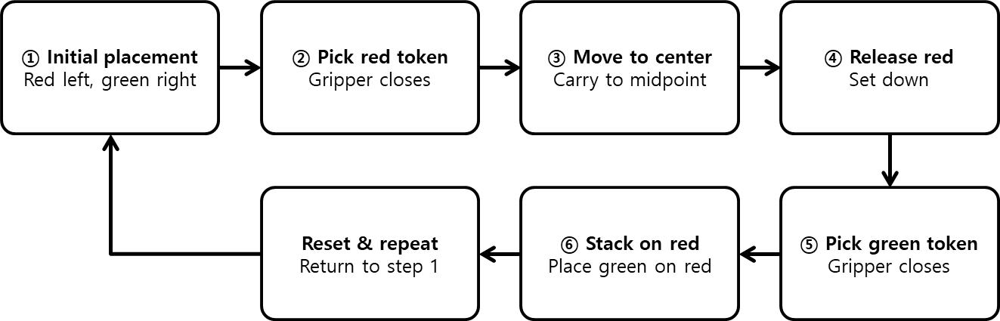

# Training & Control

데이터 수집과 파싱 과정은 [8장의 8-2. Dataset & Training](/Chapter08.%20Pick%20the%20Red%20Token/8-2.%20Dataset%20&%20Training.md#data-collection)을 참고해 주시기 바랍니다. 이번 장은 9-1에서 노드 파라미터를 stacking_token 작업에 맞게 변경하고 빌드한 상태에서 진행합니다. 이번 장에서는 토큰을 쌓는 동작을 수집합니다. 수집 데이터 개수는 성공 에피소드 기준 200개 이상을 권장합니다. 수집해야 할 행동은 다음과 같습니다.

 

1. 로봇 기준에서 좌측에 빨간 토큰, 우측에 초록 토큰을 위치시킨 뒤 에피소드 수집을 시작한다.
2. 수집이 시작되면 좌측 빨간 토큰을 집는다.
3. 집은 토큰을 가운데로 옮긴다.
4. 우측 초록 토큰을 집는다.
5. 집은 토큰을 빨간 토큰 위에 쌓는다.
6. 에피소드 수집을 완료한 뒤, 다시 위치를 초기화하고 2~6을 반복한다.



<br><br>


## Training

수집한 원시 데이터를 8장과 같은 방식으로 파싱하여 'local/stacking_token_dataset'이 준비되었다면 학습을 시작합니다. 파라미터는 아래와 같이 설정되어 있습니다. 앞과 마찬가지로 파라미터는 학습 상황에 맞게 수정해도 무관합니다. 학습 로그 확인, 조기 중단, checkpoint 재시작 방법은 [8장의 Training절](/Chapter08.%20Pick%20the%20Red%20Token/8-2.%20Dataset%20&%20Training.md#training)과 동일합니다. 단, 경로는 `outputs/train/stacking_token`을 기준으로 적용합니다.

- 배치 사이즈(batch_size): 8
- 스텝 수(steps): 200000
- 입력 데이터 위치(dataset.repo_id): local/stacking_token_dataset
- 출력 데이터 위치(output_dir): outputs/train/stacking_token
- 중간 저장(save_freq): 10,000
- 로딩 프로세스 수(num_workers): 8

```sh
lerobot-train \
  --policy.type=act \
  --dataset.repo_id=local/stacking_token_dataset \
  --batch_size=8 \
  --steps=100000 \
  --output_dir=outputs/train/stacking_token \
  --job_name=act_stacking_token \
  --policy.device=cuda \
  --policy.push_to_hub=false \
  --wandb.enable=false \
  --num_workers=8 \
  --save_freq=10,000
```

|parameter|chapter8|chapter9|
|---------|:------:|:------:|
|save_dir|dataset_raw|stacking_dataset_raw|
|task_name|pick_red_token|stacking_token|
|RAW_ROOT|./dataset_raw|./stacking_dataset_raw|
|OUT_REPO_ID|local/red_token_dataset|local/stacking_token_dataset|
|output_dir|outputs/train/pick_red_token|outputs/train/stacking_token|
|policy_path(model)|.../pick_red_token/...|.../stacking_token/...|

## 실제 로봇 제어

학습을 모두 마쳤으면 생성된 모델을 이용하여 로봇을 제어해 보겠습니다. 제어를 시작하기 전에 `inference_node`의 'policy_path'가 `outputs/train/stacking_token/checkpoints/last/pretrained_model`을 가리키는지 확인합니다. 로봇이 실행되는 중 과하게 움직이거나 멈추고 싶을 때에는 `inference_node`를 실행 중인 터미널에서 `Ctrl+C`를 눌러 노드 실행을 중단할 수 있습니다.

로봇을 실행하기 위해서는 첫 번째 터미널에서는 bringup 런치파일을 실행하고, 두 번째 터미널에서는 추론 노드를 실행해야 합니다.

```sh
# Terminal 1

ros2 launch physicai_arm bringup.launch.py
```

```sh
# Terminal 2

ros2 run physicai_arm inference_node
```
