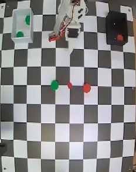
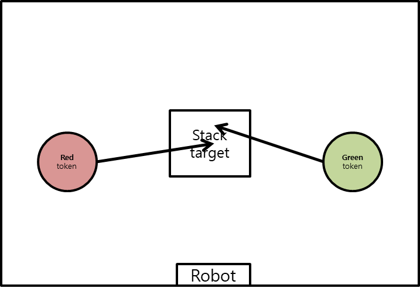
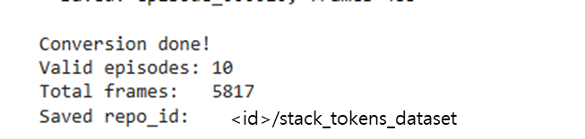

# Dataset & Training

## Data Collection

코드를 모두 작성하였다면 학습에 필요한 데이터를 수집합니다. 데이터 수집에는 세 개의 터미널이 필요합니다. 첫 번째 터미널에서는 로봇 bringup 런치 파일을 실행하고, 두 번째 터미널에서는 joystick 런치 파일을 실행합니다. 세 번째 터미널에서는 앞서 작성한 `logger_node`를 실행해 에피소드 데이터를 저장합니다.

이번 예제에서 수집해야 할 행동은 다음과 같습니다.

 

1. 빨간 토큰 위로 팔을 이동한다.
2. 그리퍼를 열고 빨간 토큰을 집는다.
3. 가운데에 빨간 토큰을 둔다.
4. 초록 토큰 위로 팔을 이동한다.
5. 그리퍼를 열고 초록 토큰을 집는다.
6. 빨간 토큰 위에 올려둔다.
7. 초기 상태로 초기화하고 이를 반복한다.


```sh
# Terminal 1

ros2 launch physicai_arm bringup.launch.py
```

```sh
# Terminal 2

ros2 launch physicai_arm joystick.launch.py
```

```sh
# Terminal 3

ros2 run physicai_arm logger_node
```

## 데이터 수집

`logger_node`를 실행하면 첫 에피소드는 `start`를 입력하지 않아도 자동으로 시작됩니다. 노드를 시작하기 전 토큰 위치를 설정합니다. 조이스틱을 이용하여 매니퓰레이터를 조작합니다.

한 번에 여러 행동을 빠르게 수행하기보다는, 조금씩 끊어서 천천히 조작하는 것을 권장합니다. 성공한 에피소드는 `s`, 실패한 에피소드는 `f`를 입력합니다. 다음 에피소드를 시작하려면 `start`를 입력합니다. 이 과정을 약 10회 정도 반복합니다. 데이터 수집이 끝났다면 `q`를 입력하여 노드를 종료합니다. 나머지 런치 파일과 노드도 `Ctrl+C`로 종료합니다. 같은 위치에 둔 토큰을 이용해 탑을 쌓는다면 20개의 데이터로도 평균적인 성능을 낼 수 있습니다. 각 다른 위치에 둔 토큰으로 탑을 쌓도록 훈련 시키기 위해서는 더 많은 데이터셋이 필요합니다.

데이터 수집이 완료되면 parsing을 위해 데이터를 구글 드라이브로 옮겨야 합니다. dataset_raw_stack 폴더가 있는 경로를 찾아 이동한 뒤, 압축해 줍니다.

```sh
zip -r dataset_raw_stack.zip dataset_raw_stack
```

먼저 좌측 메뉴바에서 `Firefox`를 눌러 인터넷을 열어줍니다. Google로 들어가 로그인한 뒤, 구글 드라이브로 들어갑니다.

파일 탐색기에서 압축한 파일을 찾아 드라이브로 드래그하여 업로드합니다.


## Parsing

데이터 파싱은 Colab에서 진행하겠습니다. [7-3. Google Colab](/Chapter07.%20AI%20Overview/7-3.%20Google%20Colab.md)을 참고해 Google Colab을 준비하시고, [8-2. Dataset & Training](/Chapter08.%20Pick%20the%20Red%20Token/8-2.%20Dataset%20&%20Training.md)을 참고해 huggingface 로그인 등 사전준비를 하시기 바랍니다.

<details>
<summary> parsing 코드</summary>

```py
import csv
import json
import shutil
from pathlib import Path
from lerobot.datasets.lerobot_dataset import LeRobotDataset
import cv2
import numpy as np
import torch


RAW_ROOT = Path("/content/dataset_raw_stack")
OUT_REPO_ID = "<id>/stack_tokens_dataset"

FPS = 20
IMAGE_SIZE = (128, 128)
TOP_CROP_SIZE = (128, 128)

MAX_TIME_DIFF = 0.06

TASK_DEFAULT = "stack"


def image_time_from_path(path):
    try:
        return float(path.stem.split("_")[-1])
    except Exception:
        return None


def build_timed_images(image_paths):
    timed = []
    for path in image_paths:
        t = image_time_from_path(path)
        if t is None or t <= 0.0:
            continue
        timed.append((t, path))
    timed.sort(key=lambda x: x[0])
    return timed


def read_csv_dict(path):
    with open(path, "r", newline="") as f:
        return list(csv.DictReader(f))


def safe_float(row, key, default=0.0):
    try:
        value = row.get(key, default)
        if value is None or value == "":
            return default
        return float(value)
    except Exception:
        return default


def get_row_time(row, fallback_index=None):
    for key in ["timestamp", "time", "t", "stamp"]:
        if key in row:
            return safe_float(row, key)
    if "sec" in row and "nanosec" in row:
        return safe_float(row, "sec") + safe_float(row, "nanosec") * 1e-9
    if "secs" in row and "nsecs" in row:
        return safe_float(row, "secs") + safe_float(row, "nsecs") * 1e-9
    if fallback_index is not None:
        return fallback_index / FPS
    return None


def row_to_state(row):
    keys = [
        "joint_0", "joint_1", "joint_2",
        "joint_3", "joint_4", "joint_5",
    ]
    return np.array([safe_float(row, k) for k in keys], dtype=np.float32)


def row_to_action_target(row):
    keys = [
        "target_joint_0", "target_joint_1", "target_joint_2",
        "target_joint_3", "target_joint_4", "target_joint_5",
    ]
    return np.array([safe_float(row, k) for k in keys], dtype=np.float32)


def load_top_image(path):
    img = cv2.imread(str(path))

    if img is None:
        img = np.zeros((TOP_CROP_SIZE[1], TOP_CROP_SIZE[0], 3), dtype=np.uint8)
    else:

        h, w = img.shape[:2]
        x_start = w // 3
        img = img[:, x_start:]
        img = cv2.resize(img, TOP_CROP_SIZE)

    img = cv2.cvtColor(img, cv2.COLOR_BGR2RGB)
    return img


def load_front_image(path):
    img = cv2.imread(str(path))

    if img is None:
        img = np.zeros((IMAGE_SIZE[1], IMAGE_SIZE[0], 3), dtype=np.uint8)
    else:
        img = cv2.resize(img, IMAGE_SIZE)

    img = cv2.cvtColor(img, cv2.COLOR_BGR2RGB)
    return img


def get_task_name(episode_path):
    metadata_path = episode_path / "metadata.json"
    if not metadata_path.exists():
        return TASK_DEFAULT
    try:
        with open(metadata_path, "r") as f:
            metadata = json.load(f)
        task_name = metadata.get("task_name", TASK_DEFAULT)
        if task_name == "stack":
            return TASK_DEFAULT
        return task_name
    except Exception:
        return TASK_DEFAULT


def get_success(episode_path):
    metadata_path = episode_path / "metadata.json"
    if not metadata_path.exists():
        return True
    try:
        with open(metadata_path, "r") as f:
            metadata = json.load(f)
        success = metadata.get("success", True)
        return success is not False
    except Exception:
        return True


def remove_old_output():
    cache_path = Path.home() / ".cache/huggingface/lerobot" / OUT_REPO_ID
    if cache_path.exists():
        shutil.rmtree(cache_path)
        print(f"Removed old output: {cache_path}")


def build_timed_rows(rows):
    timed = []
    for i, row in enumerate(rows):
        t = get_row_time(row, fallback_index=i)
        if t is None:
            continue
        timed.append((t, row))
    timed.sort(key=lambda x: x[0])
    return timed


def nearest_by_time(timed_data, target_time, start_index=0):
    if not timed_data:
        return None, start_index, None

    idx = start_index

    while idx + 1 < len(timed_data):
        now_diff = abs(timed_data[idx][0] - target_time)
        next_diff = abs(timed_data[idx + 1][0] - target_time)

        if next_diff <= now_diff:
            idx += 1
        else:
            break

    matched_time, matched_value = timed_data[idx]
    diff = abs(matched_time - target_time)

    return matched_value, idx, diff


def main():
    remove_old_output()

    features = {
        "observation.images.top": {
            "dtype": "image",
            "shape": (TOP_CROP_SIZE[1], TOP_CROP_SIZE[0], 3),
            "names": ["height", "width", "channel"],
        },
        "observation.images.front": {
            "dtype": "image",
            "shape": (IMAGE_SIZE[1], IMAGE_SIZE[0], 3),
            "names": ["height", "width", "channel"],
        },
        "observation.state": {
            "dtype": "float32",
            "shape": (6,),
            "names": ["state"],
        },
        "action": {
            "dtype": "float32",
            "shape": (6,),
            "names": ["action"],
        },
    }

    dataset = LeRobotDataset.create(
        repo_id=OUT_REPO_ID,
        fps=FPS,
        features=features,
    )

    episode_paths = sorted(RAW_ROOT.glob("episode_*"))

    print(f"Found {len(episode_paths)} raw episodes")
    print(f"top image size: {TOP_CROP_SIZE[0]}x{TOP_CROP_SIZE[1]} (w x h)")
    print(f"front image size: {IMAGE_SIZE[0]}x{IMAGE_SIZE[1]} (w x h)")

    valid_episode_count = 0
    total_frame_count = 0

    for episode_path in episode_paths:
        if not episode_path.is_dir():
            continue

        if not get_success(episode_path):
            print(f"Skip failed episode: {episode_path}")
            continue

        states_csv = episode_path / "states.csv"
        actions_csv = episode_path / "actions.csv"
        top_dir = episode_path / "images" / "top"
        front_dir = episode_path / "images" / "front"

        if not states_csv.exists():
            print(f"Skip: missing states.csv - {episode_path}")
            continue
        if not actions_csv.exists():
            print(f"Skip: missing actions.csv - {episode_path}")
            continue
        if not top_dir.exists():
            print(f"Skip: missing top image dir - {episode_path}")
            continue
        if not front_dir.exists():
            print(f"Skip: missing front image dir - {episode_path}")
            continue

        states = read_csv_dict(states_csv)
        actions = read_csv_dict(actions_csv)
        top_images = sorted(top_dir.glob("*.png"))
        front_images = sorted(front_dir.glob("*.png"))

        timed_top_images = build_timed_images(top_images)
        timed_front_images = build_timed_images(front_images)
        timed_states = build_timed_rows(states)
        timed_actions = build_timed_rows(actions)

        if not timed_states or not timed_actions or not timed_top_images or not timed_front_images:
            print(f"Skip empty episode: {episode_path}")
            continue

        task = get_task_name(episode_path)

        print(
            f"Processing {episode_path.name}: "
            f"states={len(timed_states)}, actions={len(timed_actions)}, "
            f"top={len(top_images)}, front={len(front_images)}"
        )

        state_idx = 0
        action_idx = 0
        top_idx = 0
        front_idx = 0
        added_count = 0

        for frame_time, state_row in timed_states:
            top_path,   top_idx,   top_diff   = nearest_by_time(timed_top_images,   frame_time, top_idx)
            front_path, front_idx, front_diff = nearest_by_time(timed_front_images, frame_time, front_idx)
            action_row, action_idx, act_diff  = nearest_by_time(timed_actions,      frame_time, action_idx)

            if any(d is None or d > MAX_TIME_DIFF for d in [top_diff, front_diff, act_diff]):
                continue

            if state_row is None or action_row is None:
                continue

            current_joint = row_to_state(state_row)
            target_joint  = row_to_action_target(action_row)

            top_img   = load_top_image(top_path)
            front_img = load_front_image(front_path)

            dataset.add_frame({
                "observation.images.top":   top_img,
                "observation.images.front": front_img,
                "observation.state":  torch.tensor(current_joint, dtype=torch.float32),
                "action":             torch.tensor(target_joint,  dtype=torch.float32),
                "task": task,
            })

            total_frame_count += 1
            added_count       += 1

        if added_count == 0:
            print(f"Skip save: no valid frames - {episode_path}")
            continue

        dataset.save_episode()
        valid_episode_count += 1

        print(f"  Saved: {episode_path.name}, frames={added_count}")

    print("\nConversion done!")
    print(f"Valid episodes: {valid_episode_count}")
    print(f"Total frames:   {total_frame_count}")
    print(f"Saved repo_id:  {OUT_REPO_ID}")


if __name__ == "__main__":
    main()
```

</details>

파싱이 완료되면 아래와 같은 문구가 뜹니다. 



파싱이 정상적으로 완료 되었으면 학습을 진행하겠습니다.

```py
!lerobot-train \
  --dataset.repo_id=<id>/stack_tokens_dataset \
  --policy.type=act \
  --output_dir=outputs/train/stack_tokens \
  --steps=10000 \
  --num_workers=8 \
  --batch_size=16 \
  --job_name=stack \
  --policy.repo_id=<id>/stack_tokens \
  --policy.device=cuda \
  --wandb.enable=false
```

현재 파라미터를 기준으로 학습은 약 30분 정도 소요됩니다. 

학습 모델이 huggingface에 정상적으로 업로드되지 않았으면 아래 명령어를 입력하고 실행해주시기 바랍니다.
```py
from huggingface_hub import create_repo, upload_folder

create_repo(
    repo_id="<id>/stack_tokens",
    repo_type="model",
    exist_ok=True,
)

upload_folder(
    repo_id="<id>/stack_tokens",
    repo_type="model",
    folder_path="outputs/train/stack_tokens/checkpoints/last/pretrained_model",
)
```

또한 데이터 통계 파일도 빠르게 생성하기 위해서 colab에서 진행하겠습니다. 아래 명령어를 입력하고 실행해주시기 바랍니다.

```py
import json
import torch
from pathlib import Path
from lerobot.datasets.lerobot_dataset import LeRobotDataset

ds = LeRobotDataset("<id>/stack_tokens_dataset")

states = []
actions = []

for i in range(len(ds)):
    frame = ds[i]
    states.append(frame["observation.state"])
    actions.append(frame["action"])

states = torch.stack(states).float()
actions = torch.stack(actions).float()

stats = {
    "state_mean": states.mean(dim=0).tolist(),
    "state_std": states.std(dim=0).tolist(),
    "action_mean": actions.mean(dim=0).tolist(),
    "action_std": actions.std(dim=0).tolist(),
    "action_min": actions.min(dim=0).values.tolist(),
    "action_max": actions.max(dim=0).values.tolist(),
}

with open("dataset_stats_stacking.json", "w") as f:
    json.dump(stats, f)

print(stats)
```

dataset_stats_stacking.json 파일을 구글 드라이브에 업로드 해줍니다. 그 후, Jetson 환경으로 돌아와 업로드했던 파일을 `/home/soda/physicai_arm_ws/src/physicai_arm/physicai_arm` 폴더에 복사해 줍니다.

Jetson 환경에 LeRobot이 다운되어 있지 않다면 아래 LeRobot 다운로드 하기를 열어서 실행해주시기 바랍니다. 설치되어 있다면 inference 노드 실행을 열어서 실행해주시기 바랍니다.

<details>
<summary>LeRobot 다운로드 하기</summary>

환경 설정 충돌을 방지하기 위해 가상환경을 사용하여 다운로드하도록 하겠습니다.

```sh
sudo apt install python3-venv
python3 -m venv ~/lerobot_infer_env
source ~/lerobot_infer_env/bin/activate
```

가상환경이 적용되었는지 확인하겠습니다.

```sh
which python
```

`/home/soda/lerobot_infer_env/bin/python` 라는 메시지가 나오면 성공입니다. 다르게 뜨는 경우 위에서 source를 한번 더 실행해주세요. 가상환경이 설정되었으면 LeRobot을 설치하겠습니다.

```sh
pip install "lerobot==0.4.4"
```

LeRobot 설치가 끝나면 inference 노드를 실행해보겠습니다. 가상환경이므로 entry point로 실행하기 보다는 직접 실행을 하겠습니다. 

```sh
python inference_node.py
```

</details>

<br>


<details>
<summary>inference 노드 실행</summary>

노드를 실행하기 전 bringup 런치 파일은 실행 중이어야 합니다.

```sh
ros2 launch physicai_arm bringup.launch.py
```

새 터미널을 열고 추론 노드를 실행해줍니다.

```sh
ros2 run physicai_arm inference_node
```


</details>

추론에 실패했거나 더 자연스러운 동작을 원할 경우, 데이터셋의 개수를 늘리거나 파라미터를 변경하며 학습을 다시 진행하시기 바랍니다.